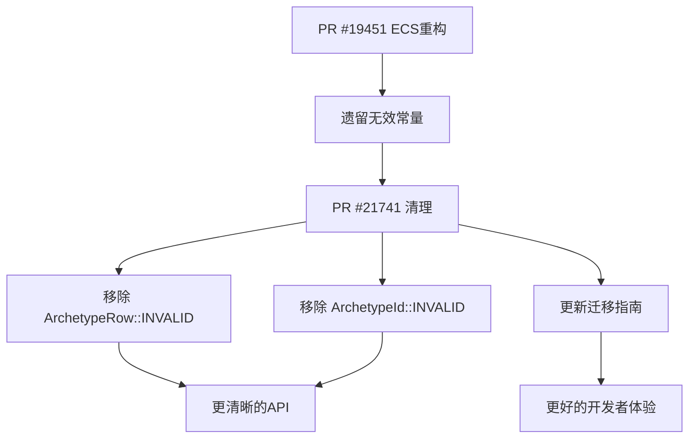

+++
title = "#21741 Removed invalid ECS archetype constants"
date = "2025-11-04T00:00:00"
draft = false
template = "pull_request_page.html"
in_search_index = false

[extra]
current_language = "zh-cn"
available_languages = {"en" = { name = "English", url = "/pull_request/bevy/2025-11/pr-21741-en-20251104" }, "zh-cn" = { name = "中文", url = "/pull_request/bevy/2025-11/pr-21741-zh-cn-20251104" }}
+++

# Removed invalid ECS archetype constants

## Basic Information
- **Title**: Removed invalid ECS archetype constants
- **PR Link**: https://github.com/bevyengine/bevy/pull/21741
- **作者**: ElliottjPierce
- **状态**: 已合并
- **标签**: D-Trivial, A-ECS, C-Code-Quality, S-Ready-For-Final-Review
- **创建时间**: 2025-11-04T20:55:59Z
- **合并时间**: 2025-11-04T21:47:20Z
- **合并者**: alice-i-cecile

## 描述翻译

# 目标

这是对 #19451 的一个小清理，移除了一些现在完全不需要的公共常量。
我的意思是，它们没有错，但它们的存在没有意义。

## 解决方案

移除了 `ArchetypeRow::INVALID` 和 `ArchetypeId::INVALID` 并扩展了迁移指南。

## 这个 Pull Request 的故事

这个 PR 源于对 Bevy ECS 架构中技术债务的清理。在之前的重构 (#19451) 中，ECS 的实体分配和刷新机制得到了改进，但一些不再需要的常量仍然保留在代码库中。

问题的核心在于，`ArchetypeRow::INVALID` 和 `ArchetypeId::INVALID` 这两个常量最初被设计为占位符值，用于表示无效的 archetype 行和 ID。然而，随着代码的演进，这些常量已经失去了实际用途，反而可能成为潜在的混淆源。

从技术角度来看，这些常量的问题在于它们虽然被标记为 "INVALID"，但在类型系统中仍然是有效的值。这违反了 Rust 的类型安全原则 - 如果某个值确实是无效的，那么它应该通过类型系统（如 `Option<T>`）来表达，而不是通过特定的魔数。

开发者采取了直接而有效的解决方案：完全移除这些不再需要的常量。这种清理工作有几个重要好处：

1. **减少认知负担**：新开发者不会困惑于这些常量的用途
2. **防止误用**：消除了使用这些"无效"值作为实际占位符的可能性
3. **代码简洁性**：移除了死代码，使代码库更加清晰

在实现方面，这个更改非常直接，但体现了良好的软件工程实践。开发者不仅移除了常量定义，还相应地更新了迁移指南，确保现有用户能够平滑过渡。

从架构角度看，这个更改反映了 Bevy ECS 向更严格的类型安全方向演进。通过消除这些魔数常量，系统鼓励开发者使用更安全的模式，如 `Option<ArchetypeRow>` 和 `Option<ArchetypeId>`，这些模式在编译时就能捕获错误。

## 可视化表示



## 关键文件更改

### `crates/bevy_ecs/src/archetype.rs` (+0/-9)

这个文件包含了 ECS 架构中 archetype 的核心定义。主要移除了两个不再需要的常量。

**主要变更：**

```rust
// 移除前：
pub struct ArchetypeRow(NonMaxU32);

impl ArchetypeRow {
    /// Index indicating an invalid archetype row.
    /// This is meant to be used as a placeholder.
    // TODO: Deprecate in favor of options, since `INVALID` is, technically, valid.
    pub const INVALID: ArchetypeRow = ArchetypeRow(NonMaxU32::MAX);

    // ... 其他方法
}

pub struct ArchetypeId(u32);

impl ArchetypeId {
    /// The ID for the [`Archetype`] without any components.
    pub const EMPTY: ArchetypeId = ArchetypeId(0);
    /// # Safety:
    ///
    /// This must always have an all-1s bit pattern to ensure soundness in fast entity id space allocation.
    pub const INVALID: ArchetypeId = ArchetypeId(u32::MAX);

    // ... 其他方法
}
```

```rust
// 移除后：
pub struct ArchetypeRow(NonMaxU32);

impl ArchetypeRow {
    // INVALID 常量已被移除

    // ... 其他方法保持不变
}

pub struct ArchetypeId(u32);

impl ArchetypeId {
    /// The ID for the [`Archetype`] without any components.
    pub const EMPTY: ArchetypeId = ArchetypeId(0);

    // INVALID 常量已被移除

    // ... 其他方法保持不变
}
```

### `release-content/migration-guides/entities_apis.md` (+3/-0)

更新了迁移指南，通知开发者这些常量的移除，并建议替代方案。

**新增内容：**

```markdown
### Other entity interactions

The `ArchetypeRow::INVALID` and `ArchetypeId::INVALID` constants have been removed, since they are no longer needed for flushing.
If you depended on these, use options instead.
```

## 进一步阅读

- [Bevy ECS 架构文档](https://bevyengine.org/learn/book/ecs/)
- [Rust 类型安全最佳实践](https://doc.rust-lang.org/book/ch06-01-defining-an-enum.html)
- [Option 类型在 Rust 中的使用](https://doc.rust-lang.org/std/option/enum.Option.html)