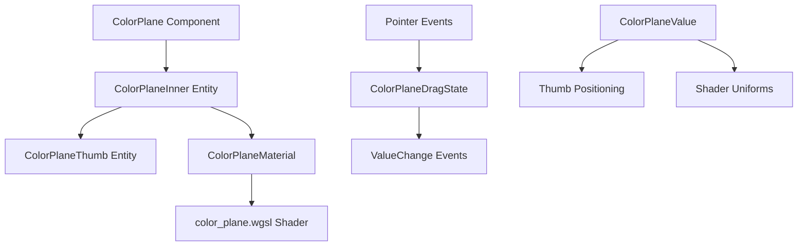

+++
title = "#21743 Color plane widget."
date = "2025-11-07T00:00:00"
draft = false
template = "pull_request_page.html"
in_search_index = true

[taxonomies]
list_display = ["show"]

[extra]
current_language = "en"
available_languages = {"en" = { name = "English", url = "/pull_request/bevy/2025-11/pr-21743-en-20251107" }, "zh-cn" = { name = "中文", url = "/pull_request/bevy/2025-11/pr-21743-zh-cn-20251107" }}
labels = ["C-Feature", "A-UI", "M-Migration-Guide", "M-Release-Note"]
+++

# Color plane widget.

## Basic Information
- **Title**: Color plane widget.
- **PR Link**: https://github.com/bevyengine/bevy/pull/21743
- **Author**: viridia
- **Status**: MERGED
- **Labels**: C-Feature, A-UI, S-Ready-For-Final-Review, M-Migration-Guide, M-Release-Note
- **Created**: 2025-11-05T00:43:57Z
- **Merged**: 2025-11-07T01:26:05Z
- **Merged By**: alice-i-cecile

## Description Translation
# Objective

Part of #19236 

Note: I did not include a release note because there's already one in the BSN branch.

## Solution

* Color Plane widget
* Also, some improvements to color swatch API

## Showcase


## The Story of This Pull Request

This PR introduces a new Color Plane widget to Bevy's UI system, addressing the need for two-dimensional color selection in color picker interfaces. The implementation follows Bevy's established patterns while extending the existing color control ecosystem.

The core problem was that Bevy's UI library lacked a widget for selecting two color components simultaneously. While color sliders existed for single-channel selection, applications needing more sophisticated color pickers required a way to visualize and select from two-dimensional color spaces. The solution combines custom shader rendering with Bevy's existing UI interaction systems to create a versatile color plane component.

The implementation centers around a new `ColorPlane` enum component that defines which color space view to display. The widget supports five different configurations: RGB planes (RedGreen, RedBlue, GreenBlue) and HSL planes (HueSaturation, HueLightness). Each variant maps different color channels to the X and Y axes of the selection plane.

```rust
#[derive(Component, Default, Debug, Clone, Reflect, Copy, PartialEq, Eq, Hash)]
pub enum ColorPlane {
    RedGreen,
    RedBlue,
    GreenBlue,
    HueSaturation,
    #[default]
    HueLightness,
}
```

The widget uses a custom WGSL shader that renders the appropriate color gradient based on the selected plane type. The shader handles both RGB and HSL color spaces, converting to linear RGB for display. The fixed third channel value is passed as a uniform to control the background gradient:

```wgsl
#ifdef PLANE_RG
    return vec4(srgb_to_linear_rgb(vec3(uv.x, uv.y, fixed_channel)), 1.0);
#else ifdef PLANE_RB
    return vec4(srgb_to_linear_rgb(vec3(uv.x, fixed_channel, uv.y)), 1.0);
```

The widget architecture follows Bevy's entity hierarchy pattern. The root entity contains the `ColorPlane` and `ColorPlaneValue` components, with child entities for the gradient plane and selection thumb. The thumb position is controlled through percentage-based UI positioning that maps directly to the 0-1 normalized color space.

Interaction handling leverages Bevy's picking system with observers for pointer events. The implementation includes drag state management to ensure smooth interaction:

```rust
fn on_drag(
    mut drag: On<Pointer<Drag>>,
    q_color_planes: Query<(&ColorPlaneDragState, Has<InteractionDisabled>), With<ColorPlane>>,
    // ... other queries
) {
    if let Ok((node, node_target, transform, parent)) = q_color_plane_inner.get(drag.entity)
        && let Ok((state, disabled)) = q_color_planes.get(parent.0)
    {
        drag.propagate(false);
        if state.0 && !disabled {
            let local_pos = transform.try_inverse().unwrap().transform_point2(
                drag.pointer_location.position * node_target.scale_factor() / ui_scale.0,
            );
            let pos = local_pos / node.size() + Vec2::splat(0.5);
            let new_value = pos.clamp(Vec2::ZERO, Vec2::ONE);
            commands.trigger(ValueChange {
                source: parent.0,
                value: new_value,
            });
        }
    }
}
```

The PR also enhances the existing color swatch system by introducing a `ColorSwatchValue` component. This change makes the swatch API more consistent with other value-based widgets and enables better state management:

```rust
#[derive(Component, Default, Clone, Reflect)]
#[reflect(Component, Clone, Default)]
pub struct ColorSwatchValue(pub Color);

fn update_swatch_color(
    q_swatch: Query<(&ColorSwatchValue, &Children), Changed<ColorSwatchValue>>,
    mut commands: Commands,
) {
    for (value, children) in q_swatch.iter() {
        if let Some(first_child) = children.first() {
            commands
                .entity(*first_child)
                .insert(BackgroundColor(value.0));
        }
    }
}
```

The color plane implementation avoids excessive color space conversions to prevent gimbal lock issues, particularly important for cylindrical color spaces like HSL. This design decision keeps the widget focused on visualization while leaving color space management to the application layer.

Integration with the existing Bevy Feathers ecosystem is handled through a new `ColorPlanePlugin` that registers all necessary systems and observers. The widget follows Bevy's theming system with appropriate theme tokens and integrates with the dark theme implementation.

The example application demonstrates practical usage, showing how the color plane can be combined with other color controls to build a complete color picker interface. The implementation emits `ValueChange<Vec2>` events, making it easy to integrate with existing application state management.

## Visual Representation



## Key Files Changed

### `crates/bevy_feathers/src/controls/color_plane.rs` (+354/-0)
This new file contains the complete implementation of the color plane widget:
- Defines the `ColorPlane` enum and related components
- Implements the UI material system for gradient rendering
- Handles pointer interactions and drag behavior
- Provides the template function for spawning color planes

```rust
pub fn color_plane<B: Bundle>(plane: ColorPlane, overrides: B) -> impl Bundle {
    (
        Node {
            display: Display::Flex,
            min_height: px(100.0),
            align_self: AlignSelf::Stretch,
            padding: UiRect::all(px(4)),
            ..Default::default()
        },
        plane,
        ColorPlaneValue::default(),
        ThemeBackgroundColor(tokens::COLOR_PLANE_BG),
        BorderRadius::all(px(5)),
        EntityCursor::System(bevy_window::SystemCursorIcon::Crosshair),
        overrides,
        children![/* ... */],
    )
}
```

### `crates/bevy_feathers/src/controls/color_swatch.rs` (+39/-2)
Enhanced the color swatch API with value-based state management:
- Added `ColorSwatchValue` component for better state management
- Implemented automatic background color updates
- Added plugin for system registration

```rust
// Before: Direct background color manipulation
// After: Value-based state management
#[derive(Component, Default, Clone, Reflect)]
pub struct ColorSwatchValue(pub Color);
```

### `examples/ui/feathers.rs` (+26/-11)
Updated the example to demonstrate the new color plane widget:
- Added color plane to the demo interface
- Integrated with existing color state management
- Showcased multiple color plane configurations

### `crates/bevy_feathers/src/assets/shaders/color_plane.wgsl` (+27/-0)
New shader implementing the color gradient rendering:
- Supports multiple color space configurations via shader defines
- Handles both RGB and HSL color conversions
- Uses uniform for fixed channel value

### `crates/bevy_feathers/src/controls/mod.rs` (+9/-2)
Updated module exports and plugin registration:
- Added color plane to public API
- Registered new plugins in the controls system

## Further Reading

- [Bevy UI Documentation](https://bevyengine.org/learn/quick-start/ui/) - Official Bevy UI guide
- [WGSL Shader Language](https://gpuweb.github.io/gpuweb/wgsl/) - WebGPU Shading Language specification
- [Color Spaces and Gamuts](https://en.wikipedia.org/wiki/Gamut) - Background on color theory and color spaces
- [Bevy Picking System](https://github.com/bevyengine/bevy/tree/main/crates/bevy_picking) - Interaction handling in Bevy

# Full Code Diff
*(The full code diff is provided in the original request)*