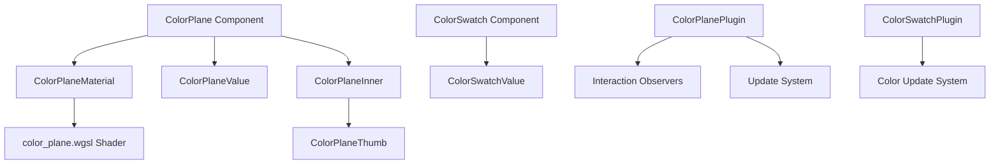

+++
title = "#21743 Color plane widget."
date = "2025-11-07T00:00:00"
draft = false
template = "pull_request_page.html"
in_search_index = false

[extra]
current_language = "zh-cn"
available_languages = {"en" = { name = "English", url = "/pull_request/bevy/2025-11/pr-21743-en-20251107" }, "zh-cn" = { name = "中文", url = "/pull_request/bevy/2025-11/pr-21743-zh-cn-20251107" }}
labels = ["C-Feature", "A-UI", "M-Migration-Guide", "M-Release-Note"]
+++

# Color plane widget.

## Basic Information
- **Title**: Color plane widget.
- **PR Link**: https://github.com/bevyengine/bevy/pull/21743
- **Author**: viridia
- **Status**: MERGED
- **Labels**: C-Feature, A-UI, S-Ready-For-Review, M-Migration-Guide, M-Release-Note
- **Created**: 2025-11-05T00:43:57Z
- **Merged**: 2025-11-07T01:26:05Z
- **Merged By**: alice-i-cecile

## Description Translation
# 目标

作为 #19236 的一部分

注意：我没有包含发布说明，因为BSN分支中已经有一个了。

## 解决方案

* 颜色平面小部件
* 同时，对颜色样本API进行了一些改进

## 展示


## The Story of This Pull Request

这个PR为Bevy引擎的Feathers UI系统添加了一个新的颜色平面组件，这是实现完整颜色选择器功能的重要一步。PR解决了在UI中提供二维颜色选择能力的需求，让用户可以在一个平面上同时选择两个颜色分量。

**问题背景**

在颜色选择场景中，用户经常需要在两个维度上调整颜色值，比如在HSL颜色空间中选择色调和饱和度，或在RGB颜色空间中选择红色和蓝色分量。现有的颜色滑块组件只能在一维上调整单个颜色分量，无法满足这种二维选择需求。

**解决方案架构**

开发者采用了模块化的设计思路，创建了一个独立的`ColorPlane`组件，它包含：
- 一个显示颜色渐变的背景平面
- 一个可拖拽的指示器来标记当前选择的位置
- 支持多种颜色空间视图的配置选项

实现的关键在于使用WGSL着色器来高效渲染颜色平面，并通过Bevy的观察者系统处理用户交互事件。

**核心技术实现**

颜色平面的核心是`ColorPlaneMaterial`，这是一个自定义的UI材质，使用专门的着色器来渲染不同的颜色空间视图。着色器通过预处理宏来选择不同的颜色转换逻辑：

```rust
// 着色器支持多种颜色平面模式
#ifdef PLANE_RG
    return vec4(srgb_to_linear_rgb(vec3(uv.x, uv.y, fixed_channel)), 1.0);
#else ifdef PLANE_RB
    return vec4(srgb_to_linear_rgb(vec3(uv.x, fixed_channel, uv.y)), 1.0);
// ... 其他模式
```

交互处理使用了Bevy的观察者模式，分别处理按压、拖拽开始、拖拽进行、拖拽结束和拖拽取消事件。这种设计确保了颜色平面在各种交互场景下都能正确响应。

**API改进**

除了颜色平面本身，PR还对现有的颜色样本组件进行了改进，引入了`ColorSwatchValue`组件来分离数据和行为：

```rust
// 新的数据组件
#[derive(Component, Default, Clone, Reflect)]
pub struct ColorSwatchValue(pub Color);

// 专门的更新系统
fn update_swatch_color(
    q_swatch: Query<(&ColorSwatchValue, &Children), Changed<ColorSwatchValue>>,
    mut commands: Commands,
) {
    // 更新逻辑
}
```

这种改进使得颜色样本的状态管理更加清晰，也为后续的颜色选择器集成提供了更好的基础。

**集成和主题支持**

颜色平面完全集成到Feathers的控件系统中，包括：
- 在控件模块中注册新的插件
- 添加深色主题支持
- 在示例应用中展示功能
- 更新发布说明文档

## Visual Representation



## Key Files Changed

### `crates/bevy_feathers/src/controls/color_plane.rs` (+354/-0)
这是主要的实现文件，包含了颜色平面的所有核心组件和逻辑。

**关键组件定义：**
```rust
#[derive(Component, Default, Debug, Clone, Reflect, Copy, PartialEq, Eq, Hash)]
pub enum ColorPlane {
    RedGreen,
    RedBlue,
    GreenBlue,
    HueSaturation,
    #[default]
    HueLightness,
}

#[derive(Component, Default, Clone, Reflect)]
pub struct ColorPlaneValue(pub Vec3);
```

**交互处理逻辑：**
```rust
fn on_drag(
    mut drag: On<Pointer<Drag>>,
    q_color_planes: Query<(&ColorPlaneDragState, Has<InteractionDisabled>), With<ColorPlane>>,
    // ... 其他参数
) {
    if let Ok((node, node_target, transform, parent)) = q_color_plane_inner.get(drag.entity)
        && let Ok((state, disabled)) = q_color_planes.get(parent.0)
    {
        drag.propagate(false);
        if state.0 && !disabled {
            // 计算新的颜色值并触发更新
            let local_pos = transform.try_inverse().unwrap().transform_point2(
                drag.pointer_location.position * node_target.scale_factor() / ui_scale.0,
            );
            let pos = local_pos / node.size() + Vec2::splat(0.5);
            let new_value = pos.clamp(Vec2::ZERO, Vec2::ONE);
            commands.trigger(ValueChange {
                source: parent.0,
                value: new_value,
            });
        }
    }
}
```

### `crates/bevy_feathers/src/controls/color_swatch.rs` (+39/-2)
改进了颜色样本组件的API，添加了值组件和更新系统。

**新增的值组件：**
```rust
#[derive(Component, Default, Clone, Reflect)]
pub struct ColorSwatchValue(pub Color);
```

**颜色更新系统：**
```rust
fn update_swatch_color(
    q_swatch: Query<(&ColorSwatchValue, &Children), Changed<ColorSwatchValue>>,
    mut commands: Commands,
) {
    for (value, children) in q_swatch.iter() {
        if let Some(first_child) = children.first() {
            commands
                .entity(*first_child)
                .insert(BackgroundColor(value.0));
        }
    }
}
```

### `crates/bevy_feathers/src/assets/shaders/color_plane.wgsl` (+27/-0)
颜色平面的着色器实现，支持多种颜色空间视图。

```rust
#ifdef PLANE_RG
    return vec4(srgb_to_linear_rgb(vec3(uv.x, uv.y, fixed_channel)), 1.0);
#else ifdef PLANE_RB
    return vec4(srgb_to_linear_rgb(vec3(uv.x, fixed_channel, uv.y)), 1.0);
#else ifdef PLANE_GB
    return vec4(srgb_to_linear_rgb(vec3(fixed_channel, uv.x, uv.y)), 1.0);
#else ifdef PLANE_HS
    return vec4(hsl_to_linear_rgb(vec3(uv.x, 1.0 - uv.y, fixed_channel)), 1.0);
#else ifdef PLANE_HL
    return vec4(hsl_to_linear_rgb(vec3(uv.x, fixed_channel, 1.0 - uv.y)), 1.0);
#endif
```

### `examples/ui/feathers.rs` (+26/-11)
在示例应用中集成了颜色平面组件，展示了实际使用方式。

**添加颜色平面到UI：**
```rust
(
    color_plane(ColorPlane::RedBlue, ()),
    observe(
        |change: On<ValueChange<Vec2>>, mut color: ResMut<DemoWidgetStates>| {
            color.rgb_color.red = change.value.x;
            color.rgb_color.blue = change.value.y;
        }
    )
)
```

### `crates/bevy_feathers/src/controls/mod.rs` (+9/-2)
注册新的颜色平面和颜色样本插件到控件系统中。

```rust
pub use color_plane::{color_plane, ColorPlane, ColorPlaneValue};
pub use color_swatch::{color_swatch, ColorSwatch, ColorSwatchFg, ColorSwatchValue};

// 在插件中注册
app.add_plugins((
    ColorPlanePlugin,
    ColorSwatchPlugin,
));
```

## Further Reading

- [Bevy UI 系统文档](https://bevyengine.org/learn/quick-start/ui/)
- [WGSL 着色器语言规范](https://gpuweb.github.io/gpuweb/wgsl/)
- [Feathers UI 控件系统架构](https://github.com/bevyengine/bevy/tree/main/crates/bevy_feathers)
- [颜色空间转换理论](https://en.wikipedia.org/wiki/Color_space)

---

# Full Code Diff
*(保留原始diff内容)*