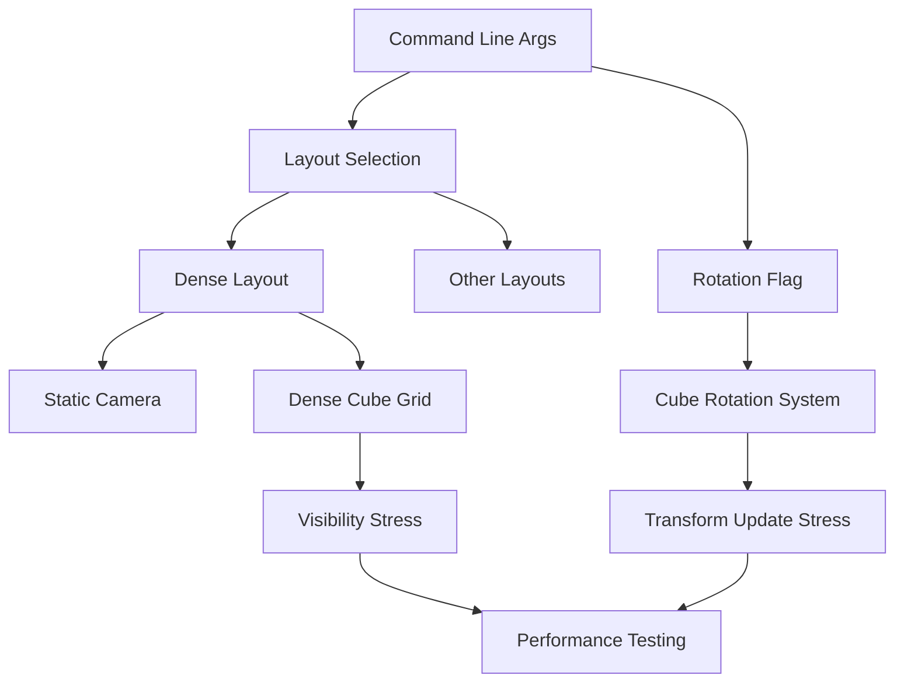

+++
title = "#21745 Add a dense layout to the `many_cubes` stress test"
date = "2025-11-05T00:00:00"
draft = false
template = "pull_request_page.html"
in_search_index = true

[taxonomies]
list_display = ["show"]

[extra]
current_language = "en"
available_languages = {"en" = { name = "English", url = "/pull_request/bevy/2025-11/pr-21745-en-20251105" }, "zh-cn" = { name = "中文", url = "/pull_request/bevy/2025-11/pr-21745-zh-cn-20251105" }}
labels = ["A-Rendering", "C-Examples", "C-Testing"]
+++

# Add a dense layout to the `many_cubes` stress test

## Basic Information
- **Title**: Add a dense layout to the `many_cubes` stress test
- **PR Link**: https://github.com/bevyengine/bevy/pull/21745
- **Author**: DeVelox
- **Status**: MERGED
- **Labels**: A-Rendering, C-Examples, S-Ready-For-Final-Review, C-Testing
- **Created**: 2025-11-05T00:52:07Z
- **Merged**: 2025-11-05T18:37:48Z
- **Merged By**: alice-i-cecile

## Description Translation

# Objective

- Test the impact that many overlapping cubes, all within the camera frustum, have on visibility/occlusion calculations, especially with continuous rotation and shadows enabled.

## Solution

- Add a dense cube layout using a static camera, and a toggle for individual cube rotation.

## Testing

- I ran the test in several stages, each causing a considerable performance drop.
  - Stage 1: using just the dense layout.
  - Stage 2: using the dense layout with rotation or shadows enabled.
  - Stage 3: using the dense layout with both rotation and shadows enabled.

```
cargo run --release --example many_cubes -- --layout dense --rotate-cubes --shadows
```

---

## Showcase


## The Story of This Pull Request

The `many_cubes` stress test in Bevy serves as a crucial benchmarking tool for evaluating rendering performance under extreme conditions. Prior to this PR, the test offered two layout patterns: a cube grid and a spherical arrangement. However, these layouts didn't effectively test the specific scenario where many objects overlap within the camera's view frustum, which is critical for evaluating visibility and occlusion culling systems.

The developer identified a gap in the stress testing capabilities - the need to evaluate how the engine handles dense object configurations where most cubes remain visible and overlapping. This scenario puts significant pressure on the visibility system, as it must process many objects that are simultaneously within the camera's view and potentially occluding each other.

The solution approach involved creating a new dense layout configuration that packs cubes tightly together in a 3D grid, ensuring they all remain within the camera frustum. The implementation required several coordinated changes:

First, the command-line interface was extended to support the new layout option and individual cube rotation:

```rust
/// whether to continuously rotate individual cubes.
#[argh(switch)]
rotate_cubes: bool,
```

```rust
#[derive(Default, Clone, PartialEq)]
enum Layout {
    Cube,
    #[default]
    Sphere,
    Dense,
}
```

The layout parsing was updated to recognize the new "dense" option, and the error message was extended to include it in the valid options list.

The core architectural change involved conditional system registration. For the dense layout, the camera movement system is disabled since the layout uses a static camera position optimized to view all cubes. Additionally, a new cube rotation system is conditionally added when the `--rotate-cubes` flag is specified:

```rust
if args.layout != Layout::Dense {
    app.add_systems(Update, move_camera);
}

if args.rotate_cubes {
    app.add_systems(Update, rotate_cubes);
}
```

The dense layout implementation itself uses mathematical precision to create a tightly-packed 3D grid:

```rust
Layout::Dense => {
    // NOTE: This pattern is good for demonstrating a dense configuration of cubes
    // overlapping each other, all within the camera frustum.
    let count = WIDTH * HEIGHT * 2;
    let size = cbrt(count as f32).round();
    let gap = 1.25;

    let cubes = (0..count).map(move |i| {
        let x = i as f32 % size;
        let y = (i as f32 / size) % size;
        let z = i as f32 / (size * size);
        let pos = Vec3::new(x * gap, y * gap, z * gap);
        // ... cube spawning logic
    });

    // camera
    commands.spawn((
        Camera3d::default(),
        Transform::from_xyz(100.0, 90.0, 100.0)
            .looking_at(Vec3::new(0.0, -10.0, 0.0), Vec3::Y),
    ));

    commands.spawn_batch(cubes);
}
```

The key technical insight here is the use of the cube root function (`cbrt`) to calculate the grid dimensions that will contain exactly `WIDTH * HEIGHT * 2` cubes. This ensures the cubes are packed into a roughly cubic volume rather than a flat plane, maximizing overlap and occlusion complexity.

The new cube rotation system provides another dimension of stress testing:

```rust
fn rotate_cubes(
    mut query: Query<&mut Transform, (With<Mesh3d>, Without<NotShadowCaster>)>,
    time: Res<Time>,
) {
    query.par_iter_mut().for_each(|mut transform| {
        transform.rotate_y(10.0 * time.delta_secs());
    });
}
```

This system uses parallel iteration (`par_iter_mut`) to efficiently update the rotation of all cubes, which is important for maintaining performance when dealing with thousands of entities.

The testing methodology described by the author demonstrates a systematic approach to performance evaluation. By enabling features incrementally (dense layout → rotation/shadows → both), they can isolate the performance impact of each complexity factor. This approach provides valuable data for engine optimization efforts, particularly around visibility determination and transform updates.

## Visual Representation



## Key Files Changed

### `examples/stress_tests/many_cubes.rs` (+57/-5)

This file contains all the changes for the new dense layout feature. The modifications include:

1. **New command-line argument for cube rotation**:
```rust
/// whether to continuously rotate individual cubes.
#[argh(switch)]
rotate_cubes: bool,
```

2. **Extended Layout enum with Dense variant**:
```rust
#[derive(Default, Clone, PartialEq)]
enum Layout {
    Cube,
    #[default]
    Sphere,
    Dense,
}
```

3. **Conditional system registration**:
```rust
if args.layout != Layout::Dense {
    app.add_systems(Update, move_camera);
}

if args.rotate_cubes {
    app.add_systems(Update, rotate_cubes);
}
```

4. **Dense layout implementation**:
```rust
Layout::Dense => {
    let count = WIDTH * HEIGHT * 2;
    let size = cbrt(count as f32).round();
    let gap = 1.25;
    // ... cube positioning logic
    // Static camera setup
    commands.spawn((
        Camera3d::default(),
        Transform::from_xyz(100.0, 90.0, 100.0)
            .looking_at(Vec3::new(0.0, -10.0, 0.0), Vec3::Y),
    ));
}
```

5. **New cube rotation system**:
```rust
fn rotate_cubes(
    mut query: Query<&mut Transform, (With<Mesh3d>, Without<NotShadowCaster>)>,
    time: Res<Time>,
) {
    query.par_iter_mut().for_each(|mut transform| {
        transform.rotate_y(10.0 * time.delta_secs());
    });
}
```

## Further Reading

- [Bevy Visibility Systems Documentation](https://bevyengine.org/learn/books/introduction/3d-rendering/visibility/)
- [Entity Component System (ECS) Pattern](https://bevyengine.org/learn/books/introduction/ecs-in-bevy/)
- [Parallel Iteration in Bevy Queries](https://bevyengine.org/learn/books/introduction/ecs-in-bevy/#system-parallelism)
- [3D Transformations and Rotation](https://bevyengine.org/learn/books/introduction/transform/)