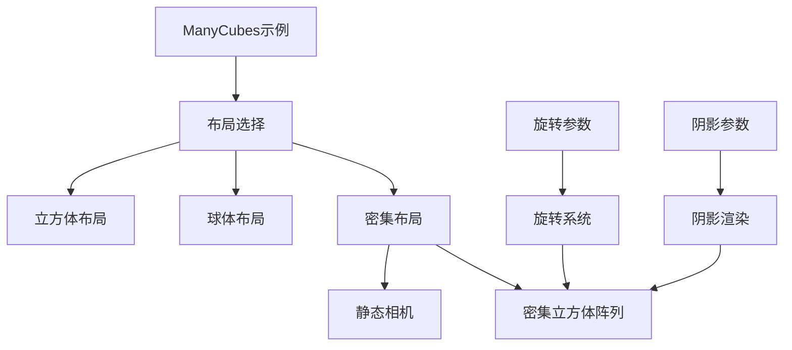

+++
title = "#21745 Add a dense layout to the `many_cubes` stress test"
date = "2025-11-05T00:00:00"
draft = false
template = "pull_request_page.html"
in_search_index = false

[extra]
current_language = "zh-cn"
available_languages = {"en" = { name = "English", url = "/pull_request/bevy/2025-11/pr-21745-en-20251105" }, "zh-cn" = { name = "中文", url = "/pull_request/bevy/2025-11/pr-21745-zh-cn-20251105" }}
+++

# 添加密集布局到 `many_cubes` 压力测试

## 基本信息
- **标题**: Add a dense layout to the `many_cubes` stress test
- **PR链接**: https://github.com/bevyengine/bevy/pull/21745  
- **作者**: DeVelox
- **状态**: 已合并
- **标签**: A-Rendering, C-Examples, S-Ready-For-Final-Review, C-Testing
- **创建时间**: 2025-11-05T00:52:07Z
- **合并时间**: 2025-11-05T18:37:48Z
- **合并者**: alice-i-cecile

## 描述翻译
# 目标

- 测试大量重叠立方体（全部位于相机视锥体内）对可见性/遮挡计算的影响，特别是在启用连续旋转和阴影的情况下。

## 解决方案

- 使用静态相机添加密集立方体布局，并添加切换单个立方体旋转的选项。

## 测试

- 我分几个阶段运行了测试，每个阶段都导致了显著的性能下降。
  - 阶段1：仅使用密集布局。
  - 阶段2：使用密集布局并启用旋转或阴影。
  - 阶段3：使用密集布局同时启用旋转和阴影。

```
cargo run --release --example many_cubes -- --layout dense --rotate-cubes --shadows
```

---

## 展示


## 这个Pull Request的故事

### 问题背景与测试需求

在游戏引擎开发中，渲染性能测试是确保引擎稳定性的关键环节。Bevy引擎的`many_cubes`示例原本提供了两种布局模式：立方体阵列和球体分布，主要用于测试视锥体剔除和基本渲染性能。然而，这些测试场景未能充分模拟真实游戏中常见的密集物体重叠情况。

开发者DeVelox识别到一个重要的测试缺口：当大量物体在视锥体内重叠时，可见性计算和遮挡剔除的性能表现。特别是在启用动态效果（如旋转）和复杂光照（如阴影）的情况下，渲染管线的压力会显著增加。现有的测试布局无法有效验证这些边界情况下的性能表现。

### 技术方案设计

为了解决这个问题，PR采用了三个核心改进：

1. **新增密集布局模式**：创建一个所有立方体都在相机视锥体内的密集排列
2. **条件化系统调度**：根据布局模式动态调整启用的系统
3. **独立旋转控制**：为每个立方体添加独立的旋转动画选项

### 实现细节分析

#### 布局枚举扩展

首先扩展了`Layout`枚举，新增`Dense`变体：

```rust
#[derive(Default, Clone, PartialEq)]
enum Layout {
    Cube,
    #[default]
    Sphere,
    Dense,  // 新增密集布局
}
```

这个变更保持了向后兼容性，同时为新的测试场景提供了明确的类型标识。

#### 条件化系统调度

在应用构建过程中，根据布局和参数动态调整系统：

```rust
if args.layout != Layout::Dense {
    app.add_systems(Update, move_camera);
}

if args.rotate_cubes {
    app.add_systems(Update, rotate_cubes);
}
```

这种条件化调度体现了Bevy ECS系统的灵活性——密集布局使用静态相机，而其他布局保持相机移动；旋转系统只在明确启用时才加入更新循环。

#### 密集布局实现

密集布局的核心算法使用立方根计算来创建紧凑的三维网格：

```rust
Layout::Dense => {
    let count = WIDTH * HEIGHT * 2;
    let size = cbrt(count as f32).round();
    let gap = 1.25;

    let cubes = (0..count).map(move |i| {
        let x = i as f32 % size;
        let y = (i as f32 / size) % size;
        let z = i as f32 / (size * size);
        let pos = Vec3::new(x * gap, y * gap, z * gap);
        // 创建变换和材质
    });
}
```

这种布局确保了所有立方体都在相机视锥体内，为可见性计算提供了最大压力测试。

#### 旋转系统实现

新增的旋转系统使用并行迭代器处理大量实体的变换更新：

```rust
fn rotate_cubes(
    mut query: Query<&mut Transform, (With<Mesh3d>, Without<NotShadowCaster>)>,
    time: Res<Time>,
) {
    query.par_iter_mut().for_each(|mut transform| {
        transform.rotate_y(10.0 * time.delta_secs());
    });
}
```

这种实现充分利用了Bevy的并行查询能力，确保即使处理数千个旋转立方体也能保持良好性能。

### 技术洞察与工程考量

#### 性能测试的分层方法

PR作者采用了分层测试策略，逐步增加复杂度：
1. 基础密集布局测试渲染管线压力
2. 添加旋转测试动态场景性能
3. 启用阴影测试光照计算开销
4. 组合所有特性测试极限情况

这种渐进式方法有助于精确识别性能瓶颈所在。

#### 数学计算的优化

使用`cbrt`（立方根）函数而不是手动计算`count.powf(1.0/3.0)`，体现了对标准库函数的合理利用，既提高了代码可读性又确保了计算精度。

#### 架构设计的灵活性

通过条件化系统添加，这个实现展示了Bevy ECS架构的模块化优势。系统可以根据运行时配置动态组合，而不需要复杂的继承或条件逻辑。

### 影响与价值

这个PR为Bevy引擎添加了重要的压力测试能力：

1. **更全面的性能覆盖**：密集布局填补了现有测试场景的空白
2. **可配置的测试复杂度**：通过命令行参数灵活组合测试条件
3. **真实的性能基准**：为引擎优化提供了更有代表性的性能数据

特别是对于可见性系统和遮挡剔除算法的开发，这个测试场景能够暴露在密集物体情况下的性能问题。

## 可视化表示



## 关键文件变更

### `examples/stress_tests/many_cubes.rs` (+57/-5)

这是PR中唯一修改的文件，包含了所有核心实现：

1. **布局枚举扩展**：
```rust
// 之前：
enum Layout {
    Cube,
    #[default]
    Sphere,
}

// 之后：
enum Layout {
    Cube,
    #[default]
    Sphere,
    Dense,  // 新增密集布局
}
```

2. **命令行参数扩展**：
```rust
// 新增旋转立方体选项
/// whether to continuously rotate individual cubes.
#[argh(switch)]
rotate_cubes: bool,
```

3. **密集布局实现**：
```rust
Layout::Dense => {
    let count = WIDTH * HEIGHT * 2;
    let size = cbrt(count as f32).round();
    let gap = 1.25;
    
    // 创建密集立方体网格
    let cubes = (0..count).map(move |i| {
        let x = i as f32 % size;
        let y = (i as f32 / size) % size;
        let z = i as f32 / (size * size);
        let pos = Vec3::new(x * gap, y * gap, z * gap);
        // 变换和材质配置
    });
    
    // 静态相机配置
    commands.spawn((
        Camera3d::default(),
        Transform::from_xyz(100.0, 90.0, 100.0)
            .looking_at(Vec3::new(0.0, -10.0, 0.0), Vec3::Y),
    ));
}
```

4. **旋转系统实现**：
```rust
// 新增旋转系统
fn rotate_cubes(
    mut query: Query<&mut Transform, (With<Mesh3d>, Without<NotShadowCaster>)>,
    time: Res<Time>,
) {
    query.par_iter_mut().for_each(|mut transform| {
        transform.rotate_y(10.0 * time.delta_secs());
    });
}
```

这些变更共同实现了为压力测试添加密集布局的目标，提供了更全面的性能测试覆盖。

## 进一步阅读

对于想要深入了解相关概念的开发者，建议参考：

1. [Bevy ECS系统调度文档](https://bevyengine.org/learn/quick-start/ecs/system-scheduling/)
2. [可见性剔除算法研究](https://en.wikipedia.org/wiki/Hidden-surface_determination)
3. [并行计算在游戏引擎中的应用](https://gameprogrammingpatterns.com/component.html)
4. [性能分析与基准测试最佳实践](https://github.com/bevyengine/bevy/blob/main/docs/plugins_guidelines.md#performance-benchmarks)