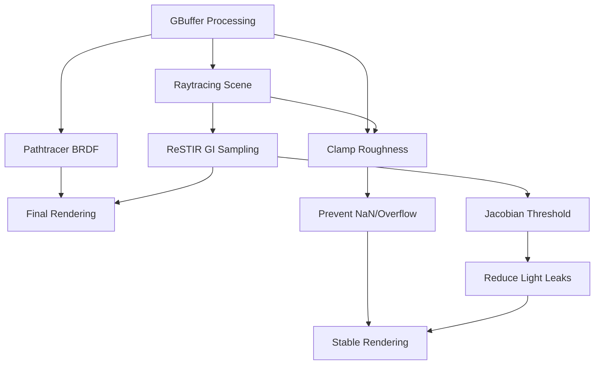

+++
title = "#21747 Solari fixes"
date = "2025-11-21T00:00:00"
draft = false
template = "pull_request_page.html"
in_search_index = true

[taxonomies]
list_display = ["show"]

[extra]
current_language = "en"
available_languages = {"en" = { name = "English", url = "/pull_request/bevy/2025-11/pr-21747-en-20251121" }, "zh-cn" = { name = "中文", url = "/pull_request/bevy/2025-11/pr-21747-zh-cn-20251121" }}
labels = ["C-Bug", "A-Rendering", "C-Refinement"]
+++

# Solari fixes

## Basic Information
- **Title**: Solari fixes
- **PR Link**: https://github.com/bevyengine/bevy/pull/21747
- **Author**: JMS55
- **Status**: MERGED
- **Labels**: C-Bug, A-Rendering, S-Ready-For-Final-Review, C-Refinement
- **Created**: 2025-11-05T02:55:27Z
- **Merged**: 2025-11-21T19:13:07Z
- **Merged By**: alice-i-cecile

## Description Translation
* Fix overflow/nans in BRDF evaluation
* Reduce jacobian rejection threshold to prevent light leaks (more aggressive cutoff now)

## The Story of This Pull Request

This pull request addresses two distinct but related issues in Bevy's Solari rendering system: numerical stability problems in BRDF evaluation and light leakage artifacts in the ReSTIR GI implementation.

The core problem stemmed from numerical instability in material property calculations. When material properties like roughness and metallic values approached extreme values, the BRDF evaluation could produce NaN (Not a Number) values or overflow conditions. These numerical errors would then propagate through the rendering pipeline, causing visual artifacts or even crashes in the rendering system.

The solution approach involved clamping material properties to safe numerical ranges. In both the gbuffer processing and raytracing scene bindings, the code now enforces minimum and maximum bounds on perceptual roughness values. The specific clamping value of 0.0316227766 corresponds to the square root of 0.001, ensuring that when squared to compute the actual roughness, it doesn't drop below the minimum safe threshold of 0.001. This prevents division by zero and other numerical instability issues that occur with extremely small roughness values.

Looking at the implementation in `gbuffer_utils.wgsl`, the key change was replacing a simple roughness calculation with a clamped approach:

```wgsl
// Before:
let perceptual_roughness = base_rough.a;
let roughness = clamp(perceptual_roughness * perceptual_roughness, 0.001, 1.0);

// After:
let perceptual_roughness = clamp(base_rough.a, 0.0316227766, 1.0);
let roughness = perceptual_roughness * perceptual_roughness;
```

The same pattern was applied in `raytracing_scene_bindings.wgsl` for consistency across different rendering paths. The author also added saturation to metallic values to prevent NaN generation, though they noted this was a defensive measure whose exact necessity wasn't fully understood.

The second issue addressed light leakage in the ReSTIR GI implementation. ReSTIR (ReSTIRred Sampling) is a reservoir-based sampling technique that can suffer from variance explosion when samples with large Jacobian determinants are included in the merging process. The previous threshold of 2.0 was too permissive, allowing samples with excessive variance to contribute to the final result.

The fix in `restir_gi.wgsl` reduces the Jacobian rejection threshold from 2.0 to 1.2:

```wgsl
// Before:
if canonical_target_function_other_sample_jacobian > 2.0 {

// After:
if canonical_target_function_other_sample_jacobian > 1.2 {
```

This more aggressive cutoff prevents the merging of samples that would introduce excessive variance, effectively reducing light leakage artifacts while maintaining the benefits of the ReSTIR algorithm.

The changes also included minor code cleanup, replacing `0.f` with `0.0` for consistency in the pathtracer code, though these were primarily stylistic improvements rather than functional fixes.

From a technical perspective, these changes demonstrate important principles in real-time graphics programming:
1. **Defensive numerical programming**: Always validate and clamp inputs to prevent numerical instability
2. **Consistent treatment of material properties**: Apply the same safety measures across different rendering pipelines
3. **Conservative sampling thresholds**: Better to reject potentially problematic samples than to allow artifacts

The impact of these changes is improved rendering stability and visual quality. The numerical clamping prevents rendering crashes and visual artifacts from NaN propagation, while the tighter Jacobian threshold reduces light leakage in global illumination, resulting in more physically plausible lighting.

## Visual Representation



## Key Files Changed

### `crates/bevy_solari/src/realtime/gbuffer_utils.wgsl` (+4/-3)
This file processes geometry buffer data. The changes prevent numerical instability by clamping material properties.

```wgsl
// Before:
let perceptual_roughness = base_rough.a;
let roughness = clamp(perceptual_roughness * perceptual_roughness, 0.001, 1.0);

// After:
// Clamp roughness to prevent NaNs
let perceptual_roughness = clamp(base_rough.a, 0.0316227766, 1.0); // Clamp roughness to 0.001
let roughness = perceptual_roughness * perceptual_roughness;
let metallic = saturate(props.g); // TODO: Not sure why saturate is needed here to prevent NaNs
```

### `crates/bevy_solari/src/scene/raytracing_scene_bindings.wgsl` (+4/-1)
Applies the same roughness clamping logic to the raytracing pipeline for consistency.

```wgsl
// Before:
m.roughness = clamp(m.perceptual_roughness * m.perceptual_roughness, 0.001, 1.0);

// After:
// Clamp roughness to prevent NaNs
m.perceptual_roughness = clamp(m.perceptual_roughness, 0.0316227766, 1.0); // Clamp roughness to 0.001
m.roughness = m.perceptual_roughness * m.perceptual_roughness;
```

### `crates/bevy_solari/src/pathtracer/pathtracer.wgsl` (+2/-2)
Minor code cleanup replacing float literals for consistency.

```wgsl
// Before:
let diffuse_weight = mix(mix(0.4f, 0.9f, ray_hit.material.perceptual_roughness), 0.f, ray_hit.material.metallic);

// After:
let diffuse_weight = mix(mix(0.4, 0.9, ray_hit.material.perceptual_roughness), 0.0, ray_hit.material.metallic);
```

### `crates/bevy_solari/src/realtime/restir_gi.wgsl` (+1/-1)
Reduces the Jacobian threshold to prevent light leakage in global illumination.

```wgsl
// Before:
if canonical_target_function_other_sample_jacobian > 2.0 {

// After:
if canonical_target_function_other_sample_jacobian > 1.2 {
```

## Further Reading

- [Physically Based Rendering](https://pbr-book.org/) - Comprehensive reference on BRDF theory and implementation
- [ReSTIR Paper](https://research.nvidia.com/publication/2020-07_spatiotemporal-reservoir-resampling-real-time-ray-tracing-dynamic-direct) - Original paper on Spatiotemporal reservoir resampling
- [Numerical Methods for Computer Graphics](https://graphics.stanford.edu/courses/cs448-01-winter/) - Stanford course covering numerical stability in graphics
- [WGSL Specification](https://www.w3.org/TR/WGSL/) - WebGPU Shading Language reference