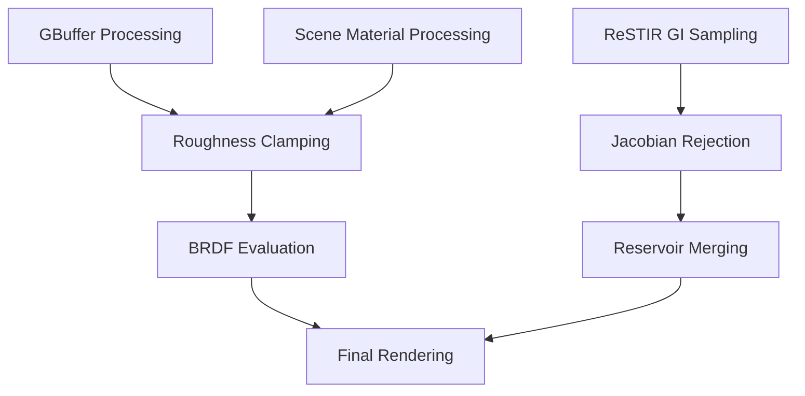

+++
title = "#21747 Solari fixes"
date = "2025-11-21T00:00:00"
draft = false
template = "pull_request_page.html"
in_search_index = false

[extra]
current_language = "zh-cn"
available_languages = {"en" = { name = "English", url = "/pull_request/bevy/2025-11/pr-21747-en-20251121" }, "zh-cn" = { name = "中文", url = "/pull_request/bevy/2025-11/pr-21747-zh-cn-20251121" }}
labels = ["C-Bug", "A-Rendering", "C-Refinement"]
+++

# Solari fixes

## Basic Information
- **Title**: Solari fixes
- **PR Link**: https://github.com/bevyengine/bevy/pull/21747
- **Author**: JMS55
- **Status**: MERGED
- **Labels**: C-Bug, A-Rendering, S-Ready-For-Final-Review, C-Refinement
- **Created**: 2025-11-05T02:55:27Z
- **Merged**: 2025-11-21T19:13:07Z
- **Merged By**: alice-i-cecile

## Description Translation
* 修复 BRDF 评估中的溢出/NaN 问题
* 降低雅可比拒绝阈值以防止光线泄漏（现在采用更激进的截断）

## The Story of This Pull Request

这个 PR 解决了 Bevy Solari 渲染系统中的两个关键数值稳定性问题。第一个问题是 BRDF 评估过程中出现的浮点溢出和 NaN 值，第二个问题是 ReSTIR GI 算法中的光线泄漏问题。

问题的根源在于材质参数的数值边界处理不足。在实时渲染中，当材质的粗糙度接近零时，BRDF 计算中的除法运算会产生极大的数值，最终导致浮点溢出或 NaN。这在物理上对应于完全光滑的表面，但在数值计算中需要特殊处理。

开发者通过添加参数钳制来解决这个问题。在 `gbuffer_utils.wgsl` 中，对感知粗糙度添加了最小值为 0.0316227766 的钳制，这个值实际上是 0.001 的平方根。选择这个特定值是因为粗糙度通常存储为感知粗糙度的平方，这样可以确保最终的粗糙度不会低于 0.001：

```wgsl
// Clamp roughness to prevent NaNs
let perceptual_roughness = clamp(base_rough.a, 0.0316227766, 1.0); // Clamp roughness to 0.001
let roughness = perceptual_roughness * perceptual_roughness;
```

同样的修复也应用到了 `raytracing_scene_bindings.wgsl` 中，确保场景材质和 GBuffer 材质使用相同的边界处理逻辑。金属度参数也通过 `saturate` 函数进行了钳制，防止超出 [0,1] 范围。

第二个问题是 ReSTIR GI 算法中的光线泄漏。ReSTIR 使用重要性采样和重采样技术，但在处理高差异的样本时，雅可比行列式可能变得过大，导致权重计算不稳定和光线泄漏。开发者通过降低雅可比拒绝阈值来解决这个问题：

```wgsl
// Don't merge samples with huge jacobians, as it explodes the variance
if canonical_target_function_other_sample_jacobian > 1.2 {
    return ReservoirMergeResult(canonical_reservoir, canonical_sample_radiance);
}
```

将阈值从 2.0 降低到 1.2 意味着更激进的样本拒绝策略，这样可以更早地截断那些可能导致数值不稳定的样本，从而减少光线泄漏现象。

此外，PR 中还包含了一些代码清理工作，将浮点字面量从 `0.f` 和 `0.4f` 改为 `0.0` 和 `0.4`，保持 WGSL 代码风格的一致性。

这些修复虽然看似简单，但对于渲染系统的稳定性至关重要。数值不稳定问题在光线追踪中特别常见，因为涉及大量的浮点运算和复杂的光传输模拟。通过合理的参数钳制和阈值调整，可以在保持物理准确性的同时确保数值稳定性。

## Visual Representation



## Key Files Changed

### `crates/bevy_solari/src/realtime/gbuffer_utils.wgsl` (+4/-3)
修复 GBuffer 材质参数处理中的数值稳定性问题：

```wgsl
// Before:
let perceptual_roughness = base_rough.a;
let roughness = clamp(perceptual_roughness * perceptual_roughness, 0.001, 1.0);
let metallic = props.g;

// After:
// Clamp roughness to prevent NaNs
let perceptual_roughness = clamp(base_rough.a, 0.0316227766, 1.0); // Clamp roughness to 0.001
let roughness = perceptual_roughness * perceptual_roughness;
let metallic = saturate(props.g); // TODO: Not sure why saturate is needed here to prevent NaNs
```

### `crates/bevy_solari/src/scene/raytracing_scene_bindings.wgsl` (+4/-1)
对场景材质应用相同的粗糙度钳制：

```wgsl
// Before:
m.roughness = clamp(m.perceptual_roughness * m.perceptual_roughness, 0.001, 1.0);

// After:
// Clamp roughness to prevent NaNs
m.perceptual_roughness = clamp(m.perceptual_roughness, 0.0316227766, 1.0); // Clamp roughness to 0.001
m.roughness = m.perceptual_roughness * m.perceptual_roughness;
```

### `crates/bevy_solari/src/pathtracer/pathtracer.wgsl` (+2/-2)
清理浮点字面量格式：

```wgsl
// Before:
let diffuse_weight = mix(mix(0.4f, 0.9f, ray_hit.material.perceptual_roughness), 0.f, ray_hit.material.metallic);

// After:
let diffuse_weight = mix(mix(0.4, 0.9, ray_hit.material.perceptual_roughness), 0.0, ray_hit.material.metallic);
```

### `crates/bevy_solari/src/realtime/restir_gi.wgsl` (+1/-1)
降低雅可比拒绝阈值以防止光线泄漏：

```wgsl
// Before:
if canonical_target_function_other_sample_jacobian > 2.0 {

// After:
if canonical_target_function_other_sample_jacobian > 1.2 {
```

## Further Reading

- [Real-Time Rendering](https://www.realtimerendering.com/) - 计算机图形学经典参考书
- [Physically Based Rendering: From Theory to Implementation](https://pbr-book.org/) - PBR 理论和实现
- [ReSTIR: Path Resampling for Real-Time Path Tracing](https://research.nvidia.com/publication/2020-07_restir-path-resampling-real-time-path-tracing) - ReSTIR 算法的原始论文
- [Numerical Robustness for Ray Tracing](https://jcgt.org/published/0008/01/04/) - 光线追踪中的数值稳定性问题