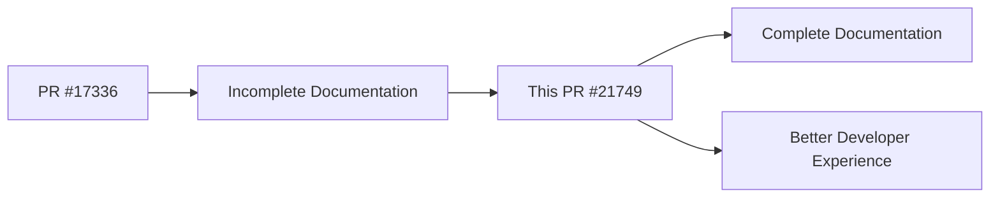

+++
title = "#21749 fix doc for struct World"
date = "2025-11-05T00:00:00"
draft = false
template = "pull_request_page.html"
in_search_index = true

[taxonomies]
list_display = ["show"]

[extra]
current_language = "en"
available_languages = {"en" = { name = "English", url = "/pull_request/bevy/2025-11/pr-21749-en-20251105" }, "zh-cn" = { name = "中文", url = "/pull_request/bevy/2025-11/pr-21749-zh-cn-20251105" }}
labels = ["C-Docs", "D-Trivial", "A-ECS"]
+++

# Title

## Basic Information
- **Title**: fix doc for struct World
- **PR Link**: https://github.com/bevyengine/bevy/pull/21749
- **Author**: bieyuanxi
- **Status**: MERGED
- **Labels**: C-Docs, D-Trivial, A-ECS, S-Ready-For-Final-Review
- **Created**: 2025-11-05T07:09:49Z
- **Merged**: 2025-11-05T18:41:27Z
- **Merged By**: alice-i-cecile

## Description Translation
**Objective**
PR #17336 has a doc flaw.

**Solution**
- fix it

**Testing**
- trivial

---

## The Story of This Pull Request

This pull request addresses a small but important documentation issue in the Bevy ECS (Entity Component System) codebase. The problem originated from PR #17336, which introduced incomplete documentation for the `World` struct - a fundamental component of Bevy's ECS architecture.

The issue was straightforward: the documentation comment for the `World` struct contained an incomplete sentence. The original text stated that entity components "can be created, updated, removed, and queried using a given" but failed to specify what exactly these operations use. This left developers reading the documentation with an incomplete understanding of how to interact with the ECS system.

The solution implemented in this PR is minimal and precise - adding the missing `[World]` reference to complete the sentence. While this change appears simple on the surface, it serves an important purpose in maintaining the quality and clarity of Bevy's documentation. Well-documented core APIs are crucial for a game engine like Bevy, where developers need to understand the fundamental building blocks of the ECS system.

The fix follows Rust documentation conventions by using markdown link syntax `[World]` to create a clickable reference to the `World` struct definition. This allows developers reading the documentation to easily navigate to the struct's detailed implementation if they need more information.

The change was reviewed and merged quickly, indicating that the maintainers recognized it as a straightforward improvement to the codebase. This type of documentation maintenance is essential for open-source projects, as it helps reduce the learning curve for new contributors and ensures that core APIs remain well-documented as the codebase evolves.

## Visual Representation



## Key Files Changed

**crates/bevy_ecs/src/world/mod.rs** (+1/-1)

This file contains the core implementation of the `World` struct in Bevy's ECS system. The `World` is the central container that stores all entities, components, and their associated metadata.

**Change Details:**
The modification was a single-line documentation fix that completes an incomplete sentence in the struct's documentation.

```rust
// File: crates/bevy_ecs/src/world/mod.rs
// Before:
/// Entity components can be created, updated, removed, and queried using a given

// After:
/// Entity components can be created, updated, removed, and queried using a given [`World`].
```

The change adds the missing `[World]` reference, which:
1. Completes the grammatical structure of the sentence
2. Provides a clickable link to the `World` struct in the generated documentation
3. Clarifies that the `World` instance itself is the context for these operations

## Further Reading

- [Bevy ECS Documentation](https://docs.rs/bevy_ecs/latest/bevy_ecs/) - Official Bevy ECS documentation
- [Rust Documentation Guidelines](https://rust-lang.github.io/rfcs/1574-more-api-documentation-conventions.html) - Rust API documentation conventions
- [Bevy Book - ECS Chapter](https://bevyengine.org/learn/book/ecs/) - Comprehensive guide to Bevy's ECS system

# Full Code Diff
```diff
diff --git a/crates/bevy_ecs/src/world/mod.rs b/crates/bevy_ecs/src/world/mod.rs
index ff5081cddd1ae..a4f49c7460a35 100644
--- a/crates/bevy_ecs/src/world/mod.rs
+++ b/crates/bevy_ecs/src/world/mod.rs
@@ -75,7 +75,7 @@ use unsafe_world_cell::UnsafeWorldCell;
 /// and their associated metadata.
 ///
 /// Each [`Entity`] has a set of unique components, based on their type.
-/// Entity components can be created, updated, removed, and queried using a given
+/// Entity components can be created, updated, removed, and queried using a given [`World`].
 ///
 /// For complex access patterns involving [`SystemParam`](crate::system::SystemParam),
 /// consider using [`SystemState`](crate::system::SystemState).
```