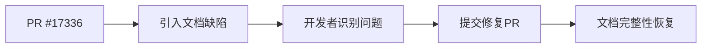

+++
title = "#21749 fix doc for struct World"
date = "2025-11-05T00:00:00"
draft = false
template = "pull_request_page.html"
in_search_index = false

[extra]
current_language = "zh-cn"
available_languages = {"en" = { name = "English", url = "/pull_request/bevy/2025-11/pr-21749-en-20251105" }, "zh-cn" = { name = "中文", url = "/pull_request/bevy/2025-11/pr-21749-zh-cn-20251105" }}
labels = ["C-Docs", "D-Trivial", "A-ECS"]
+++

# Title

## Basic Information
- **Title**: fix doc for struct World
- **PR Link**: https://github.com/bevyengine/bevy/pull/21749
- **Author**: bieyuanxi
- **Status**: MERGED
- **Labels**: C-Docs, D-Trivial, A-ECS, S-Ready-For-Final-Review
- **Created**: 2025-11-05T07:09:49Z
- **Merged**: 2025-11-05T18:41:27Z
- **Merged By**: alice-i-cecile

## Description Translation
修复 PR #17336 中的一个文档缺陷。

### 解决方案
- 修复该文档问题

### 测试
- 简单修改

---

## The Story of This Pull Request

这是一个典型的文档维护案例，展示了开源项目中如何保持代码文档的准确性和一致性。问题的根源可以追溯到 PR #17336，该 PR 在修改代码时引入了一个文档上的小缺陷。

在 `World` 结构体的文档注释中，原本的句子在语法上是不完整的：

```rust
/// Entity components can be created, updated, removed, and queried using a given
```

这个句子以 "using a given" 结尾，但没有指定具体是什么。从技术角度看，这就像是一个函数声明缺少了参数类型，或者一个变量声明缺少了类型注解。虽然对于熟悉 ECS 系统的开发者来说，能够推断出这里应该是指 `World` 实例，但对于新接触 Bevy 的开发者来说，这种不完整的文档会造成困惑。

开发者 bieyuanxi 识别到了这个问题，并提供了一个直接的修复方案：在文档中添加对 `World` 类型的引用链接。修改后的文档：

```rust
/// Entity components can be created, updated, removed, and queried using a given [`World`].
```

这个修改虽然简单，但体现了几个重要的工程实践：

1. **文档完整性**：确保所有技术文档都是自包含且完整的
2. **类型链接**：使用 `[`World`]` 语法创建到 `World` 类型的内部文档链接，提供了更好的导航体验
3. **一致性维护**：保持代码库中所有文档的统一质量标准

从技术角度看，这个修改属于 Rust 文档注释的标准实践。`[`World`]` 语法利用了 Rustdoc 的链接功能，会自动生成指向 `World` 结构体文档的链接。这种内联文档链接是 Rust 生态系统中的常见模式，有助于创建相互关联的文档网络。

这个 PR 被标记为 "D-Trivial"（简单修改）和 "C-Docs"（文档类别），准确地反映了修改的性质。虽然修改很小，但它体现了开源项目维护中对细节的关注 - 即使是单行的文档问题也会得到及时的修复。

## Visual Representation



## Key Files Changed

### `crates/bevy_ecs/src/world/mod.rs` (+1/-1)

这个文件包含了 ECS 系统中核心的 `World` 结构体定义。修改发生在 `World` 结构体的文档注释中。

**修改详情：**

```rust
// Before:
/// Entity components can be created, updated, removed, and queried using a given

// After:
/// Entity components can be created, updated, removed, and queried using a given [`World`].
```

**修改说明：**
- 在文档注释的末尾添加了 `[`World`]` 链接
- 修复了语法不完整的问题
- 提供了到 `World` 类型文档的直接链接

这个修改确保了 `World` 结构体的文档在技术上是准确和完整的，为开发者提供了更好的文档体验。

## Further Reading

对于想要了解更多关于 Rust 文档实践和 Bevy ECS 系统的开发者，建议参考：

1. [Rust 官方文档 - 文档注释](https://doc.rust-lang.org/rustdoc/how-to-write-documentation.html)
2. [Bevy ECS 系统文档](https://bevyengine.org/learn/quick-start/ecs/)
3. [Rustdoc 链接语法指南](https://doc.rust-lang.org/rustdoc/linking-to-items-by-name.html)

# Full Code Diff
```diff
diff --git a/crates/bevy_ecs/src/world/mod.rs b/crates/bevy_ecs/src/world/mod.rs
index ff5081cddd1ae..a4f49c7460a35 100644
--- a/crates/bevy_ecs/src/world/mod.rs
+++ b/crates/bevy_ecs/src/world/mod.rs
@@ -75,7 +75,7 @@ use unsafe_world_cell::UnsafeWorldCell;
 /// and their associated metadata.
 ///
 /// Each [`Entity`] has a set of unique components, based on their type.
-/// Entity components can be created, updated, removed, and queried using a given
+/// Entity components can be created, updated, removed, and queried using a given [`World`].
 ///
 /// For complex access patterns involving [`SystemParam`](crate::system::SystemParam),
 /// consider using [`SystemState`](crate::system::SystemState).
```