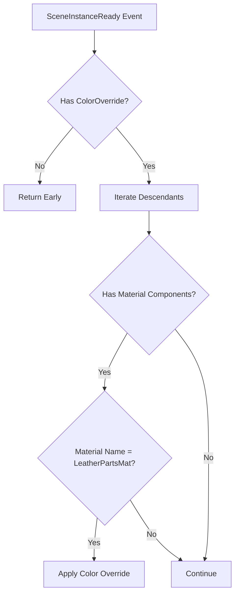

+++
title = "#21751 Shortcircuit `SceneInstanceReady` on models that do not have `ColorOverride`"
date = "2025-11-06T00:00:00"
draft = false
template = "pull_request_page.html"
in_search_index = true

[taxonomies]
list_display = ["show"]

[extra]
current_language = "en"
available_languages = {"en" = { name = "English", url = "/pull_request/bevy/2025-11/pr-21751-en-20251106" }, "zh-cn" = { name = "中文", url = "/pull_request/bevy/2025-11/pr-21751-zh-cn-20251106" }}
labels = ["C-Examples", "A-Assets", "C-Code-Quality"]
+++

# Title

## Basic Information
- **Title**: Shortcircuit `SceneInstanceReady` on models that do not have `ColorOverride`
- **PR Link**: https://github.com/bevyengine/bevy/pull/21751
- **Author**: hukasu
- **Status**: MERGED
- **Labels**: C-Examples, A-Assets, C-Code-Quality, S-Ready-For-Final-Review
- **Created**: 2025-11-05T12:24:46Z
- **Merged**: 2025-11-06T18:49:09Z
- **Merged By**: alice-i-cecile

## Description Translation
# Objective

The `edit_material_on_gltf` example was iterating over all materials of a Gltf even when it did not have `ColorOverride`.

## Solution

Shortcircuit observer if scene does not have `ColorOverride`

## Testing

Ran the example

## The Story of This Pull Request

This PR addresses a performance issue in the `edit_material_on_gltf` example where unnecessary processing was occurring. The problem was straightforward: when a scene instance became ready, the system would iterate through all descendant entities and their materials, even when there was no color override to apply.

The core issue was in the control flow. The original implementation checked for the `ColorOverride` component inside the loop that iterated over scene descendants, after already performing several other checks and operations. This meant that even when no color override was present, the system would still:

1. Iterate through all descendant entities
2. Check each entity for material components
3. Validate material names
4. Only then skip the actual color modification

The solution implemented a short-circuit pattern by moving the `ColorOverride` check to the very beginning of the system function. Now, when a `SceneInstanceReady` event fires, the system immediately checks if the scene entity has a `ColorOverride` component. If it doesn't, the function returns early, avoiding all the expensive descendant iteration and material checking.

This change demonstrates a common optimization pattern in ECS systems: placing the most restrictive conditions first to minimize unnecessary work. The performance improvement scales with scene complexity - larger scenes with more entities and materials benefit more from this optimization.

The implementation also improved code clarity by adding better documentation. The comments now clearly explain that the system only modifies materials named "LeatherPartsMat" and explicitly mentions the short-circuiting behavior when no `ColorOverride` is present.

## Visual Representation



## Key Files Changed

**File:** `examples/gltf/edit_material_on_gltf.rs` (+12/-5)

This is the only file modified in the PR. The changes focus on optimizing the material modification system and improving documentation.

### Key Changes:

1. **Documentation Improvements:**
```rust
// Before:
/// This is added to a [`SceneRoot`] and will cause the [`StandardMaterial::base_color`]
/// of all materials to be overwritten

// After:
/// This is added to a [`SceneRoot`] and will cause the [`StandardMaterial::base_color`]
/// of materials with [`GltfMaterialName`] equal to `LeatherPartsMat`.
```

2. **Early Return Implementation:**
```rust
// Before:
fn change_material(
    scene_ready: On<SceneInstanceReady>,
    mut commands: Commands,
    children: Query<&Children>,
    color_override: Query<&ColorOverride>,
    mut materials: Query<(&mut Handle<StandardMaterial>, &GltfMaterialName)>,
    mut asset_materials: ResMut<Assets<StandardMaterial>>,
) {
    info!("processing Scene Entity: {}", scene_ready.entity);
    // Iterate over all children recursively
    for descendant in children.iter_descendants(scene_ready.entity) {
        // ... material checking logic ...
        match material_name.0.as_str() {
            "LeatherPartsMat" => {
                // ColorOverride check was inside the match arm
                let Ok(color_override) = color_override.get(scene_ready.entity) else {
                    continue;
                };
                // ... color modification logic ...
            }
        }
    }
}

// After:
fn change_material(
    scene_ready: On<SceneInstanceReady>,
    mut commands: Commands,
    children: Query<&Children>,
    color_override: Query<&ColorOverride>,
    mut materials: Query<(&mut Handle<StandardMaterial>, &GltfMaterialName)>,
    mut asset_materials: ResMut<Assets<StandardMaterial>>,
) {
    info!("processing Scene Entity: {}", scene_ready.entity);

    // Get the `ColorOverride` of the entity, if it does not have a color override, return
    let Ok(color_override) = color_override.get(scene_ready.entity) else {
        info!("{} does not have a color override", scene_ready.entity);
        return;
    };

    // Rest of the iteration logic remains but now only runs when needed
    for descendant in children.iter_descendants(scene_ready.entity) {
        // ... material checking logic ...
        match material_name.0.as_str() {
            "LeatherPartsMat" => {
                // ColorOverride is now available from the early check
                // ... color modification logic using color_override ...
            }
        }
    }
}
```

The key insight here is moving the `ColorOverride` query check outside the loop, which transforms an O(n) operation (where n is the number of descendants) into an O(1) check for the common case where no color override is present.

## Further Reading

- [Bevy ECS System Optimization Patterns](https://bevy-cheatbook.github.io/programming/system-params.html)
- [Bevy Query Documentation](https://docs.rs/bevy/latest/bevy/ecs/system/struct.Query.html)
- [Early Return Pattern in Systems](https://bevy-cheatbook.github.io/programming/system-commands.html#early-return)