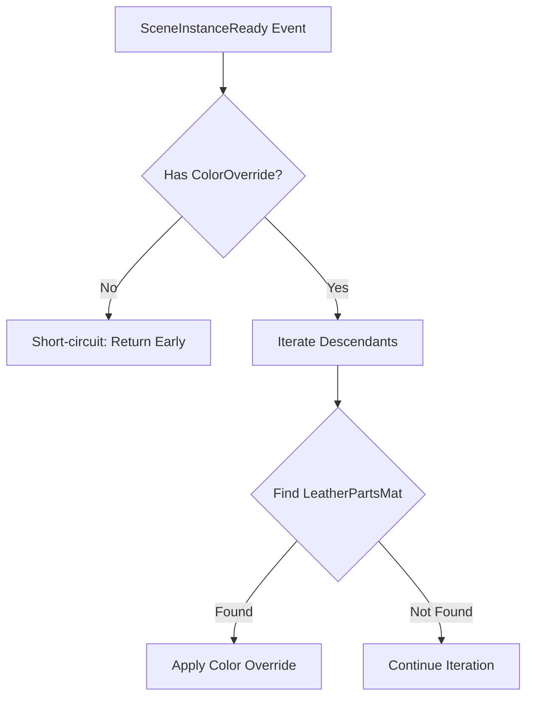

+++
title = "#21751 Shortcircuit `SceneInstanceReady` on models that do not have `ColorOverride`"
date = "2025-11-06T00:00:00"
draft = false
template = "pull_request_page.html"
in_search_index = false

[extra]
current_language = "zh-cn"
available_languages = {"en" = { name = "English", url = "/pull_request/bevy/2025-11/pr-21751-en-20251106" }, "zh-cn" = { name = "中文", url = "/pull_request/bevy/2025-11/pr-21751-zh-cn-20251106" }}
labels = ["C-Examples", "A-Assets", "C-Code-Quality"]
+++

# Title

## Basic Information
- **Title**: Shortcircuit `SceneInstanceReady` on models that do not have `ColorOverride`
- **PR Link**: https://github.com/bevyengine/bevy/pull/21751
- **Author**: hukasu
- **Status**: MERGED
- **Labels**: C-Examples, A-Assets, C-Code-Quality, S-Ready-For-Final-Review
- **Created**: 2025-11-05T12:24:46Z
- **Merged**: 2025-11-06T18:49:09Z
- **Merged By**: alice-i-cecile

## Description Translation
# 目标

即使没有 `ColorOverride`，`edit_material_on_gltf` 示例也会遍历 Gltf 的所有材质。

## 解决方案

如果场景没有 `ColorOverride`，则短路观察器

## 测试

运行了该示例

## The Story of This Pull Request

这个PR解决了一个在Bevy引擎的`edit_material_on_gltf`示例中的性能优化问题。问题的核心在于系统处理场景实例准备时的效率不足。

**问题分析**：
在原始的`change_material`系统实现中，每当`SceneInstanceReady`事件触发时，系统会无条件地遍历场景中所有实体的后代，检查每个后代是否具有特定的材质名称。只有当找到匹配的材质名称后，才会检查根实体是否具有`ColorOverride`组件。

```rust
// 原始实现的问题：先遍历所有后代，再检查ColorOverride
for descendant in children.iter_descendants(scene_ready.entity) {
    // ... 获取材质信息
    match material_name.0.as_str() {
        "LeatherPartsMat" => {
            // 在循环内部检查ColorOverride
            let Ok(color_override) = color_override.get(scene_ready.entity) else {
                continue;
            };
            // ... 修改材质
        }
    }
}
```

这种实现方式在性能上存在问题，因为即使场景根实体没有`ColorOverride`组件，系统仍然会遍历整个场景层级结构的所有后代实体，执行不必要的查询和匹配操作。

**解决方案**：
PR通过引入短路逻辑（short-circuiting）来优化这个问题。新的实现在进入循环之前先检查场景根实体是否具有`ColorOverride`组件：

```rust
// 优化后的实现：先检查ColorOverride，再决定是否遍历
let Ok(color_override) = color_override.get(scene_ready.entity) else {
    info!("{} does not have a color override", scene_ready.entity);
    return;
};
```

这种改变带来了显著的性能改进：
- 对于没有`ColorOverride`组件的场景，系统立即返回，避免了不必要的遍历操作
- 减少了查询次数和内存访问
- 降低了CPU开销，特别是在处理大型场景时效果更明显

**代码质量改进**：
除了性能优化，PR还改进了代码的文档质量：
1. 更新了`ColorOverride`组件的文档注释，更精确地描述了其功能
2. 为`change_material`系统添加了详细的文档注释，说明了系统的行为和条件逻辑

```rust
/// On [`SceneInstanceReady`], iterates over all descendants of the scene
/// and modifies the tint of the material for the materials named `LeatherPartsMat`.
///
/// If the [`SceneRoot`] does not have a [`ColorOverride`], it is skipped.
```

**技术洞察**：
这个优化展示了在Bevy ECS系统中处理观察者模式时的最佳实践：
- 在系统开始时尽早进行条件检查，避免不必要的计算
- 利用ECS的查询系统来快速确定是否需要处理
- 通过日志记录帮助调试系统执行流程

这种短路模式在游戏开发中特别重要，因为它可以显著减少每帧的计算量，特别是在处理复杂场景和大量实体时。

## Visual Representation



## Key Files Changed

- `examples/gltf/edit_material_on_gltf.rs` (+12/-5)

### 主要变更分析

这个PR只修改了一个文件，但包含了逻辑优化和文档改进：

**核心逻辑变更**：
```rust
// Before:
fn change_material(
    // ... 参数
) {
    info!("processing Scene Entity: {}", scene_ready.entity);
    // 直接开始遍历所有后代
    for descendant in children.iter_descendants(scene_ready.entity) {
        // ... 获取材质信息
        match material_name.0.as_str() {
            "LeatherPartsMat" => {
                // 在循环内部检查ColorOverride
                let Ok(color_override) = color_override.get(scene_ready.entity) else {
                    continue;
                };
                // ... 修改材质逻辑
            }
        }
    }
}

// After:
fn change_material(
    // ... 参数
) {
    info!("processing Scene Entity: {}", scene_ready.entity);

    // 新增：在循环前检查ColorOverride
    let Ok(color_override) = color_override.get(scene_ready.entity) else {
        info!("{} does not have a color override", scene_ready.entity);
        return;
    };

    // 只有在有ColorOverride时才遍历后代
    for descendant in children.iter_descendants(scene_ready.entity) {
        // ... 获取材质信息
        match material_name.0.as_str() {
            "LeatherPartsMat" => {
                // 移除了内部的ColorOverride检查
                info!("editing LeatherPartsMat to use ColorOverride tint");
                // ... 修改材质逻辑（现在可以直接使用color_override）
            }
        }
    }
}
```

**文档改进**：
```rust
// Before:
/// This is added to a [`SceneRoot`] and will cause the [`StandardMaterial::base_color`]
/// of all materials to be overwritten

// After:
/// This is added to a [`SceneRoot`] and will cause the [`StandardMaterial::base_color`]
/// of materials with [`GltfMaterialName`] equal to `LeatherPartsMat`.
```

这些变更共同实现了：
1. 性能优化：避免了不必要的场景遍历
2. 代码清晰度：移除了嵌套的条件检查
3. 文档准确性：更精确地描述了组件的行为

## Further Reading

- [Bevy ECS 系统文档](https://bevyengine.org/learn/book/ecs/system/)
- [Bevy 观察者模式最佳实践](https://bevyengine.org/learn/book/patterns/observer/)
- [Rust 性能优化技巧](https://doc.rust-lang.org/book/ch13-00-functional-features.html)
- [ECS 系统中的查询优化](https://bevyengine.org/learn/book/ecs/queries/)