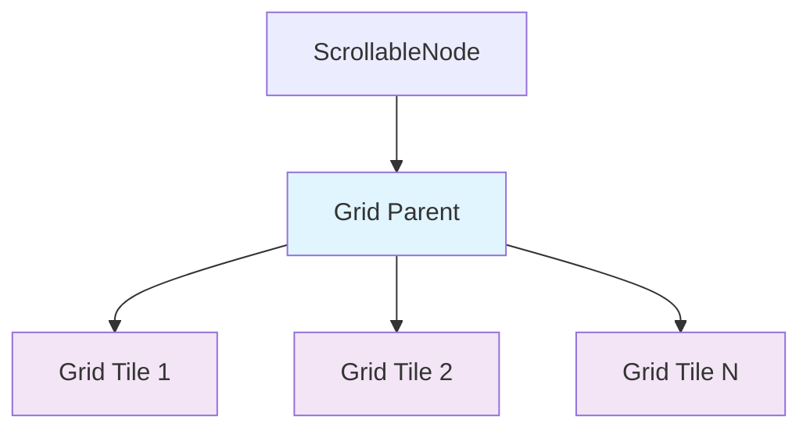

+++
title = "#21752 Fix dragging bug in drag_to_scroll example"
date = "2025-11-05T00:00:00"
draft = false
template = "pull_request_page.html"
in_search_index = true

[taxonomies]
list_display = ["show"]

[extra]
current_language = "en"
available_languages = {"en" = { name = "English", url = "/pull_request/bevy/2025-11/pr-21752-en-20251105" }, "zh-cn" = { name = "中文", url = "/pull_request/bevy/2025-11/pr-21752-zh-cn-20251105" }}
labels = ["C-Bug", "C-Examples", "A-UI"]
+++

# Fix dragging bug in drag_to_scroll example

## Basic Information
- **Title**: Fix dragging bug in drag_to_scroll example
- **PR Link**: https://github.com/bevyengine/bevy/pull/21752
- **Author**: rudderbucky
- **Status**: MERGED
- **Labels**: C-Bug, C-Examples, A-UI, S-Ready-For-Final-Review
- **Created**: 2025-11-05T13:49:27Z
- **Merged**: 2025-11-05T19:26:21Z
- **Merged By**: alice-i-cecile

## Description Translation
# Objective

Fixes #21675. The issue was that the position the drag started on was never saved so new drags always forced the grid to its initial position.

The original entity hierarchy consists of a `ScrollableNode`, with a child node (grid parent), which itself has a bunch of nodes as children (grid tiles). Only the grid node has a `Pickable` component.

There are a few issues in the original code:

* Since grid tiles have `should_block_lower = false` and `is_hoverable = true`, they will allow drag events to propagate to the grid parent. Since the grid parent does not have `Pickable`, it blocks further propagation but does ding a scroll event. This creates two scroll events observed by the `ScrollableNode`.
* However, neither of these are the same entity as the `ScrollableNode`, so both events fail the check originally on line 59 (`drag_start.entity != drag_start.original_event_target()`).

## Solution

I tried to fix both issues.

* Add `Pickable` to the grid parent with `should_block_lower = true` and `is_hoverable = false`. This way it does not ding an event nor does it propagate further. This ensures there is only one scroll event ever going through.
* Remove the line 59 entity check as it is no longer necessary.

## Testing

Tested on macOS, seems to work fine.

## The Story of This Pull Request

The drag-to-scroll example in Bevy was experiencing a critical bug where users couldn't properly scroll through content by dragging. Every new drag attempt would reset the scroll position to its initial state, making the feature essentially unusable. This bug was reported in issue #21675 and required immediate attention since it affected a core UI interaction pattern.

The root cause was found in the event handling architecture. The original implementation had a complex hierarchy where grid tiles had specific `Pickable` configurations that allowed drag events to propagate upward, while the grid parent lacked proper event handling configuration. This resulted in multiple scroll events being generated, none of which passed the entity validation check designed to filter events.

The developer approached this problem by addressing both the event propagation issue and the overly restrictive validation. First, they added a `Pickable` component to the grid parent node with specific configurations: `is_hoverable: false` to prevent it from generating hover events, and `should_block_lower: true` to properly handle event propagation. This ensured that only one clean scroll event would be processed.

Second, they removed the entity validation check that was preventing legitimate scroll events from being processed. The combination of these changes created a clean event flow where drag interactions would properly update the scroll position without resetting it.

The implementation demonstrates good understanding of Bevy's event system and the importance of proper component configuration in UI hierarchies. By ensuring that each layer in the UI tree has appropriate event handling characteristics, the developer created a robust solution that prevents multiple event generation while maintaining the intended user interaction behavior.

## Visual Representation



*Blue: Grid Parent (now has Pickable component)*  
*Purple: Grid Tiles (have Pickable with different configuration)*

## Key Files Changed

### `examples/ui/drag_to_scroll.rs` (+13/-10)

This is the main example file that demonstrates drag-to-scroll functionality. The changes fix the event handling to prevent scroll position reset on new drags.

**Key Changes:**

1. **Removed entity validation check** - The original code had a check that prevented scroll position updates if the drag entity didn't match the original event target:

```rust
// Before:
|drag_start: On<Pointer<DragStart>>,
 mut scroll_position_query: Query<
    (&ComputedNode, &mut ScrollStart),
    With<ScrollableNode>,
>| {
    if drag_start.entity != drag_start.original_event_target() {
        return;
    }
    // ... rest of function
}

// After:
|_: On<Pointer<DragStart>>,
 mut scroll_position_query: Query<
    (&ComputedNode, &mut ScrollStart),
    With<ScrollableNode>,
>| {
    // ... rest of function (check removed)
}
```

2. **Added Pickable component to grid parent** - The grid parent node now includes proper event handling configuration:

```rust
// Before:
commands
    .spawn(Node {
        display: Display::Grid,
        grid_template_rows: RepeatedGridTrack::px(w as i32, 100.),
        grid_template_columns: RepeatedGridTrack::px(h as i32, 100.),
        ..default()
    })

// After:
commands
    .spawn((
        Node {
            display: Display::Grid,
            grid_template_rows: RepeatedGridTrack::px(w as i32, 100.),
            grid_template_columns: RepeatedGridTrack::px(h as i32, 100.),
            ..default()
        },
        Pickable {
            is_hoverable: false,
            should_block_lower: true,
        }
    ))
```

These changes work together to ensure that drag events are properly handled at the grid parent level, preventing multiple event generation and allowing the scroll position to be correctly maintained during drag operations.

## Further Reading

- [Bevy UI Documentation](https://bevyengine.org/learn/books/ui/) - Comprehensive guide to Bevy's UI system
- [Bevy Input Events](https://bevyengine.org/learn/books/input/) - Understanding Bevy's input handling system
- [Bevy Examples](https://github.com/bevyengine/bevy/tree/main/examples) - Other UI examples demonstrating different interaction patterns

## Full Code Diff
```diff
diff --git a/examples/ui/drag_to_scroll.rs b/examples/ui/drag_to_scroll.rs
index 7de099e02602a..54a63a442cfd6 100644
--- a/examples/ui/drag_to_scroll.rs
+++ b/examples/ui/drag_to_scroll.rs
@@ -51,14 +51,11 @@ fn setup(mut commands: Commands) {
             },
         )
         .observe(
-            |drag_start: On<Pointer<DragStart>>,
+            |_: On<Pointer<DragStart>>,
              mut scroll_position_query: Query<
                 (&ComputedNode, &mut ScrollStart),
                 With<ScrollableNode>,
             >| {
-                if drag_start.entity != drag_start.original_event_target() {
-                    return;
-                }
                 if let Ok((computed_node, mut start)) = scroll_position_query.single_mut() {
                     start.0 = computed_node.scroll_position * computed_node.inverse_scale_factor;
                 }
@@ -66,12 +63,18 @@ fn setup(mut commands: Commands) {
         )
         .with_children(|commands| {
             commands
-                .spawn(Node {
-                    display: Display::Grid,
-                    grid_template_rows: RepeatedGridTrack::px(w as i32, 100.),
-                    grid_template_columns: RepeatedGridTrack::px(h as i32, 100.),
-                    ..default()
-                })
+                .spawn((
+                    Node {
+                        display: Display::Grid,
+                        grid_template_rows: RepeatedGridTrack::px(w as i32, 100.),
+                        grid_template_columns: RepeatedGridTrack::px(h as i32, 100.),
+                        ..default()
+                    },
+                    Pickable {
+                        is_hoverable: false,
+                        should_block_lower: true,
+                    }
+                ))
                 .with_children(|commands| {
                     for y in 0..h {
                         for x in 0..w {
```