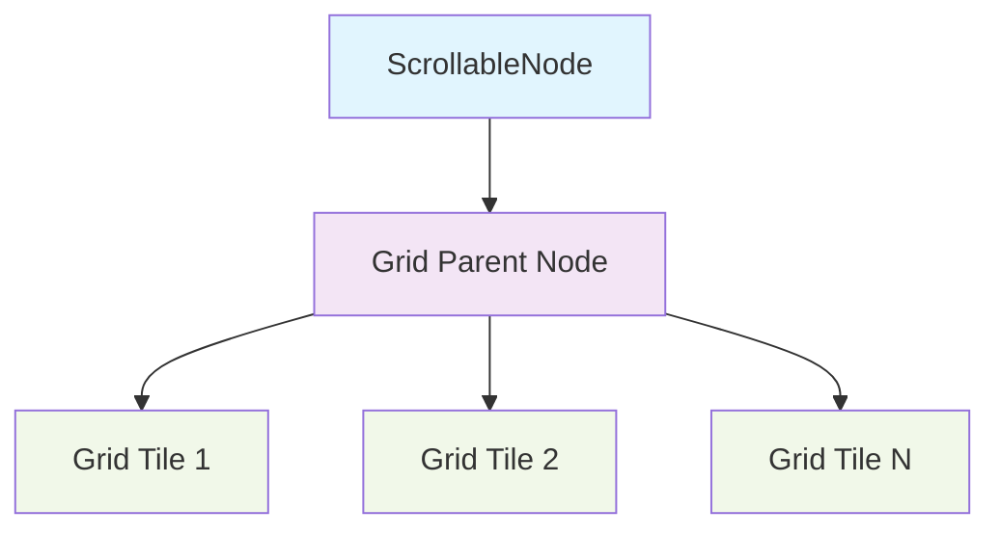

+++
title = "#21752 Fix dragging bug in drag_to_scroll example"
date = "2025-11-05T00:00:00"
draft = false
template = "pull_request_page.html"
in_search_index = false

[extra]
current_language = "zh-cn"
available_languages = {"en" = { name = "English", url = "/pull_request/bevy/2025-11/pr-21752-en-20251105" }, "zh-cn" = { name = "中文", url = "/pull_request/bevy/2025-11/pr-21752-zh-cn-20251105" }}
labels = ["C-Bug", "C-Examples", "A-UI"]
+++

# Title

## Basic Information
- **Title**: Fix dragging bug in drag_to_scroll example
- **PR Link**: https://github.com/bevyengine/bevy/pull/21752
- **Author**: rudderbucky
- **Status**: MERGED
- **Labels**: C-Bug, C-Examples, A-UI, S-Ready-For-Final-Review
- **Created**: 2025-11-05T13:49:27Z
- **Merged**: 2025-11-05T19:26:21Z
- **Merged By**: alice-i-cecile

## Description Translation
# 目标

修复 #21675。问题在于拖拽开始的位置从未被保存，因此每次新的拖拽都会强制将网格重置到初始位置。

原始的实体层次结构包含一个 `ScrollableNode`，它有一个子节点（网格父节点），该子节点本身又有一系列子节点（网格瓦片）。只有网格节点具有 `Pickable` 组件。

原始代码中存在几个问题：

* 由于网格瓦片设置了 `should_block_lower = false` 和 `is_hoverable = true`，它们会允许拖拽事件传播到网格父节点。由于网格父节点没有 `Pickable` 组件，它会阻止进一步传播但不会触发滚动事件。这导致 `ScrollableNode` 观察到两个滚动事件。
* 然而，这两个事件都不是 `ScrollableNode` 实体本身，因此两个事件都无法通过原始代码第59行的检查（`drag_start.entity != drag_start.original_event_target()`）。

## 解决方案

我尝试修复这两个问题：

* 为网格父节点添加 `Pickable` 组件，设置 `should_block_lower = true` 和 `is_hoverable = false`。这样它既不会触发事件也不会进一步传播。这确保了只有一个滚动事件通过。
* 移除第59行的实体检查，因为它不再必要。

## 测试

在 macOS 上测试，似乎工作正常。

## The Story of This Pull Request

这个PR解决了一个在Bevy引擎UI示例中的拖拽滚动bug。问题的核心在于事件传播机制和实体层次结构之间的不匹配。

**问题背景**
在原始的 `drag_to_scroll` 示例中，开发者遇到了一个令人困惑的行为：每次开始拖拽时，网格都会重置到初始位置，而不是从当前位置继续滚动。通过分析问题 #21675，作者发现根本原因在于拖拽开始位置的计算逻辑存在问题。

**技术分析**
问题的技术根源在于Bevy的事件系统和UI实体层次结构的交互方式。在原始实现中：

- `ScrollableNode`（可滚动节点）包含一个网格父节点
- 网格父节点包含多个网格瓦片子节点
- 只有网格瓦片具有 `Pickable` 组件，用于处理交互

由于网格瓦片配置为 `should_block_lower = false` 和 `is_hoverable = true`，当用户拖拽时：
1. 拖拽事件首先在网格瓦片上触发
2. 由于 `should_block_lower = false`，事件传播到网格父节点
3. 网格父节点没有 `Pickable` 组件，但会阻止事件进一步传播
4. 这导致系统观察到两个不同的拖拽事件

更关键的是，原始代码中的检查逻辑：
```rust
if drag_start.entity != drag_start.original_event_target() {
    return;
}
```
这个检查阻止了正确的滚动位置更新，因为事件目标实体与期望的实体不匹配。

**解决方案实现**
作者采用了双重修复策略来解决这个问题：

首先，在网格父节点上添加了适当的 `Pickable` 组件：
```rust
.spawn((
    Node {
        display: Display::Grid,
        grid_template_rows: RepeatedGridTrack::px(w as i32, 100.),
        grid_template_columns: RepeatedGridTrack::px(h as i32, 100.),
        ..default()
    },
    Pickable {
        is_hoverable: false,
        should_block_lower: true,
    }
))
```

这个配置确保：
- `is_hoverable: false` - 网格父节点不会干扰悬停检测
- `should_block_lower: true` - 事件在网格父节点处被正确处理，不会产生重复事件

其次，移除了有问题的实体检查：
```rust
// 移除的代码：
// if drag_start.entity != drag_start.original_event_target() {
//     return;
// }
```

**技术洞察**
这个修复展示了Bevy事件系统中一个重要概念：事件传播链的管理。通过正确配置 `Pickable` 组件的属性，开发者可以精确控制事件如何在UI层次结构中传播。

关键的技术要点：
1. **事件传播控制**：`should_block_lower` 控制事件是否继续向下传播
2. **悬停行为**：`is_hoverable` 决定组件是否参与悬停检测
3. **实体层次关系**：在复杂的UI结构中，需要仔细考虑事件目标和实体关系

**影响评估**
这个修复虽然只涉及示例代码，但具有重要的教育价值：
- 为其他开发者展示了正确处理UI拖拽事件的方法
- 演示了如何调试和修复事件传播问题
- 提供了配置 `Pickable` 组件的最佳实践

修复后，拖拽滚动行为变得平滑和可预测，从用户体验角度提供了显著的改进。

## Visual Representation



**图例说明**：
- **蓝色**：ScrollableNode - 处理滚动的根节点
- **紫色**：Grid Parent Node - 新增Pickable组件的网格父节点
- **绿色**：Grid Tiles - 原有的可交互网格瓦片

## Key Files Changed

### `examples/ui/drag_to_scroll.rs` (+13/-10)

这个文件包含了修复拖拽滚动bug的所有关键修改。

**主要修改**：

1. **移除实体检查逻辑**：
```rust
// 移除的代码：
// if drag_start.entity != drag_start.original_event_target() {
//     return;
// }
```

这个检查原本用于防止错误的事件处理，但由于事件传播机制的问题，它实际上阻止了正确的滚动位置更新。

2. **为网格父节点添加Pickable组件**：
```rust
// 修改前：
.spawn(Node {
    display: Display::Grid,
    grid_template_rows: RepeatedGridTrack::px(w as i32, 100.),
    grid_template_columns: RepeatedGridTrack::px(h as i32, 100.),
    ..default()
})

// 修改后：
.spawn((
    Node {
        display: Display::Grid,
        grid_template_rows: RepeatedGridTrack::px(w as i32, 100.),
        grid_template_columns: RepeatedGridTrack::px(h as i32, 100.),
        ..default()
    },
    Pickable {
        is_hoverable: false,
        should_block_lower: true,
    }
))
```

这个修改确保了事件在网格父节点层面被正确处理，避免了重复的事件传播。

3. **更新事件监听器签名**：
```rust
// 修改前：
|drag_start: On<Pointer<DragStart>>,

// 修改后：
|_: On<Pointer<DragStart>>,
```

由于不再需要检查drag_start的具体属性，参数被简化。

## Further Reading

对于想要深入了解相关概念的开发者，建议参考：

1. **Bevy官方文档**：
   - [Bevy UI 系统](https://bevyengine.org/learn/books/introduction/ui) - 了解Bevy的UI架构
   - [事件系统](https://bevyengine.org/learn/books/introduction/events) - 掌握Bevy事件处理机制

2. **Pickable组件文档**：
   - `Pickable` 组件的详细属性和行为说明

3. **相关PR和Issue**：
   - 原始问题 #21675
   - 其他UI交互相关的PR和示例

# Full Code Diff
```
diff --git a/examples/ui/drag_to_scroll.rs b/examples/ui/drag_to_scroll.rs
index 7de099e02602a..54a63a442cfd6 100644
--- a/examples/ui/drag_to_scroll.rs
+++ b/examples/ui/drag_to_scroll.rs
@@ -51,14 +51,11 @@ fn setup(mut commands: Commands) {
             },
         )
         .observe(
-            |drag_start: On<Pointer<DragStart>>,
+            |_: On<Pointer<DragStart>>,
              mut scroll_position_query: Query<
                 (&ComputedNode, &mut ScrollStart),
                 With<ScrollableNode>,
             >| {
-                if drag_start.entity != drag_start.original_event_target() {
-                    return;
-                }
                 if let Ok((computed_node, mut start)) = scroll_position_query.single_mut() {
                     start.0 = computed_node.scroll_position * computed_node.inverse_scale_factor;
                 }
@@ -66,12 +63,18 @@ fn setup(mut commands: Commands) {
         )
         .with_children(|commands| {
             commands
-                .spawn(Node {
-                    display: Display::Grid,
-                    grid_template_rows: RepeatedGridTrack::px(w as i32, 100.),
-                    grid_template_columns: RepeatedGridTrack::px(h as i32, 100.),
-                    ..default()
-                })
+                .spawn((
+                    Node {
+                        display: Display::Grid,
+                        grid_template_rows: RepeatedGridTrack::px(w as i32, 100.),
+                        grid_template_columns: RepeatedGridTrack::px(h as i32, 100.),
+                        ..default()
+                    },
+                    Pickable {
+                        is_hoverable: false,
+                        should_block_lower: true,
+                    }
+                ))
                 .with_children(|commands| {
                     for y in 0..h {
                         for x in 0..w {
```