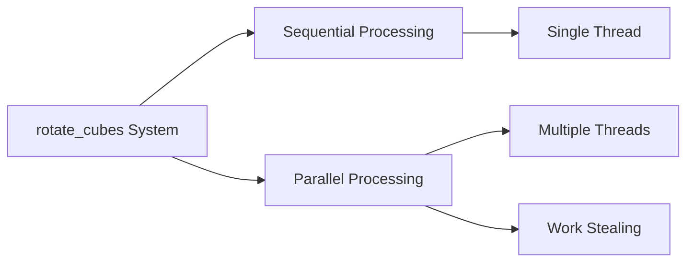

+++
title = "#21755 Update `rotate_cubes` system to use `par_iter_mut()` to reduce its impact on performance"
date = "2025-11-05T00:00:00"
draft = false
template = "pull_request_page.html"
in_search_index = true

[taxonomies]
list_display = ["show"]

[extra]
current_language = "en"
available_languages = {"en" = { name = "English", url = "/pull_request/bevy/2025-11/pr-21755-en-20251105" }, "zh-cn" = { name = "中文", url = "/pull_request/bevy/2025-11/pr-21755-zh-cn-20251105" }}
labels = ["C-Examples", "C-Performance"]
+++

# Title
Update `rotate_cubes` system to use `par_iter_mut()` to reduce its impact on performance

## Basic Information
- **Title**: Update `rotate_cubes` system to use `par_iter_mut()` to reduce its impact on performance
- **PR Link**: https://github.com/bevyengine/bevy/pull/21755
- **Author**: DeVelox
- **Status**: MERGED
- **Labels**: C-Examples, C-Performance, S-Ready-For-Final-Review
- **Created**: 2025-11-05T19:01:04Z
- **Merged**: 2025-11-05T21:48:02Z
- **Merged By**: alice-i-cecile

## Description Translation
Quick follow-up to #21745.

## The Story of This Pull Request

This pull request addresses a straightforward but impactful performance optimization in one of Bevy's stress test examples. The `many_cubes` example is designed to test the engine's capabilities under heavy load by rendering thousands of entities. Within this example, the `rotate_cubes` system was identified as a candidate for parallelization.

The original implementation used a sequential iteration approach with `iter_mut()`, which processed each cube's transform update one at a time on a single thread. Given that this example can involve thousands of cubes, this created unnecessary performance bottlenecks, especially on multi-core systems.

The solution leverages Bevy's built-in parallel iteration capabilities through `par_iter_mut()`. This change allows the system to distribute the workload of updating cube transforms across multiple CPU cores. The transformation logic itself remains unchanged - each cube still rotates around the Y-axis at the same rate - but the execution strategy now takes advantage of modern CPU architectures.

The implementation is minimal and focused. Only two lines of code were modified, replacing the sequential for-loop with a parallel iterator. The key insight here is recognizing that cube rotations are independent operations - updating one cube's transform doesn't affect others, making this an ideal candidate for parallel processing.

From a technical perspective, this change demonstrates several important concepts:

1. **Embarrassing Parallelism**: Each cube rotation is completely independent, requiring no synchronization between iterations
2. **Zero-Cost Abstractions**: The parallel iterator provides significant performance benefits without changing the core logic
3. **Progressive Optimization**: This follows up on previous work (#21745), showing continuous improvement in the codebase

The impact is particularly noticeable in stress testing scenarios where the number of entities is high. While the exact performance improvement depends on hardware configuration (particularly core count), this change reduces the system's impact on frame times and better utilizes available CPU resources.

## Visual Representation



## Key Files Changed

### `examples/stress_tests/many_cubes.rs` (+2/-2)

This file contains the stress test example that renders many cubes. The changes optimize the cube rotation system by parallelizing the transform updates.

```rust
// File: examples/stress_tests/many_cubes.rs
// Before:
for mut transform in query.iter_mut() {
    transform.rotate_y(10.0 * time.delta_secs());
}

// After:
query.par_iter_mut().for_each(|mut transform| {
    transform.rotate_y(10.0 * time.delta_secs());
});
```

The key change replaces the sequential `iter_mut()` with parallel `par_iter_mut()`, distributing the workload of updating cube rotations across multiple threads. The transformation logic (`rotate_y`) remains identical, ensuring the visual behavior of the example is unchanged while improving performance.

## Further Reading

- [Bevy ECS Queries Documentation](https://docs.rs/bevy/latest/bevy/ecs/system/struct.Query.html)
- [Parallel Iteration in Bevy](https://bevy-cheatbook.github.io/programming/parallel-query.html)
- [Rayon Parallel Iterators](https://docs.rs/rayon/latest/rayon/iter/trait.ParallelIterator.html) (the underlying parallelization library used by Bevy)
- [Embarrassingly Parallel Problems](https://en.wikipedia.org/wiki/Embarrassingly_parallel)