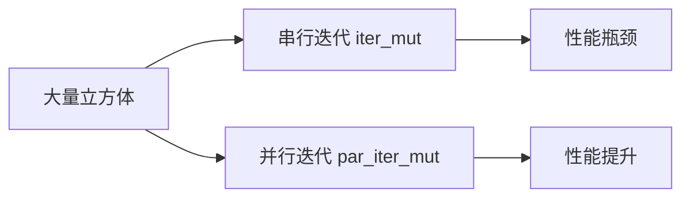

+++
title = "#21755 Update `rotate_cubes` system to use `par_iter_mut()` to reduce its impact on performance"
date = "2025-11-05T00:00:00"
draft = false
template = "pull_request_page.html"
in_search_index = false

[extra]
current_language = "zh-cn"
available_languages = {"en" = { name = "English", url = "/pull_request/bevy/2025-11/pr-21755-en-20251105" }, "zh-cn" = { name = "中文", url = "/pull_request/bevy/2025-11/pr-21755-zh-cn-20251105" }}
+++

# Update `rotate_cubes` system to use `par_iter_mut()` to reduce its impact on performance

## 基本信息
- **标题**: Update `rotate_cubes` system to use `par_iter_mut()` to reduce its impact on performance
- **PR链接**: https://github.com/bevyengine/bevy/pull/21755
- **作者**: DeVelox
- **状态**: 已合并
- **标签**: C-Examples, C-Performance, S-Ready-For-Final-Review
- **创建时间**: 2025-11-05T19:01:04Z
- **合并时间**: 2025-11-05T21:48:02Z
- **合并者**: alice-i-cecile

## 描述翻译
这是对 #21745 的快速跟进。

## 这个Pull Request的故事

### 问题和背景
在 Bevy 引擎的应力测试示例 `many_cubes` 中，`rotate_cubes` 系统负责旋转场景中的所有立方体。这个系统在原始实现中使用了串行迭代：

```rust
for mut transform in query.iter_mut() {
    transform.rotate_y(10.0 * time.delta_secs());
}
```

当场景中包含大量立方体时（这正是应力测试的目的），这种串行处理方式会成为性能瓶颈。每个立方体的旋转操作都是独立的，不存在数据竞争，这为并行化提供了理想条件。

### 解决方案方法
开发者选择了最直接的并行化方案：将 `iter_mut()` 替换为 `par_iter_mut()`。这种方法利用了 Bevy ECS 内置的并行查询能力，无需引入额外的依赖或复杂的代码重构。

### 实现细节
修改的核心是将串行循环转换为并行迭代器模式。新的实现使用了 `par_iter_mut()` 方法，该方法会自动将工作负载分布到多个线程中执行：

```rust
query.par_iter_mut().for_each(|mut transform| {
    transform.rotate_y(10.0 * time.delta_secs());
});
```

这种改变保持了代码的简洁性，同时显著提升了性能。`for_each` 闭包中的逻辑与原始实现完全相同，确保了行为一致性。

### 技术洞察
这个优化展示了 ECS 架构的一个重要优势：由于每个实体的 Transform 组件在内存中是独立存储的，且旋转操作不涉及共享状态，因此可以安全地进行并行处理。`par_iter_mut()` 内部使用了工作窃取算法，能够动态平衡各线程的工作负载。

值得注意的是，这种优化在应力测试场景中特别有效，因为当实体数量较少时，并行化的开销可能会超过收益。但在 `many_cubes` 这种专门测试大量实体的示例中，性能提升是显著的。

### 影响
这个修改虽然简单，但体现了性能优化的基本原则：识别可并行化的独立操作，并利用现代多核 CPU 的计算能力。对于应力测试示例来说，这种优化确保了测试结果更能反映引擎的真实性能潜力，而不是被单个系统的串行执行所限制。

## 可视化表示



## 关键文件更改

### `examples/stress_tests/many_cubes.rs` (+2/-2)

这个文件中的 `rotate_cubes` 系统从串行迭代改为并行迭代：

```rust
// 修改前:
for mut transform in query.iter_mut() {
    transform.rotate_y(10.0 * time.delta_secs());
}

// 修改后:
query.par_iter_mut().for_each(|mut transform| {
    transform.rotate_y(10.0 * time.delta_secs());
});
```

这个修改直接对应 PR 的主要目标：通过并行化减少 `rotate_cubes` 系统对性能的影响。

## 进一步阅读

- [Bevy ECS 查询文档](https://docs.rs/bevy_ecs/latest/bevy_ecs/system/struct.Query.html#method.par_iter_mut)
- [Rayon 并行迭代器（Bevy 使用的并行库）](https://docs.rs/rayon/latest/rayon/iter/trait.ParallelIterator.html)
- [Bevy 应力测试示例](https://github.com/bevyengine/bevy/tree/main/examples/stress_tests)

# Full Code Diff
diff --git a/examples/stress_tests/many_cubes.rs b/examples/stress_tests/many_cubes.rs
index 48694ccb02365..a1d95acf19532 100644
--- a/examples/stress_tests/many_cubes.rs
+++ b/examples/stress_tests/many_cubes.rs
@@ -547,9 +547,9 @@ fn rotate_cubes(
     mut query: Query<&mut Transform, (With<Mesh3d>, Without<NotShadowCaster>)>,
     time: Res<Time>,
 ) {
-    for mut transform in query.iter_mut() {
+    query.par_iter_mut().for_each(|mut transform| {
         transform.rotate_y(10.0 * time.delta_secs());
-    }
+    });
 }
 
 #[inline]