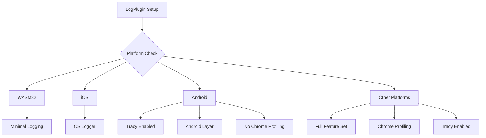

+++
title = "#21760 enable tracy subscriber layer on android"
date = "2025-11-12T00:00:00"
draft = false
template = "pull_request_page.html"
in_search_index = true

[taxonomies]
list_display = ["show"]

[extra]
current_language = "en"
available_languages = {"en" = { name = "English", url = "/pull_request/bevy/2025-11/pr-21760-en-20251112" }, "zh-cn" = { name = "中文", url = "/pull_request/bevy/2025-11/pr-21760-zh-cn-20251112" }}
labels = ["C-Feature", "O-Android", "A-Diagnostics"]
+++

# Title
enable tracy subscriber layer on android

## Basic Information
- **Title**: enable tracy subscriber layer on android
- **PR Link**: https://github.com/bevyengine/bevy/pull/21760
- **Author**: WireWhiz
- **Status**: MERGED
- **Labels**: C-Feature, O-Android, S-Ready-For-Final-Review, A-Diagnostics
- **Created**: 2025-11-06T02:29:16Z
- **Merged**: 2025-11-09T18:22:35Z
- **Merged By**: alice-i-cecile

## Description Translation
# Objective

I really need tracing on android right now as I'm attempting to profile bevy running on a quest 3.

## Solution

I saw [this issue](https://github.com/bevyengine/bevy/issues/21612) already opened about it around 2 weeks ago, and I was able to use it to figure out how to enable tracy to run on android. However I did not enable it for IOS and made sure to retain the same behavior for other flags such as chrome style profiling.

## Testing

I've tested that the engine still builds on both windows and to android. Additionally the flame graph will now show complete frames of info, instead of one single mono-frame with 4 different render events.

Android also requires: `android.permission.INTERNET` and possibly `android.permission.NEARBY_WIFI_DEVICES` to be able to host the debug server.

## Showcase
Tracy running for an apk deployed to a quest 3.


## The Story of This Pull Request

The developer needed to profile Bevy performance on Android devices, specifically a Quest 3 VR headset, but encountered a limitation where Tracy tracing wasn't available on Android. This made performance analysis difficult because the flame graphs showed incomplete frame information - just "one single mono-frame with 4 different render events" instead of the detailed profiling data needed for optimization.

The root cause was in Bevy's logging configuration, where Android was explicitly excluded from Tracy support alongside iOS and WebAssembly. The implementation used conditional compilation flags that prevented the Tracy subscriber layer from being initialized on Android targets.

The solution involved restructuring the conditional compilation logic in the LogPlugin to treat Android more like desktop platforms rather than mobile restrictions. The key change was modifying the platform exclusion criteria from excluding `wasm32`, `android`, and `ios` to only excluding `wasm32` and `ios`. This allowed Android to enter the main logging configuration block where Tracy and other profiling tools are set up.

However, the developer made careful engineering decisions to maintain platform-specific behavior where appropriate. Chrome-style profiling (`tracing-chrome`) remained disabled on Android since it wasn't needed, while Tracy profiling was enabled. The Android-specific tracing layer (`android_tracing::AndroidLayer`) was moved into the main configuration block rather than being handled in a separate platform-specific section, creating a more unified initialization flow.

The implementation demonstrates good platform-aware design by:
- Enabling the needed feature (Tracy) on the target platform
- Preserving existing behavior for other platforms
- Maintaining feature flags for optional components
- Organizing the code logically by platform capabilities rather than arbitrary exclusions

From a technical perspective, the changes show how Rust's conditional compilation system (`#[cfg]` attributes) can be used to create platform-specific feature sets while maintaining clean code organization. The restructuring also improves maintainability by reducing code duplication - the Android layer initialization is now colocated with other layer initializations rather than in a separate block.

The impact is significant for Android development with Bevy. Developers can now use Tracy for detailed performance profiling on Android devices, which is crucial for optimizing VR applications on Quest devices where performance is critical. The permissions note about requiring `android.permission.INTERNET` is important since Tracy needs network access to communicate with its profiling server.

## Visual Representation



## Key Files Changed

**File: `crates/bevy_log/src/lib.rs`**

This file contains the main logging configuration for Bevy. The changes restructured how different platforms initialize their logging and tracing subsystems, specifically enabling Tracy profiling on Android.

**Key Changes:**

1. **Platform Exclusion Logic Modified:**
```rust
// Before:
#[cfg(all(
    not(target_arch = "wasm32"),
    not(target_os = "android"), 
    not(target_os = "ios")
))]

// After:
#[cfg(all(not(target_arch = "wasm32"), not(target_os = "ios")))]
```
This change removes Android from the exclusion list, allowing it to use the same logging configuration as desktop platforms.

2. **Chrome Profiling Limited on Android:**
```rust
// Chrome layer only enabled when NOT on Android
#[cfg(all(feature = "tracing-chrome", not(target_os = "android")))]
let chrome_layer = {
    // chrome layer initialization
};
```

3. **Android Layer Integration:**
```rust
// Android layer now integrated into main configuration block
#[cfg(target_os = "android")]
let subscriber = subscriber.with(android_tracing::AndroidLayer::default());

// Removed separate Android configuration block that was here before
```

4. **Tracy Layer Now Available on Android:**
Since Android now enters the main configuration block, the Tracy layer is automatically included when the `tracing-tracy` feature is enabled.

## Further Reading

- [Tracy Profiler Documentation](https://github.com/wolfpld/tracy) - The profiling tool enabled by this change
- [Bevy Diagnostics Documentation](https://bevyengine.org/learn/advanced/diagnostics/) - Bevy's approach to performance monitoring
- [Rust Conditional Compilation](https://doc.rust-lang.org/reference/conditional-compilation.html) - How `#[cfg]` attributes work
- [Android Tracing](https://developer.android.com/topic/performance/tracing) - Android's native tracing capabilities

# Full Code Diff
```diff
diff --git a/crates/bevy_log/src/lib.rs b/crates/bevy_log/src/lib.rs
index 988fa8e23ad71..0abe1941c5793 100644
--- a/crates/bevy_log/src/lib.rs
+++ b/crates/bevy_log/src/lib.rs
@@ -336,13 +336,9 @@ impl Plugin for LogPlugin {
         #[cfg(feature = "trace")]
         let subscriber = subscriber.with(tracing_error::ErrorLayer::default());
 
-        #[cfg(all(
-            not(target_arch = "wasm32"),
-            not(target_os = "android"),
-            not(target_os = "ios")
-        ))]
+        #[cfg(all(not(target_arch = "wasm32"), not(target_os = "ios")))]
         {
-            #[cfg(feature = "tracing-chrome")]
+            #[cfg(all(feature = "tracing-chrome", not(target_os = "android")))]
             let chrome_layer = {
                 let mut layer = tracing_chrome::ChromeLayerBuilder::new();
                 if let Ok(path) = std::env::var("TRACE_CHROME") {
@@ -386,10 +382,12 @@ impl Plugin for LogPlugin {
 
             let subscriber = subscriber.with(fmt_layer);
 
-            #[cfg(feature = "tracing-chrome")]
+            #[cfg(all(feature = "tracing-chrome", not(target_os = "android")))]
             let subscriber = subscriber.with(chrome_layer);
             #[cfg(feature = "tracing-tracy")]
             let subscriber = subscriber.with(tracy_layer);
+            #[cfg(target_os = "android")]
+            let subscriber = subscriber.with(android_tracing::AndroidLayer::default());
             finished_subscriber = subscriber;
         }
 
@@ -400,11 +398,6 @@ impl Plugin for LogPlugin {
             ));
         }
 
-        #[cfg(target_os = "android")]
-        {
-            finished_subscriber = subscriber.with(android_tracing::AndroidLayer::default());
-        }
-
         #[cfg(target_os = "ios")]
         {
             finished_subscriber = subscriber.with(tracing_oslog::OsLogger::default());
```