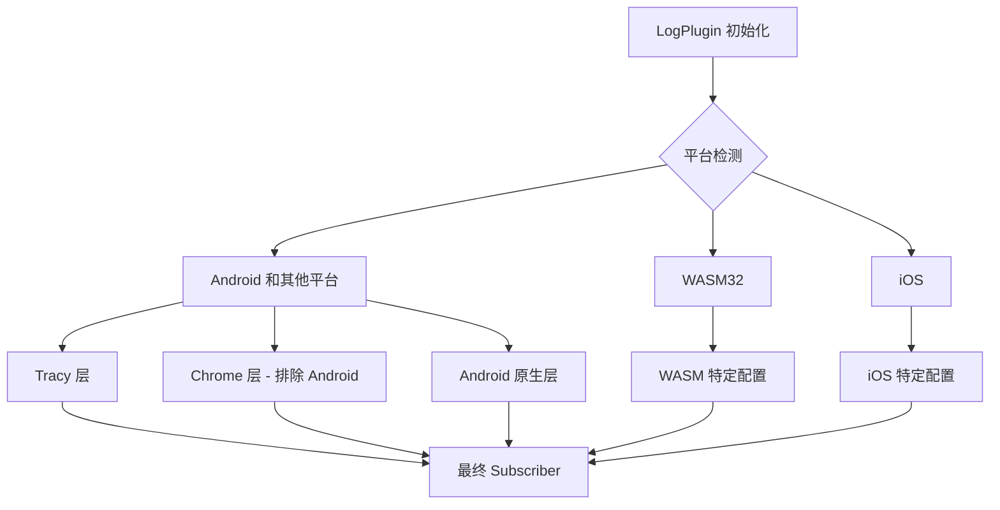

+++
title = "#21760 enable tracy subscriber layer on android"
date = "2025-11-12T00:00:00"
draft = false
template = "pull_request_page.html"
in_search_index = false

[extra]
current_language = "zh-cn"
available_languages = {"en" = { name = "English", url = "/pull_request/bevy/2025-11/pr-21760-en-20251112" }, "zh-cn" = { name = "中文", url = "/pull_request/bevy/2025-11/pr-21760-zh-cn-20251112" }}
labels = ["C-Feature", "O-Android", "A-Diagnostics"]
+++

# Title
enable tracy subscriber layer on android

## Basic Information
- **Title**: enable tracy subscriber layer on android
- **PR Link**: https://github.com/bevyengine/bevy/pull/21760
- **Author**: WireWhiz
- **Status**: MERGED
- **Labels**: C-Feature, O-Android, S-Ready-For-Final-Review, A-Diagnostics
- **Created**: 2025-11-06T02:29:16Z
- **Merged**: 2025-11-09T18:22:35Z
- **Merged By**: alice-i-cecile

## Description Translation
# 目标

我现在确实需要在 Android 上使用追踪功能，因为我正在尝试分析在 Quest 3 上运行的 Bevy。

## 解决方案

我看到[这个问题](https://github.com/bevyengine/bevy/issues/21612)大约两周前已经打开，我能够利用它来弄清楚如何让 tracy 在 Android 上运行。但是我没有为 IOS 启用它，并确保保留其他标志的相同行为，例如 Chrome 风格的性能分析。

## 测试

我已经测试过引擎仍然可以在 Windows 和 Android 上构建。此外，火焰图现在将显示完整帧的信息，而不是一个单一的单帧包含 4 个不同的渲染事件。

Android 还需要：`android.permission.INTERNET` 和可能的 `android.permission.NEARBY_WIFI_DEVICES` 才能托管调试服务器。

## 展示
Tracy 在部署到 Quest 3 的 apk 上运行。


## The Story of This Pull Request

这个 PR 源于一个实际的开发需求：开发者 WireWhiz 需要在 Android 设备（特别是 Quest 3 VR 头显）上进行性能分析。在 Bevy 游戏引擎中，Tracy 是一个重要的性能分析工具，但之前 Android 平台被排除在 Tracy 支持之外。

问题的核心在于条件编译逻辑。在原来的代码中，Android 平台被明确排除在 Tracy 和 Chrome 追踪层之外：

```rust
#[cfg(all(
    not(target_arch = "wasm32"),
    not(target_os = "android"),  // Android 被排除
    not(target_os = "ios")
))]
```

这种排除导致在 Android 上运行时，开发者只能看到一个"单帧"的追踪数据，无法获得完整的帧级别性能分析信息，这对于优化 VR 应用的性能至关重要。

解决方案涉及对条件编译逻辑的重新组织。主要变化包括：

1. **放宽平台限制**：从条件编译中移除 Android 排除，让 Android 能够进入主要的追踪配置块
2. **分层控制**：对不同的追踪层进行更精细的控制
3. **架构统一**：将 Android 特定的追踪层整合到主配置流程中

具体实现上，开发者首先修改了平台检测条件：

```rust
// 之前：
#[cfg(all(not(target_arch = "wasm32"), not(target_os = "android"), not(target_os = "ios")))]

// 之后：
#[cfg(all(not(target_arch = "wasm32"), not(target_os = "ios")))]
```

这个改变让 Android 平台能够进入包含 Tracy 和 Chrome 追踪层配置的代码块。但是，开发者意识到 Chrome 追踪层在 Android 上可能存在问题，因此对 Chrome 层添加了额外的平台检查：

```rust
#[cfg(all(feature = "tracing-chrome", not(target_os = "android")))]
```

同时，将 Android 原生的追踪层从单独的条件块移动到主配置块内：

```rust
// 之前是单独的条件块：
#[cfg(target_os = "android")]
{
    finished_subscriber = subscriber.with(android_tracing::AndroidLayer::default());
}

// 之后整合到主配置块中：
#[cfg(target_os = "android")]
let subscriber = subscriber.with(android_tracing::AndroidLayer::default());
```

这种重构带来了几个技术优势：

- **代码结构更清晰**：所有平台的追踪层配置现在都在同一个逻辑流程中
- **功能完整性**：Android 现在可以同时使用 Tracy 和原生的 Android 追踪层
- **向后兼容**：iOS 和 WebAssembly 平台的行为保持不变

从工程角度来看，这个 PR 展示了条件编译在跨平台开发中的重要性。通过精细的平台特性控制，开发者可以在不破坏其他平台功能的情况下，为特定平台启用高级特性。

测试方面，开发者验证了修改不会破坏现有平台的构建，并确认在 Android 设备上现在能够获得完整的帧级别追踪数据，这对于 VR 应用的性能优化至关重要。

## Visual Representation



## Key Files Changed

### `crates/bevy_log/src/lib.rs`

这个文件包含了 Bevy 日志系统的核心配置，负责设置不同平台的追踪订阅者。

**主要变更：**

1. **平台检测逻辑重构**
```rust
// 之前：
#[cfg(all(
    not(target_arch = "wasm32"),
    not(target_os = "android"),
    not(target_os = "ios")
))]

// 之后：
#[cfg(all(not(target_arch = "wasm32"), not(target_os = "ios")))]
```

2. **Chrome 追踪层的平台特定控制**
```rust
// 之前：
#[cfg(feature = "tracing-chrome")]

// 之后：
#[cfg(all(feature = "tracing-chrome", not(target_os = "android")))]
```

3. **Android 原生追踪层的位置调整**
```rust
// 之前（在单独的条件块中）：
#[cfg(target_os = "android")]
{
    finished_subscriber = subscriber.with(android_tracing::AndroidLayer::default());
}

// 之后（整合到主配置块中）：
#[cfg(target_os = "android")]
let subscriber = subscriber.with(android_tracing::AndroidLayer::default());
```

这些变更使得：
- Android 平台现在能够使用 Tracy 性能分析工具
- 保持了 Chrome 风格分析在其他平台上的可用性
- 代码结构更加统一和可维护

## Further Reading

- [Tracy Profiler 官方文档](https://github.com/wolfpld/tracy) - 了解 Tracy 性能分析工具的功能和使用方法
- [Bevy 诊断系统](https://bevyengine.org/learn/book/getting-started/diagnostics/) - Bevy 引擎的诊断和性能分析功能
- [Rust 条件编译](https://doc.rust-lang.org/reference/conditional-compilation.html) - Rust 中 `#[cfg]` 属性的详细说明
- [Android 性能分析最佳实践](https://developer.android.com/topic/performance) - Android 平台性能优化的官方指南

# Full Code Diff
```diff
diff --git a/crates/bevy_log/src/lib.rs b/crates/bevy_log/src/lib.rs
index 988fa8e23ad71..0abe1941c5793 100644
--- a/crates/bevy_log/src/lib.rs
+++ b/crates/bevy_log/src/lib.rs
@@ -336,13 +336,9 @@ impl Plugin for LogPlugin {
         #[cfg(feature = "trace")]
         let subscriber = subscriber.with(tracing_error::ErrorLayer::default());
 
-        #[cfg(all(
-            not(target_arch = "wasm32"),
-            not(target_os = "android"),
-            not(target_os = "ios")
-        ))]
+        #[cfg(all(not(target_arch = "wasm32"), not(target_os = "ios")))]
         {
-            #[cfg(feature = "tracing-chrome")]
+            #[cfg(all(feature = "tracing-chrome", not(target_os = "android")))]
             let chrome_layer = {
                 let mut layer = tracing_chrome::ChromeLayerBuilder::new();
                 if let Ok(path) = std::env::var("TRACE_CHROME") {
@@ -386,10 +382,12 @@ impl Plugin for LogPlugin {
 
             let subscriber = subscriber.with(fmt_layer);
 
-            #[cfg(feature = "tracing-chrome")]
+            #[cfg(all(feature = "tracing-chrome", not(target_os = "android")))]
             let subscriber = subscriber.with(chrome_layer);
             #[cfg(feature = "tracing-tracy")]
             let subscriber = subscriber.with(tracy_layer);
+            #[cfg(target_os = "android")]
+            let subscriber = subscriber.with(android_tracing::AndroidLayer::default());
             finished_subscriber = subscriber;
         }
 
@@ -400,11 +398,6 @@ impl Plugin for LogPlugin {
             ));
         }
 
-        #[cfg(target_os = "android")]
-        {
-            finished_subscriber = subscriber.with(android_tracing::AndroidLayer::default());
-        }
-
         #[cfg(target_os = "ios")]
         {
             finished_subscriber = subscriber.with(tracing_oslog::OsLogger::default());
```