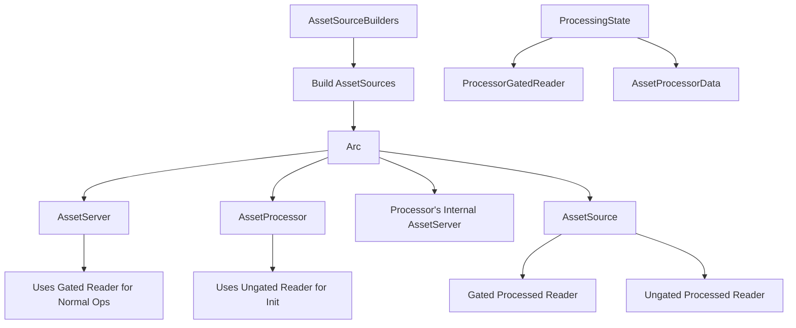

+++
title = "#21763 Share `AssetSources` between the `AssetServer`, the asset processor, and the asset processor's internal asset server."
date = "2025-11-20T00:00:00"
draft = false
template = "pull_request_page.html"
in_search_index = true

[taxonomies]
list_display = ["show"]

[extra]
current_language = "en"
available_languages = {"en" = { name = "English", url = "/pull_request/bevy/2025-11/pr-21763-en-20251120" }, "zh-cn" = { name = "中文", url = "/pull_request/bevy/2025-11/pr-21763-zh-cn-20251120" }}
labels = ["A-Assets", "C-Code-Quality", "M-Migration-Guide", "D-Modest"]
+++

# Title

## Basic Information
- **Title**: Share `AssetSources` between the `AssetServer`, the asset processor, and the asset processor's internal asset server.
- **PR Link**: https://github.com/bevyengine/bevy/pull/21763
- **Author**: andriyDev
- **Status**: MERGED
- **Labels**: A-Assets, C-Code-Quality, S-Ready-For-Final-Review, M-Migration-Guide, D-Modest
- **Created**: 2025-11-06T07:30:54Z
- **Merged**: 2025-11-20T01:00:48Z
- **Merged By**: alice-i-cecile

## Description Translation

# Objective

- Previously, we would build the sources up to 3 times with different options: once for the regular asset server, once for the asset processor, and once for the asset processor's internal asset server.
- This is a step towards #21758 (since now adding a source to this shared `AssetSources` will be reflected in all the uses.

## Solution

1) Skip all the hot-reloading polling if `watch_for_changes` is false. If we don't do this, sharing the sources between the asset server and the processor-internal asset server will result in two tasks consuming asset events, so the regular asset server will miss asset events.
2) Move the state of the asset processor into a separate struct that we then Arc. We need to be able to gate the processed asset reader, but we can't create an asset processor without the sources. So instead we allow ourselves to create the state first, so that we can gate on that state, and then create the processor with that state.
3) Split the processed reader into a gated and an ungated form. The gate first blocks on the processor being done initialized, followed by gating on the per-asset lock. However the asset processor needs to iterate through all the directories in order to finish initializing. So just unconditionally gating doesn't work - we hit a deadlock. So we provide access to the ungated processed reader, so that the processor can use that to initialize its state.
4) Finally do the sharing!

One thing I'm starting in this PR is making things more private. For example, it's not clear why `ProcessorGatedReader` was `pub`. I've also made `AssetSources::gate_on_processor` no longer `pub`. This does mean that users can no longer initialize their own `AssetServer` properly (e.g., gated on the processor), but I don't think we should really support this - our focus should be on the `AssetServer` initialized by `AssetPlugin`, not hypothetical uses where someone wants to insert their own `AssetServer`.

## Testing

- CI

## The Story of This Pull Request

This PR addresses a fundamental inefficiency in Bevy's asset system where `AssetSources` were being constructed multiple times with different configurations. The core problem was that the system built separate instances for the regular asset server, the asset processor, and the processor's internal asset server, leading to code duplication and potential synchronization issues.

The implementation approach involved several interconnected changes to enable sharing a single `AssetSources` instance across all components. First, the PR introduces logic to skip hot-reloading polling when `watch_for_changes` is false, preventing duplicate event consumption that would cause the regular asset server to miss asset events when sources are shared.

To enable proper gating of processed asset readers, the asset processor's state was extracted into a separate `ProcessingState` struct that can be Arc-wrapped and shared independently. This allows creating the state first, gating asset sources on that state, and then creating the processor with the shared state. The processed reader was split into gated and ungated versions to resolve a deadlock situation where the processor needed to iterate through directories during initialization but would be blocked by its own gating mechanism.

The key architectural insight was recognizing that the processor initialization requires ungated access to processed assets to build its internal state, while normal operations should remain gated. This led to the introduction of `ungated_processed_reader` alongside the existing gated processed reader in `AssetSource`.

Throughout the implementation, the author focused on improving encapsulation by making several previously public types and methods private, particularly `ProcessorGatedReader` and `AssetSources::gate_on_processor`. This reflects a deliberate design choice to prioritize the standard `AssetPlugin` initialization path over hypothetical custom use cases.

The changes required updating the constructors for both `AssetServer` and `AssetProcessor` to use `Arc<AssetSources>`, which represents a breaking change that necessitated the creation of a comprehensive migration guide. The PR demonstrates careful consideration of initialization order and state management to achieve the sharing goal while maintaining system correctness.

## Visual Representation



## Key Files Changed

### `crates/bevy_asset/src/processor/mod.rs` (+122/-50)

This file underwent the most significant changes, introducing the `ProcessingState` struct and refactoring the asset processor initialization.

**Key Changes:**
- Extracted processing state into separate `ProcessingState` struct
- Modified `AssetProcessor::new` to return both processor and shared sources
- Updated state management to use the new `ProcessingState`

```rust
// Before:
pub struct AssetProcessorData {
    pub(crate) asset_infos: async_lock::RwLock<ProcessorAssetInfos>,
    state: async_lock::RwLock<ProcessorState>,
    sources: AssetSources,
    // ... other fields
}

// After:
pub struct AssetProcessorData {
    pub(crate) processing_state: Arc<ProcessingState>,
    sources: Arc<AssetSources>,
    // ... other fields
}

pub(crate) struct ProcessingState {
    state: async_lock::RwLock<ProcessorState>,
    asset_infos: async_lock::RwLock<ProcessorAssetInfos>,
    // ... channel fields
}
```

### `crates/bevy_asset/src/io/source.rs` (+26/-8)

This file was modified to support both gated and ungated processed readers and to use the new `ProcessingState`.

**Key Changes:**
- Added `ungated_processed_reader` field to `AssetSource`
- Updated `gate_on_processor` to use `ProcessingState` instead of `AssetProcessorData`
- Made `gate_on_processor` method crate-private

```rust
// Before:
pub struct AssetSource {
    processed_reader: Option<Box<dyn ErasedAssetReader>>,
    // ... other fields
}

// After:
pub struct AssetSource {
    processed_reader: Option<Arc<dyn ErasedAssetReader>>,
    ungated_processed_reader: Option<Arc<dyn ErasedAssetReader>>,
    // ... other fields
}

// Updated gate_on_processor method:
pub(crate) fn gate_on_processor(&mut self, processing_state: Arc<ProcessingState>) {
    if let Some(reader) = self.processed_reader.take() {
        self.ungated_processed_reader = Some(reader.clone());
        self.processed_reader = Some(Arc::new(ProcessorGatedReader::new(
            self.id(),
            reader,
            processing_state,
        )));
    }
}
```

### `crates/bevy_asset/src/io/processor_gated.rs` (+20/-27)

This file was updated to use the new `ProcessingState` and improve encapsulation.

**Key Changes:**
- Made `ProcessorGatedReader` crate-private
- Moved transaction lock logic to `ProcessingState`
- Updated to use `Arc<dyn ErasedAssetReader>` instead of `Box`

```rust
// Before:
pub struct ProcessorGatedReader {
    reader: Box<dyn ErasedAssetReader>,
    processor_data: Arc<AssetProcessorData>,
}

// After:
pub(crate) struct ProcessorGatedReader {
    reader: Arc<dyn ErasedAssetReader>,
    processing_state: Arc<ProcessingState>,
}
```

### `crates/bevy_asset/src/server/mod.rs` (+10/-4)

This file was updated to use shared `AssetSources` and optimize hot-reloading.

**Key Changes:**
- Changed `AssetServer` to use `Arc<AssetSources>`
- Added early return to skip hot-reloading when not watching for changes

```rust
// Before:
pub struct AssetServerData {
    sources: AssetSources,
    // ... other fields
}

// After:
pub(crate) struct AssetServerData {
    sources: Arc<AssetSources>,
    // ... other fields
}

// Hot-reloading optimization:
if !infos.watching_for_changes {
    return;
}
```

### `release-content/migration-guides/changed_asset_server_init.md` (+62/-0)

This new file provides migration guidance for the breaking changes introduced by this PR.

## Further Reading

- [Bevy Assets Documentation](https://bevyengine.org/learn/books/introduction/assets/) - Official Bevy asset system documentation
- [Arc and Thread Safety in Rust](https://doc.rust-lang.org/std/sync/struct.Arc.html) - Understanding shared ownership patterns
- [Async Programming in Rust](https://rust-lang.github.io/async-book/) - Background on async patterns used in this PR