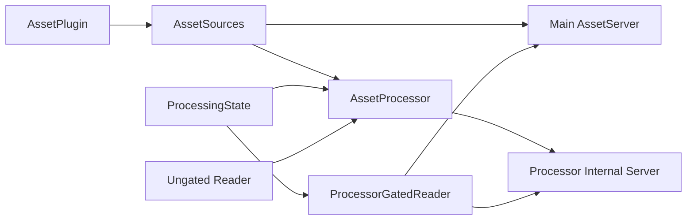

+++
title = "#21763 Share `AssetSources` between the `AssetServer`, the asset processor, and the asset processor's internal asset server."
date = "2025-11-20T00:00:00"
draft = false
template = "pull_request_page.html"
in_search_index = false

[extra]
current_language = "zh-cn"
available_languages = {"en" = { name = "English", url = "/pull_request/bevy/2025-11/pr-21763-en-20251120" }, "zh-cn" = { name = "中文", url = "/pull_request/bevy/2025-11/pr-21763-zh-cn-20251120" }}
labels = ["A-Assets", "C-Code-Quality", "M-Migration-Guide", "D-Modest"]
+++

# Title

## Basic Information
- **Title**: Share `AssetSources` between the `AssetServer`, the asset processor, and the asset processor's internal asset server.
- **PR Link**: https://github.com/bevyengine/bevy/pull/21763
- **Author**: andriyDev
- **Status**: MERGED
- **Labels**: A-Assets, C-Code-Quality, S-Ready-For-Final-Review, M-Migration-Guide, D-Modest
- **Created**: 2025-11-06T07:30:54Z
- **Merged**: 2025-11-20T01:00:48Z
- **Merged By**: alice-i-cecile

## Description Translation
# Objective

- 之前，我们会用不同的选项构建资源最多3次：一次用于常规资产服务器，一次用于资产处理器，一次用于资产处理器的内部资产服务器。
- 这是朝着 #21758 迈出的一步（因为现在向这个共享的 `AssetSources` 添加一个资源将在所有使用中反映出来）。

## Solution

1) 如果 `watch_for_changes` 为 false，则跳过所有热重载轮询。如果我们不这样做，在资产服务器和处理器内部资产服务器之间共享资源将导致两个任务消费资产事件，因此常规资产服务器将错过资产事件。
2) 将资产处理器的状态移动到一个单独的结构中，然后我们对其进行 Arc。我们需要能够对处理后的资产读取器进行门控，但是没有资源我们无法创建资产处理器。因此，我们允许自己首先创建状态，以便我们可以基于该状态进行门控，然后使用该状态创建处理器。
3) 将处理后的读取器分为门控和非门控两种形式。门控首先阻塞在处理器完成初始化上，然后阻塞在每项资产的锁上。然而，资产处理器需要遍历所有目录才能完成初始化。因此，无条件门控不起作用 - 我们会遇到死锁。因此，我们提供对非门控处理读取器的访问，以便处理器可以使用它来初始化其状态。
4) 最后进行共享！

在这篇 PR 中我开始做的一件事是使事情更加私有化。例如，不清楚为什么 `ProcessorGatedReader` 是 `pub`。我还使 `AssetSources::gate_on_processor` 不再是 `pub`。这确实意味着用户无法再正确初始化他们自己的 `AssetServer`（例如，在处理器上进行门控），但我认为我们不应该真正支持这一点 - 我们的重点应该放在由 `AssetPlugin` 初始化的 `AssetServer` 上，而不是假设有人想要插入他们自己的 `AssetServer` 的用例。

## Testing

- CI

## The Story of This Pull Request

这个 PR 解决了 Bevy 资产系统中一个长期存在的效率问题：重复构建 `AssetSources`。在之前的实现中，同一个资产源会被构建三次 - 分别用于主资产服务器、资产处理器和处理器内部的资产服务器。这不仅浪费资源，还可能导致状态不一致。

问题的核心在于架构设计。资产处理器需要访问处理后的资产，但同时又要管理这些资产的生成过程。这就产生了一个循环依赖：处理器需要先初始化才能提供门控读取，但初始化过程又需要访问处理后的资产源。

开发者采用了分步骤的解决方案。首先，他们发现当 `watch_for_changes` 为 false 时，跳过热重载轮询可以避免事件重复消费的问题。这是一个重要的优化，因为共享资源后，多个消费者会同时监听相同的事件源。

接下来，他们将处理器的状态分离到新的 `ProcessingState` 结构中。这个设计很巧妙 - 通过将状态与处理器本身解耦，可以在创建处理器之前先创建和配置状态。`ProcessingState` 包含了处理器的运行时状态、资产信息以及用于协调的信号通道。

```rust
pub(crate) struct ProcessingState {
    state: async_lock::RwLock<ProcessorState>,
    initialized_sender: async_broadcast::Sender<()>,
    initialized_receiver: async_broadcast::Receiver<()>,
    finished_sender: async_broadcast::Sender<()>,
    finished_receiver: async_broadcast::Receiver<()>,
    asset_infos: async_lock::RwLock<ProcessorAssetInfos>,
}
```

然后是最关键的死锁问题解决。处理器在初始化时需要遍历所有处理后的资产目录，但如果读取器被门控在处理器本身上，就会形成死锁。解决方案是引入非门控的处理读取器 (`ungated_processed_reader`)，让处理器在初始化阶段可以无阻塞地访问资源。

```rust
/// The ungated version of `processed_reader`.
///
/// This allows the processor to read all the processed assets to initialize itself without
/// being gated on itself (causing a deadlock).
ungated_processed_reader: Option<Arc<dyn ErasedAssetReader>>,
```

在 `AssetSource` 中，现在维护了两个版本的读取器：门控版本用于常规访问，非门控版本用于处理器初始化。这种设计既保证了安全性，又避免了死锁。

最后，通过使用 `Arc<AssetSources>` 实现了真正的资源共享。现在所有组件都引用同一个资产源实例，消除了重复构建的开销。

这个 PR 还体现了良好的 API 设计原则。开发者将有潜在危险的 API（如 `ProcessorGatedReader` 和 `gate_on_processor`）设为私有，鼓励用户通过标准路径 (`AssetPlugin`) 来使用系统，而不是尝试手动构造可能不安全的配置。

## Visual Representation



## Key Files Changed

### `crates/bevy_asset/src/processor/mod.rs` (+122/-50)

这是变化最大的文件，重构了资产处理器的核心架构：

```rust
// 主要变化：引入 ProcessingState 结构
pub(crate) struct ProcessingState {
    state: async_lock::RwLock<ProcessorState>,
    initialized_sender: async_broadcast::Sender<()>,
    // ... 其他字段
}

// AssetProcessor::new 现在返回元组
pub fn new(
    sources: &mut AssetSourceBuilders,
    watch_processed: bool,
) -> (Self, Arc<AssetSources>) {
    let state = Arc::new(ProcessingState::new());
    let mut sources = sources.build_sources(true, watch_processed);
    sources.gate_on_processor(state.clone());
    let sources = Arc::new(sources);
    // ... 创建 processor
}
```

### `crates/bevy_asset/src/io/source.rs` (+26/-8)

在 AssetSource 中增加了非门控读取器支持：

```rust
pub struct AssetSource {
    // ... 原有字段
    processed_reader: Option<Arc<dyn ErasedAssetReader>>,
    /// The ungated version of `processed_reader`.
    ungated_processed_reader: Option<Arc<dyn ErasedAssetReader>>,
    // ... 其他字段
}

// 新增方法提供非门控读取器访问
pub(crate) fn ungated_processed_reader(&self) -> Option<&dyn ErasedAssetReader> {
    self.ungated_processed_reader.as_deref()
}
```

### `crates/bevy_asset/src/io/processor_gated.rs` (+20/-27)

重构了 ProcessorGatedReader，使其更简洁并依赖于 ProcessingState：

```rust
pub(crate) struct ProcessorGatedReader {
    reader: Arc<dyn ErasedAssetReader>,
    source: AssetSourceId<'static>,
    processing_state: Arc<ProcessingState>,
}

// 移除了原有的 get_transaction_lock 方法，现在使用 ProcessingState 的方法
```

### `crates/bevy_asset/src/server/mod.rs` (+10/-4)

修改 AssetServer 以使用 Arc<AssetSources>：

```rust
// 所有构造函数现在接受 Arc<AssetSources>
pub fn new(
    sources: Arc<AssetSources>,
    mode: AssetServerMode,
    watching_for_changes: bool,
    unapproved_path_mode: UnapprovedPathMode,
) -> Self {
    // ...
}

// 添加了热重载优化
if !infos.watching_for_changes {
    return;
}
```

### `release-content/migration-guides/changed_asset_server_init.md` (+62/-0)

新增了迁移指南，详细说明了 API 变化：

```markdown
Previously `AssetServer`s `new` methods would take `AssetSources`. Now, these methods take `Arc<AssetSources>`.

// 之前：
AssetServer::new(sources, mode, watching_for_changes, unapproved_path_mode)

// 现在：
AssetServer::new(Arc::new(sources), mode, watching_for_changes, unapproved_path_mode)
```

## Further Reading

- [Bevy Assets Documentation](https://bevyengine.org/learn/quick-start/assets/) - Bevy 资产系统官方文档
- [Arc and Thread Safety in Rust](https://doc.rust-lang.org/std/sync/struct.Arc.html) - Rust 中 Arc 的使用和线程安全
- [Async Programming in Rust](https://rust-lang.github.io/async-book/) - Rust 异步编程指南
- [Deadlock Prevention Techniques](https://en.wikipedia.org/wiki/Deadlock_prevention_algorithms) - 死锁预防算法