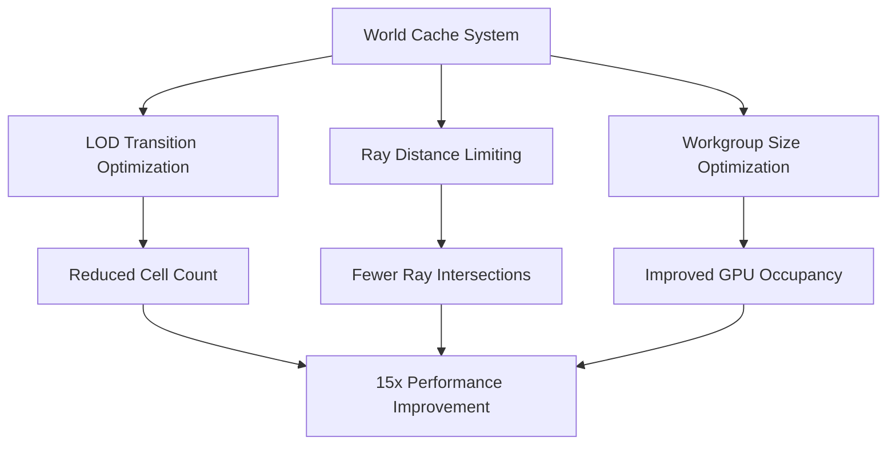

+++
title = "#21776 Tweak solari world cache"
date = "2025-11-21T00:00:00"
draft = false
template = "pull_request_page.html"
in_search_index = true

[taxonomies]
list_display = ["show"]

[extra]
current_language = "en"
available_languages = {"en" = { name = "English", url = "/pull_request/bevy/2025-11/pr-21776-en-20251121" }, "zh-cn" = { name = "中文", url = "/pull_request/bevy/2025-11/pr-21776-zh-cn-20251121" }}
labels = ["A-Rendering", "C-Refinement"]
+++

# Tweak solari world cache

## Basic Information
- **Title**: Tweak solari world cache
- **PR Link**: https://github.com/bevyengine/bevy/pull/21776
- **Author**: JMS55
- **Status**: MERGED
- **Labels**: A-Rendering, S-Ready-For-Final-Review, C-Refinement
- **Created**: 2025-11-07T17:14:31Z
- **Merged**: 2025-11-21T19:13:07Z
- **Merged By**: alice-i-cecile

## Description Translation
* Make the world cache transition LODs faster. On big scenes like bistro, we had way too many small cells before.
* Limit world cache GI rays to 4m, we save a ton of time and improve stability by not sampling super far away cells.
* Switch world cache active cell update workgroup size from 1024 -> 64. Using large workgroup sizes for RT work kills occupancy.

World cache sample_radiance time goes from 1.42ms to 0.09ms.

## The Story of This Pull Request

This PR addresses performance bottlenecks in Bevy's solari world cache system through three targeted optimizations that work together to dramatically reduce computation time.

The core problem was that the world cache system was performing unnecessary work across multiple dimensions. In large scenes like the bistro scene, the system was creating too many small cache cells due to overly conservative LOD transitions, sampling distant geometry that contributed minimally to the final result, and using workgroup sizes that were suboptimal for ray tracing workloads.

The first optimization tackled the LOD transition rate. The original implementation used a `WORLD_CACHE_POSITION_LOD_SCALE` of 30.0, which meant the system would maintain high-detail small cells at relatively large distances from the camera. By reducing this value to 8.0, the system transitions to larger, coarser cells much more quickly as distance from the camera increases. This directly addresses the problem of "way too many small cells" in large scenes by reducing the overall cell count and computational overhead.

The second optimization introduced a maximum distance limit for global illumination rays. Previously, rays could travel up to `RAY_T_MAX` (which is typically a very large value), causing the system to sample distant cache cells that have minimal visual impact. The addition of `MAX_GI_RAY_DISTANCE: f32 = 4.0` constrains these rays to a 4-meter radius, which significantly reduces the number of ray intersections and cache lookups needed per frame. This change leverages the observation that distant lighting contributions have diminishing returns, allowing the system to focus computational resources on nearby surfaces that matter most for visual quality.

The third optimization addresses GPU occupancy by reducing workgroup sizes from 1024 to 64 across all compute shaders in the world cache pipeline. Large workgroup sizes are problematic for ray tracing workloads because they can lead to thread divergence and reduced occupancy on modern GPU architectures. By using smaller workgroups (64 threads), the GPU can better utilize its execution units and hide memory latency through improved thread scheduling.

These three changes work synergistically: the reduced cell count from faster LOD transitions means fewer active cells need processing, the limited ray distance reduces per-cell computation, and the optimized workgroup size ensures the remaining work executes efficiently on the GPU. The result is a dramatic performance improvement, with `sample_radiance` execution time dropping from 1.42ms to 0.09ms - a 15x speedup.

## Visual Representation



## Key Files Changed

### `crates/bevy_solari/src/realtime/world_cache_query.wgsl` (+1/-1)

This file controls how the world cache transitions between levels of detail. The key change reduces the LOD transition scale to make the system use larger cells more aggressively.

```wgsl
// Before:
const WORLD_CACHE_POSITION_LOD_SCALE: f32 = 30.0;

// After:
const WORLD_CACHE_POSITION_LOD_SCALE: f32 = 8.0;
```

This change directly addresses the problem of excessive small cells in large scenes by making the system transition to coarser LODs more quickly as distance from the camera increases.

### `crates/bevy_solari/src/realtime/world_cache_update.wgsl` (+5/-4)

This file contains the core radiance sampling logic and received multiple optimizations:

```wgsl
// Workgroup size optimization
// Before:
@compute @workgroup_size(1024, 1, 1)
// After:
@compute @workgroup_size(64, 1, 1)

// Ray distance limitation
// Before:
#import bevy_solari::scene_bindings::{trace_ray, resolve_ray_hit_full, RAY_T_MIN, RAY_T_MAX}
// After:
#import bevy_solari::scene_bindings::{trace_ray, resolve_ray_hit_full, RAY_T_MIN}

// New constant for ray distance constraint
const MAX_GI_RAY_DISTANCE: f32 = 4.0;

// Ray tracing call with distance limit
// Before:
let ray_hit = trace_ray(geometry_data.world_position, ray_direction, RAY_T_MIN, RAY_T_MAX, RAY_FLAG_NONE);
// After:
let ray_hit = trace_ray(geometry_data.world_position, ray_direction, RAY_T_MIN, MAX_GI_RAY_DISTANCE, RAY_FLAG_NONE);
```

These changes work together to reduce both the amount of work per cell and improve how that work is scheduled on the GPU.

### `crates/bevy_solari/src/realtime/world_cache_compact.wgsl` (+1/-1)

This file handles cache compaction and was updated to match the new workgroup size:

```wgsl
// Before:
world_cache_active_cells_dispatch = vec3((world_cache_active_cells_count + 1023u) / 1024u, 1u, 1u);
// After:
world_cache_active_cells_dispatch = vec3((world_cache_active_cells_count + 63u) / 64u, 1u, 1u);
```

This ensures consistent workgroup sizing across the entire world cache pipeline.

## Further Reading

- [WGSL Compute Shaders Documentation](https://www.w3.org/TR/WGSL/#compute-shader)
- [GPU Occupancy and Performance Optimization](https://developer.nvidia.com/blog/cuda-pro-tip-occupancy-api-simplifies-launch-configuration/)
- [Level of Detail (LOD) Techniques in Real-time Rendering](https://developer.nvidia.com/gpugems/gpugems2/part-i-geometric-complexity/chapter-2-terrain-rendering-using-gpu-based-geometry)
- [Ray Tracing Performance Best Practices](https://developer.nvidia.com/rtx/raytracing/ray-tracing-best-practices)