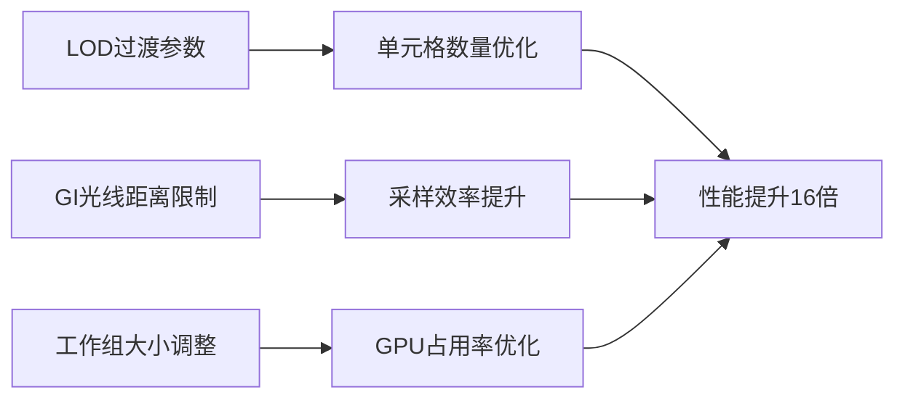

+++
title = "#21776 Tweak solari world cache"
date = "2025-11-21T00:00:00"
draft = false
template = "pull_request_page.html"
in_search_index = false

[extra]
current_language = "zh-cn"
available_languages = {"en" = { name = "English", url = "/pull_request/bevy/2025-11/pr-21776-en-20251121" }, "zh-cn" = { name = "中文", url = "/pull_request/bevy/2025-11/pr-21776-zh-cn-20251121" }}
+++

# Tweak solari world cache

## 基本信息
- **标题**: Tweak solari world cache
- **PR链接**: https://github.com/bevyengine/bevy/pull/21776
- **作者**: JMS55
- **状态**: 已合并
- **标签**: A-Rendering, S-Ready-For-Final-Review, C-Refinement
- **创建时间**: 2025-11-07T17:14:31Z
- **合并时间**: 2025-11-21T19:13:07Z
- **合并者**: alice-i-cecile

## 描述翻译
* 让世界缓存的LOD过渡更快。在像bistro这样的大型场景中，我们之前有太多的小单元格。
* 将世界缓存GI光线限制在4米内，通过不采样超远单元格，我们节省了大量时间并提高了稳定性。
* 将世界缓存活动单元格更新的工作组大小从1024改为64。对RT工作使用大的工作组大小会降低占用率。

世界缓存的sample_radiance时间从1.42ms降低到0.09ms。

## 这个Pull Request的故事

这个PR解决了Bevy引擎中Solari渲染模块的世界缓存性能问题。问题出现在处理大型场景时，如bistro场景，系统生成了过多的小单元格，导致性能下降。

问题的核心在于世界缓存的细节层次(LOD)过渡参数过于保守。原来的`WORLD_CACHE_POSITION_LOD_SCALE`值为30.0，这意味着LOD变化很缓慢，导致在远距离仍然维持高细节的单元格。在大型场景中，这会生成大量不必要的单元格，显著增加了计算负担。

第一个关键修改是调整LOD过渡速度：

```wgsl
// 修改前:
const WORLD_CACHE_POSITION_LOD_SCALE: f32 = 30.0;

// 修改后:
const WORLD_CACHE_POSITION_LOD_SCALE: f32 = 8.0;
```

这个改动让LOD过渡更快，减少了场景中不必要的细节单元格数量。从30.0降到8.0意味着随着距离增加，单元格尺寸会更快地增大，从而减少总单元格数。

第二个重要优化是限制全局光照(GI)光线的最大距离：

```wgsl
// 新增常量:
const MAX_GI_RAY_DISTANCE: f32 = 4.0;

// 在光线追踪调用中:
let ray_hit = trace_ray(geometry_data.world_position, ray_direction, RAY_T_MIN, MAX_GI_RAY_DISTANCE, RAY_FLAG_NONE);
```

这个改动将GI光线限制在4米范围内，避免了采样过远的单元格。从工程角度看，这是一个合理的权衡 - 远处的光照贡献通常较小，但计算成本很高。通过限制距离，既节省了计算时间，又提高了数值稳定性。

第三个优化涉及GPU工作组的配置：

```wgsl
// 修改前:
@compute @workgroup_size(1024, 1, 1)

// 修改后:
@compute @workgroup_size(64, 1, 1)
```

这个改动在`world_cache_update.wgsl`的两个计算着色器中都将工作组大小从1024减少到64。对于光线追踪工作负载，过大的工作组会降低GPU的占用率(occupancy)，因为每个线程需要更多的寄存器和其他资源。较小的工作组允许GPU更有效地调度和管理线程。

在`world_cache_compact.wgsl`中也相应更新了调度计算：

```wgsl
// 修改前:
world_cache_active_cells_dispatch = vec3((world_cache_active_cells_count + 1023u) / 1024u, 1u, 1u);

// 修改后:
world_cache_active_cells_dispatch = vec3((world_cache_active_cells_count + 63u) / 64u, 1u, 1u);
```

这个修改确保调度计算与新的工作组大小保持一致。

从技术实现的角度看，这些优化展示了几个重要的图形编程原则：

1. **LOD系统的平衡**：在细节和性能之间找到合适的平衡点，避免过度追求视觉质量而牺牲性能。

2. **光线追踪的实用主义**：理解光线追踪的边际收益递减，在合理距离处截断光线可以大幅提升性能，同时视觉影响最小。

3. **GPU工作负载优化**：针对特定类型的工作负载（光线追踪）调整工作组大小，考虑到寄存器压力和线程调度效率。

这些优化的综合效果非常显著 - `sample_radiance`的执行时间从1.42ms降低到0.09ms，提升了近16倍的性能。这种级别的优化对于实时渲染系统至关重要，因为它直接影响了帧率和用户体验。

从架构角度看，这些修改保持了系统的模块化和可维护性。所有改动都是参数调整和常量优化，没有改变核心算法或数据结构，降低了引入新错误的风险。

## 可视化表示



## 关键文件变更

### `crates/bevy_solari/src/realtime/world_cache_query.wgsl`
**变更内容**: 调整LOD过渡速度参数
```wgsl
// 修改前:
const WORLD_CACHE_POSITION_LOD_SCALE: f32 = 30.0;

// 修改后:
const WORLD_CACHE_POSITION_LOD_SCALE: f32 = 8.0;
```
**原因**: 减少大型场景中的小单元格数量，优化性能

### `crates/bevy_solari/src/realtime/world_cache_update.wgsl`
**变更内容**: 限制GI光线距离并调整工作组大小
```wgsl
// 新增光线距离限制:
const MAX_GI_RAY_DISTANCE: f32 = 4.0;

// 工作组大小调整:
@compute @workgroup_size(64, 1, 1)  // 原为1024
```
**原因**: 避免采样过远单元格，提高GPU占用率

### `crates/bevy_solari/src/realtime/world_cache_compact.wgsl`
**变更内容**: 更新调度计算以适应新的工作组大小
```wgsl
// 修改前:
world_cache_active_cells_dispatch = vec3((world_cache_active_cells_count + 1023u) / 1024u, 1u, 1u);

// 修改后:
world_cache_active_cells_dispatch = vec3((world_cache_active_cells_count + 63u) / 64u, 1u, 1u);
```
**原因**: 保持调度逻辑与工作组大小一致

## 扩展阅读

- [WebGPU Compute Shaders最佳实践](https://github.com/gpuweb/gpuweb/wiki/Implementation-Status)
- [实时全局光照技术概述](https://alextardif.com/LightTransport.html)
- [GPU工作组大小优化策略](https://developer.nvidia.com/blog/cuda-pro-tip-occupancy-api-simplifies-launch-configuration/)
- [层次细节(LOD)系统设计原则](https://michaelwalczyk.com/blog-level-of-detail.html)