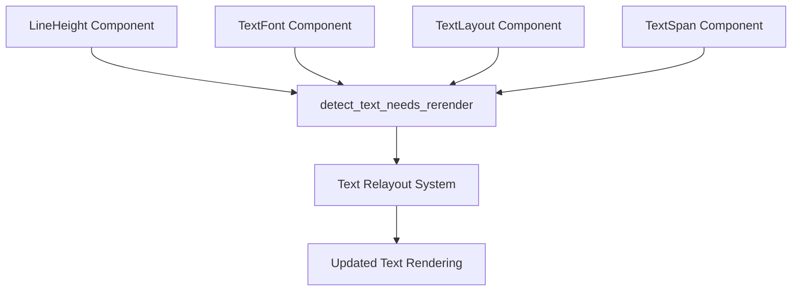

+++
title = "#21779 Relayout text on changes to `LineHeight`"
date = "2025-11-14T00:00:00"
draft = false
template = "pull_request_page.html"
in_search_index = true

[taxonomies]
list_display = ["show"]

[extra]
current_language = "en"
available_languages = {"en" = { name = "English", url = "/pull_request/bevy/2025-11/pr-21779-en-20251114" }, "zh-cn" = { name = "中文", url = "/pull_request/bevy/2025-11/pr-21779-zh-cn-20251114" }}
labels = ["C-Bug", "A-Text", "D-Straightforward"]
+++

# Title
Relayout text on changes to `LineHeight`

## Basic Information
- **Title**: Relayout text on changes to `LineHeight`
- **PR Link**: https://github.com/bevyengine/bevy/pull/21779
- **Author**: ickshonpe
- **Status**: MERGED
- **Labels**: C-Bug, S-Ready-For-Final-Review, A-Text, D-Straightforward
- **Created**: 2025-11-07T19:40:34Z
- **Merged**: 2025-11-14T00:05:53Z
- **Merged By**: mockersf

## Description Translation
# Objective

`LineHeight` was removed from `TextFont` and made into a component, but change detection on the `LineHeight` component to trigger a relayout wasn't added.

## Solution

Add `Changed<LineHeight>` query filters to `detect_text_needs_rerender`.

## The Story of This Pull Request

This PR addresses a straightforward but important gap in Bevy's text rendering system. The core issue stemmed from a recent architectural change where `LineHeight` was extracted from the `TextFont` struct and made into its own component. While this architectural improvement was made, the change detection system wasn't fully updated to account for this new component structure.

The problem manifested when developers would modify the `LineHeight` component on text entities - the text wouldn't automatically relayout to reflect the new line spacing. This created a user experience issue where visual changes weren't properly synchronized with component changes.

The solution implemented here is minimal and surgical. The developer identified that the `detect_text_needs_rerender` function, which is responsible for triggering text relayout when relevant components change, needed to be updated to include `LineHeight` in its change detection queries. This function uses Bevy's query system with `Or` filters to detect when any of the relevant text-related components have been modified.

The implementation adds `Changed<LineHeight>` to two key locations in the query filters. First, it's added to the root entity query to detect when the `LineHeight` component changes on the main text entity. Second, it's added to the child entity query to handle cases where `LineHeight` might be modified on child text spans. This ensures comprehensive coverage for all text hierarchy configurations.

This fix demonstrates the importance of maintaining consistency across architectural boundaries when refactoring component structures. The change itself is small - just two lines of code added - but it completes the architectural transition that was started when `LineHeight` became a standalone component.

## Visual Representation



## Key Files Changed

### `crates/bevy_text/src/text.rs` (+2/-0)

This file contains the core text rendering logic for Bevy. The changes add `LineHeight` to the change detection queries that trigger text relayout.

**Key modifications:**

```rust
// File: crates/bevy_text/src/text.rs
// Before:
Or<(
    Changed<Root>,
    Changed<TextFont>,
    Changed<TextLayout>,
    Changed<Children>,
)>

// After:
Or<(
    Changed<Root>,
    Changed<TextFont>,
    Changed<TextLayout>,
    Changed<LineHeight>,
    Changed<Children>,
)>
```

```rust
// File: crates/bevy_text/src/text.rs  
// Before:
Or<(
    Changed<TextSpan>,
    Changed<TextFont>,
    Changed<Children>,
    Changed<ChildOf>, // Included to detect broken text block hierarchies.
    Added<TextLayout>,
)>

// After:
Or<(
    Changed<TextSpan>,
    Changed<TextFont>,
    Changed<LineHeight>,
    Changed<Children>,
    Changed<ChildOf>, // Included to detect broken text block hierarchies.
    Added<TextLayout>,
)>
```

These changes ensure that when the `LineHeight` component is modified on either root text entities or child text spans, the text rendering system will detect the change and trigger a relayout to reflect the new line spacing.

## Further Reading

- [Bevy Text Rendering Documentation](https://docs.rs/bevy_text/latest/bevy_text/)
- [Bevy Component Change Detection](https://bevy-cheatbook.github.io/programming/change-detection.html)
- [Bevy ECS Queries](https://bevy-cheatbook.github.io/programming/queries.html)
- [Text Layout and Line Height Concepts](https://developer.mozilla.org/en-US/docs/Web/CSS/line-height)

# Full Code Diff
```diff
diff --git a/crates/bevy_text/src/text.rs b/crates/bevy_text/src/text.rs
index 2f37d32871bf1..f100eca0c786b 100644
--- a/crates/bevy_text/src/text.rs
+++ b/crates/bevy_text/src/text.rs
@@ -674,6 +674,7 @@ pub fn detect_text_needs_rerender<Root: Component>(
                 Changed<Root>,
                 Changed<TextFont>,
                 Changed<TextLayout>,
+                Changed<LineHeight>,
                 Changed<Children>,
             )>,
             With<Root>,
@@ -687,6 +688,7 @@ pub fn detect_text_needs_rerender<Root: Component>(
             Or<(
                 Changed<TextSpan>,
                 Changed<TextFont>,
+                Changed<LineHeight>,
                 Changed<Children>,
                 Changed<ChildOf>, // Included to detect broken text block hierarchies.
                 Added<TextLayout>,
```