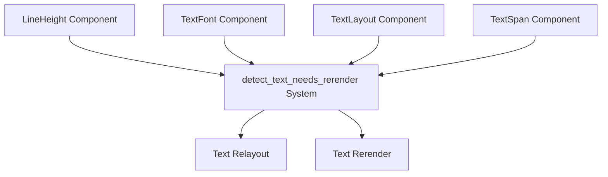

+++
title = "#21779 Relayout text on changes to `LineHeight`"
date = "2025-11-14T00:00:00"
draft = false
template = "pull_request_page.html"
in_search_index = false

[extra]
current_language = "zh-cn"
available_languages = {"en" = { name = "English", url = "/pull_request/bevy/2025-11/pr-21779-en-20251114" }, "zh-cn" = { name = "中文", url = "/pull_request/bevy/2025-11/pr-21779-zh-cn-20251114" }}
labels = ["C-Bug", "A-Text", "D-Straightforward"]
+++

# Relayout text on changes to `LineHeight`

## Basic Information
- **Title**: Relayout text on changes to `LineHeight`
- **PR Link**: https://github.com/bevyengine/bevy/pull/21779
- **Author**: ickshonpe
- **Status**: MERGED
- **Labels**: C-Bug, S-Ready-For-Final-Review, A-Text, D-Straightforward
- **Created**: 2025-11-07T19:40:34Z
- **Merged**: 2025-11-14T00:05:53Z
- **Merged By**: mockersf

## Description Translation
# 目标

`LineHeight` 已从 `TextFont` 中移除并成为一个组件，但未添加对 `LineHeight` 组件的变更检测以触发重新布局。

## 解决方案

在 `detect_text_needs_rerender` 中添加 `Changed<LineHeight>` 查询过滤器。

## 这个 Pull Request 的故事

这个 PR 解决了一个在 Bevy 文本系统中由于架构重构导致的回归问题。问题的根源在于当 `LineHeight` 从一个字段转变为独立组件时，相应的变更检测逻辑没有同步更新。

在早期的实现中，`LineHeight` 是 `TextFont` 结构体的一个字段。当文本系统需要检测何时重新布局文本时，它会监听 `Changed<TextFont>` 事件，这自然包括了行高的变化。然而，当架构演进将 `LineHeight` 提取为独立的组件后，这个变更检测的覆盖范围出现了缺口。

问题的技术本质是：Bevy 使用 ECS（Entity-Component-System）架构，其中变更检测通过查询过滤器如 `Changed<T>` 来实现。当 `LineHeight` 成为独立组件后，原有的 `Changed<TextFont>` 过滤器不再能够捕获行高的变化，因为这两个组件现在在 ECS 中是分离的。

解决方案直接而有效：在文本重新渲染检测系统中添加对 `LineHeight` 组件的变更检测。具体实现是在 `detect_text_needs_rerender` 函数的两个查询中都加入了 `Changed<LineHeight>` 过滤器。

第一个查询针对根实体（带有 `Root` 组件的实体），第二个查询针对文本跨度实体（不带有 `Root` 组件的实体）。这种双重覆盖确保了无论行高变化发生在文本层次结构的哪个部分，系统都能正确检测并触发重新布局。

从工程角度看，这个修复体现了组件化架构中一个常见但容易被忽视的问题：当数据从一个组件移动到另一个组件时，所有依赖于该数据的系统都需要相应更新其查询条件。这是一个典型的架构演进中的同步问题，而不是逻辑错误。

这个修复确保了文本系统的完整性，当开发者通过修改 `LineHeight` 组件来调整文本行间距时，界面能够正确响应并立即更新显示。

## 视觉表示



## 关键文件变更

### `crates/bevy_text/src/text.rs` (+2/-0)

这个文件包含了文本系统的核心逻辑，特别是文本重新渲染的检测机制。

**变更内容：**
在 `detect_text_needs_rerender` 函数的两个查询中添加了 `Changed<LineHeight>` 过滤器。

```rust
// 在根实体查询中添加变更检测
Or<(
    Changed<Root>,
    Changed<TextFont>,
    Changed<TextLayout>,
    Changed<LineHeight>,  // 新增
    Changed<Children>,
)>

// 在文本跨度实体查询中添加变更检测  
Or<(
    Changed<TextSpan>,
    Changed<TextFont>,
    Changed<LineHeight>,  // 新增
    Changed<Children>,
    Changed<ChildOf>, // 包含以检测破损的文本块层次结构
    Added<TextLayout>,
)>
```

**变更原因：**
确保当 `LineHeight` 组件发生变化时，文本系统能够正确检测到变化并触发重新布局和渲染。

**技术细节：**
- 第一个查询处理带有 `Root` 组件的实体（通常是文本块的根实体）
- 第二个查询处理文本跨度实体（不带有 `Root` 组件的文本部分）
- 两个查询都使用 `Or` 组合器，意味着任何一个组件的变化都会触发重新渲染
- 新增的 `Changed<LineHeight>` 确保了行高变化能够被正确检测

## 进一步阅读

- [Bevy ECS 指南 - 变更检测](https://bevyengine.org/learn/quick-start/ecs/change-detection/)
- [Bevy 文本系统文档](https://docs.rs/bevy_text/latest/bevy_text/)
- [ECS 架构模式](https://en.wikipedia.org/wiki/Entity_component_system)

# Full Code Diff
```diff
diff --git a/crates/bevy_text/src/text.rs b/crates/bevy_text/src/text.rs
index 2f37d32871bf1..f100eca0c786b 100644
--- a/crates/bevy_text/src/text.rs
+++ b/crates/bevy_text/src/text.rs
@@ -674,6 +674,7 @@ pub fn detect_text_needs_rerender<Root: Component>(
                 Changed<Root>,
                 Changed<TextFont>,
                 Changed<TextLayout>,
+                Changed<LineHeight>,
                 Changed<Children>,
             )>,
             With<Root>,
@@ -687,6 +688,7 @@ pub fn detect_text_needs_rerender<Root: Component>(
             Or<(
                 Changed<TextSpan>,
                 Changed<TextFont>,
+                Changed<LineHeight>,
                 Changed<Children>,
                 Changed<ChildOf>, // Included to detect broken text block hierarchies.
                 Added<TextLayout>,
```