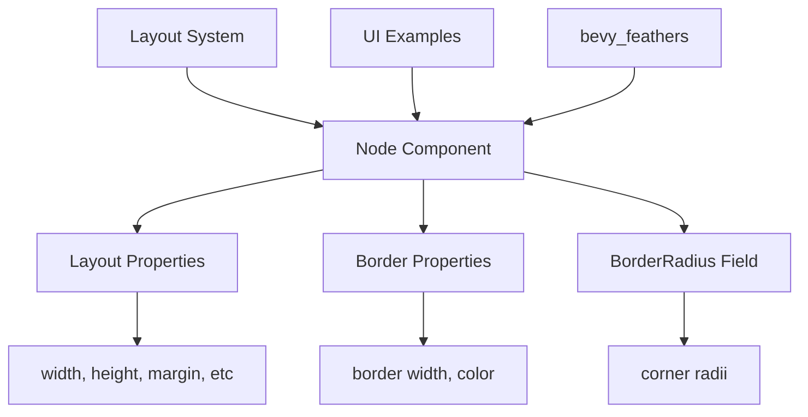

+++
title = "#21781 Add `BorderRadius` to `Node`"
date = "2025-11-14T00:00:00"
draft = false
template = "pull_request_page.html"
in_search_index = true

[taxonomies]
list_display = ["show"]

[extra]
current_language = "en"
available_languages = {"en" = { name = "English", url = "/pull_request/bevy/2025-11/pr-21781-en-20251114" }, "zh-cn" = { name = "中文", url = "/pull_request/bevy/2025-11/pr-21781-zh-cn-20251114" }}
labels = ["A-UI", "M-Migration-Guide", "D-Straightforward"]
+++

# Title
Add `BorderRadius` to `Node`

## Basic Information
- **Title**: Add `BorderRadius` to `Node`
- **PR Link**: https://github.com/bevyengine/bevy/pull/21781
- **Author**: ickshonpe
- **Status**: MERGED
- **Labels**: A-UI, S-Ready-For-Final-Review, M-Migration-Guide, D-Straightforward
- **Created**: 2025-11-08T01:37:58Z
- **Merged**: 2025-11-14T00:09:41Z
- **Merged By**: mockersf

## Description Translation
# Objective

There was discussion in the `Next Generation Scene/UI` about adding `BackgroundColor` to `Node`. I don't know about that, but it reminded me that border radius isn't part of `Node`. All the other properties that affect a `Node`'s shape are there, border radius should be there too.

## Solution

* Add a `border_radius: BorderRadius` field.
* Remove the `Component` derive from `BorderRadius`.

## Testing

The internal changes are relatively trivial. There could be mistakes in the examples though, because of the large number of changes.

## The Story of This Pull Request

### The Problem and Context

In Bevy's UI system, the `Node` component serves as the fundamental building block for UI layout and styling. It contains properties like `width`, `height`, `margin`, `padding`, and `border` that define a UI element's shape and positioning. However, `BorderRadius` - which controls rounded corners - was implemented as a separate component rather than being integrated into `Node`.

This architectural inconsistency became apparent during discussions about UI improvements. While other shape-affecting properties were centralized in `Node`, developers had to add `BorderRadius` as a separate component, creating unnecessary complexity and boilerplate in UI construction.

### The Solution Approach

The solution was straightforward: integrate `BorderRadius` directly into the `Node` component as a field and remove its standalone component status. This approach:

1. Maintains consistency with other shape-related properties
2. Reduces component count and query complexity
3. Simplifies the API for UI construction

The implementation required two main changes:
- Adding a `border_radius: BorderRadius` field to the `Node` struct
- Removing the `Component` derive from `BorderRadius`

### The Implementation

The core change occurred in `ui_node.rs`, where the `Node` struct gained a new field:

```rust
// File: crates/bevy_ui/src/ui_node.rs
// Before:
#[derive(Component, Clone, Debug, PartialEq, Reflect)]
#[reflect(Component, PartialEq, Default, Debug, Clone)]
pub struct BorderRadius {
    // ... fields
}

// After:
#[derive(Copy, Clone, Debug, PartialEq, Reflect)]
#[reflect(PartialEq, Default, Debug, Clone)]
pub struct BorderRadius {
    // ... fields (same as before)
}

// Node gained a new field:
pub struct Node {
    // ... existing fields
    pub border_radius: BorderRadius,
    // ... other fields
}
```

The layout system in `layout/mod.rs` was updated to read border radius directly from `Node` instead of querying for a separate component:

```rust
// File: crates/bevy_ui/src/layout/mod.rs
// Before:
pub fn ui_layout_system(
    // ...
    Option<&BorderRadius>,  // Separate component query
    // ...
)

// After:
pub fn ui_layout_system(
    // ...
    &Node,  // Now reads border_radius from Node
    // ...
)

// The resolution logic moved from component to field:
node.bypass_change_detection().border_radius = style.border_radius.resolve(
    inverse_target_scale_factor.recip(),
    node.size,
    target_size,
);
```

### Technical Insights

This change simplifies the ECS architecture by reducing the number of components needed for basic UI elements. Previously, creating a rounded UI element required spawning both a `Node` and a `BorderRadius` component. Now, it's consolidated into a single component.

The migration maintains full backward compatibility in terms of functionality while changing the API. The `BorderRadius` struct remains identical - only its usage pattern changes from component to field.

Performance considerations are minimal but positive: fewer components mean simpler archetypes and potentially better cache locality when processing UI nodes.

### The Impact

The primary impact is API simplification. UI construction becomes more intuitive as all shape-related properties are centralized in `Node`. This change affects 33 files across the codebase, primarily examples and the `bevy_feathers` UI library.

The migration guide provides clear instructions for updating code:

```rust
// Before:
commands.spawn((
    Node { /* ... */ },
    BorderRadius::all(Val::Px(10.0)),
));

// After:
commands.spawn((
    Node {
        border_radius: BorderRadius::all(Val::Px(10.0)),
        /* ... */
    },
));
```

## Visual Representation



## Key Files Changed

### `crates/bevy_ui/src/ui_node.rs` (+52/-13)
This file contains the core structural changes:
- Added `border_radius` field to `Node` with comprehensive documentation
- Removed `Component` derive from `BorderRadius`
- Updated examples in documentation to use the new field

```rust
// Key addition to Node struct:
pub struct Node {
    // ...
    pub border_radius: BorderRadius,
    // ...
}

// BorderRadius lost Component derive:
#[derive(Copy, Clone, Debug, PartialEq, Reflect)]  // Removed: Component
#[reflect(PartialEq, Default, Debug, Clone)]       // Removed: Component
pub struct BorderRadius {
    // ... fields unchanged
}
```

### `crates/bevy_ui/src/layout/mod.rs` (+8/-13)
Updated the layout system to read border radius from `Node` instead of querying for a separate component:

```rust
// Before: Separate component query
Option<&BorderRadius>,

// After: Read from Node field
node.bypass_change_detection().border_radius = style.border_radius.resolve(
    inverse_target_scale_factor.recip(),
    node.size,
    target_size,
);
```

### `examples/ui/box_shadow.rs` (+21/-22)
Demonstrates the migration pattern in a complex example:

```rust
// Before:
(
    Node { /* ... */ },
    BorderRadius::ZERO,
)

// After:
(
    Node {
        border_radius: BorderRadius::ZERO,
        /* ... */
    },
)
```

### `examples/helpers/widgets.rs` (+11/-11)
Shows how helper functions were updated to use the new field-based approach for conditional border radius:

```rust
// Before:
BorderRadius::ZERO
    .with_left(if is_first { BUTTON_BORDER_RADIUS_SIZE } else { px(0) })
    .with_right(if is_last { BUTTON_BORDER_RADIUS_SIZE } else { px(0) }),

// After:
border_radius: BorderRadius::ZERO
    .with_left(if is_first { BUTTON_BORDER_RADIUS_SIZE } else { px(0) })
    .with_right(if is_last { BUTTON_BORDER_RADIUS_SIZE } else { px(0) }),
```

### `examples/testbed/ui.rs` (+11/-11)
Updated test cases to use the integrated border radius approach:

```rust
// Before: Separate component insertion
commands.entity(border_node).insert(border_radius);

// After: Set during Node construction
Node {
    border_radius: if rounded { /* ... */ } else { BorderRadius::ZERO },
    /* ... */
}
```

## Further Reading

- [Bevy UI Documentation](https://bevyengine.org/learn/quick-start/ecs/ui/) - Official Bevy UI guide
- [CSS Border Radius Specification](https://developer.mozilla.org/en-US/docs/Web/CSS/border-radius) - Web standard that inspired the implementation
- [Bevy ECS Components](https://bevyengine.org/learn/quick-start/ecs/components/) - Understanding component architecture
- [Migration Guide](release-content/migration-guides/border_radius_is_now_a_field_on_node.md) - Official migration instructions for this change