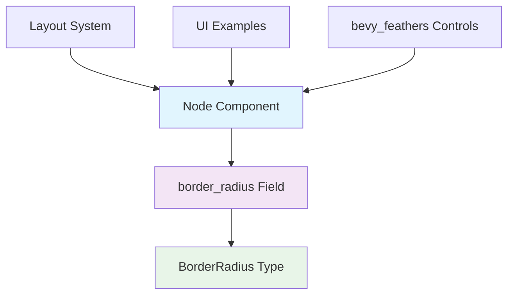

+++
title = "#21781 Add `BorderRadius` to `Node"
date = "2025-11-14T00:00:00"
draft = false
template = "pull_request_page.html"
in_search_index = false

[extra]
current_language = "zh-cn"
available_languages = {"en" = { name = "English", url = "/pull_request/bevy/2025-11/pr-21781-en-20251114" }, "zh-cn" = { name = "中文", url = "/pull_request/bevy/2025-11/pr-21781-zh-cn-20251114" }}
+++

# Add `BorderRadius` to `Node`

## 基本信息
- **标题**: Add `BorderRadius` to `Node`
- **PR链接**: https://github.com/bevyengine/bevy/pull/21781
- **作者**: ickshonpe
- **状态**: 已合并
- **标签**: A-UI, S-Ready-For-Final-Review, M-Migration-Guide, D-Straightforward
- **创建时间**: 2025-11-08T01:37:58Z
- **合并时间**: 2025-11-14T00:09:41Z
- **合并者**: mockersf

## 描述翻译
# 目标

在`Next Generation Scene/UI`中有关于将`BackgroundColor`添加到`Node`的讨论。我不确定那个，但这提醒我边框半径（border radius）不是`Node`的一部分。所有其他影响`Node`形状的属性都在那里，边框半径也应该在那里。

## 解决方案

* 添加一个`border_radius: BorderRadius`字段。
* 从`BorderRadius`中移除`Component`派生。

## 测试

内部改动相对简单。但由于改动数量大，示例中可能会有错误。

## 这个PR的故事

### 问题和背景
这个PR源于Bevy UI系统的一个设计不一致性问题。在当前的实现中，大多数影响UI节点形状的属性如`width`、`height`、`border`等都直接内置于`Node`组件中，但`BorderRadius`却作为一个独立的组件存在。这种分离导致API使用不够直观，开发者需要同时处理`Node`和`BorderRadius`两个组件来定义完整的UI节点样式。

问题的核心在于架构的一致性。当所有其他影响节点几何形状的属性都集中在`Node`中时，`BorderRadius`的独立存在造成了概念上的分裂，增加了使用复杂性。

### 解决方案方法
作者采取了直接而有效的解决方案：将`BorderRadius`从独立组件重构为`Node`结构体的一个字段。这个决策基于几个工程考虑：

1. **一致性原则**：保持所有影响节点几何形状的属性在同一个地方
2. **简化API**：减少开发者需要处理的组件数量
3. **性能优化**：减少ECS查询的复杂度

技术选择上，作者决定：
- 保留`BorderRadius`类型定义，但移除其`Component`派生
- 在`Node`结构体中添加`border_radius`字段
- 更新所有相关系统以使用新的字段

### 实现细节
实现过程主要涉及两个关键方面的修改：

**核心架构变更**：
在`crates/bevy_ui/src/ui_node.rs`中，`Node`结构体新增了`border_radius`字段：

```rust
// 之前：BorderRadius 是独立组件
#[derive(Component, Copy, Clone, Debug, PartialEq, Reflect)]
pub struct BorderRadius { ... }

// 之后：BorderRadius 成为 Node 的字段
#[derive(Copy, Clone, Debug, PartialEq, Reflect)]
pub struct BorderRadius { ... }

pub struct Node {
    // ... 其他字段
    pub border_radius: BorderRadius,
    // ... 其他字段
}
```

**布局系统适配**：
在`crates/bevy_ui/src/layout/mod.rs`中，布局系统不再需要查询独立的`BorderRadius`组件：

```rust
// 之前：需要查询可选的 BorderRadius 组件
pub fn ui_layout_system(
    // ... 其他参数
    Option<&BorderRadius>,
    // ... 其他参数
) { ... }

// 之后：直接从 Node 获取 border_radius
pub fn ui_layout_system(
    // ... 其他参数
    // 移除了 Option<&BorderRadius> 参数
    // ... 其他参数
) { ... }
```

在系统内部，计算逻辑也相应简化：
```rust
// 之前需要检查 Optional 组件
if let Some(border_radius) = maybe_border_radius {
    node.bypass_change_detection().border_radius = border_radius.resolve(...);
}

// 之后直接使用 Node 中的字段
node.bypass_change_detection().border_radius = style.border_radius.resolve(...);
```

### 技术洞察
这个重构展示了几个重要的软件工程原则：

1. **关注点分离的平衡**：虽然将功能拆分为独立组件有助于模块化，但过度拆分会增加使用复杂度。这个改动找到了合理的平衡点。

2. **API设计的一致性**：通过统一相关属性到同一个结构体中，提供了更直观的开发者体验。

3. **向后兼容性考虑**：虽然这是破坏性变更，但提供了清晰的迁移路径和文档。

性能方面，这个改动可能带来轻微的性能提升，因为减少了ECS查询的复杂度，但主要收益在于代码的可维护性和开发者体验。

### 影响
这个PR的影响主要体现在：

1. **API简化**：开发者现在可以在创建`Node`时直接设置边框半径，无需额外添加组件
2. **代码一致性**：所有影响节点形状的属性现在都在同一个地方
3. **迁移需求**：需要更新现有代码，将`BorderRadius`组件的使用改为设置`Node`的`border_radius`字段

从工程角度看，这是一个典型的重构，旨在改善代码库的长期可维护性，即使短期内需要一定的迁移成本。

## 可视化表示



## 关键文件更改

### `crates/bevy_ui/src/ui_node.rs` (+52/-13)
这是最核心的变更文件，实现了主要的架构重构。

**关键修改：**
```rust
// 在 Node 结构体中添加新字段
pub struct Node {
    // ... 现有字段
    pub border_radius: BorderRadius,
    // ... 现有字段
}

// 移除 BorderRadius 的 Component 派生
// 之前：
#[derive(Component, Copy, Clone, Debug, PartialEq, Reflect)]
#[reflect(Component, PartialEq, Default, Debug, Clone)]
pub struct BorderRadius { ... }

// 之后：
#[derive(Copy, Clone, Debug, PartialEq, Reflect)]
#[reflect(PartialEq, Default, Debug, Clone)]
pub struct BorderRadius { ... }
```

**影响：** 这是整个重构的核心，改变了`BorderRadius`在ECS中的角色。

### `crates/bevy_ui/src/layout/mod.rs` (+8/-13)
布局系统适配新架构。

**关键修改：**
```rust
// 系统签名移除 BorderRadius 查询参数
// 之前：
pub fn ui_layout_system(
    // ...
    Option<&BorderRadius>,
    // ...
)

// 之后：
pub fn ui_layout_system(
    // ...
    // 移除了 Option<&BorderRadius>
    // ...
)

// 系统内部直接使用 Node.border_radius
// 之前需要检查 Optional 组件
// 之后直接访问 style.border_radius
```

**影响：** 简化了布局系统的查询逻辑，提高了性能。

### `examples/ui/box_shadow.rs` (+21/-22)
示例文件展示了API用法的变化。

**关键修改：**
```rust
// 之前：单独添加 BorderRadius 组件
commands.spawn((
    Node { ... },
    BorderRadius::all(px(41)),
    // ... 其他组件
));

// 之后：在 Node 中设置 border_radius
commands.spawn((
    Node {
        border_radius: BorderRadius::all(px(41)),
        ... 
    },
    // ... 其他组件
));
```

**影响：** 展示了新的更简洁的API用法模式。

### `examples/helpers/widgets.rs` (+11/-11)
辅助函数更新以反映新的API。

**关键修改：**
```rust
// 之前：BorderRadius 作为独立组件
Node { ... },
BorderRadius::ZERO.with_left(...).with_right(...),

// 之后：border_radius 作为 Node 字段
Node {
    border_radius: BorderRadius::ZERO.with_left(...).with_right(...),
    ... 
},
```

**影响：** 统一了UI控件的创建模式。

### `examples/testbed/ui.rs` (+11/-11)
测试代码更新以确保功能正确性。

**关键修改：**
```rust
// 之前：条件性添加 BorderRadius 组件
if rounded {
    commands.entity(border_node).insert(border_radius);
}

// 之后：直接在 Node 中设置
Node {
    border_radius: if rounded { ... } else { ... },
    ... 
}
```

**影响：** 展示了条件设置边框半径的新模式。

## 进一步阅读

- [Bevy UI 系统文档](https://docs.rs/bevy_ui/latest/bevy_ui/)
- [ECS 组件设计最佳实践](https://bevy-cheatbook.github.io/programming/ecs-intro.html)
- [Rust 结构体设计模式](https://doc.rust-lang.org/book/ch05-01-defining-structs.html)