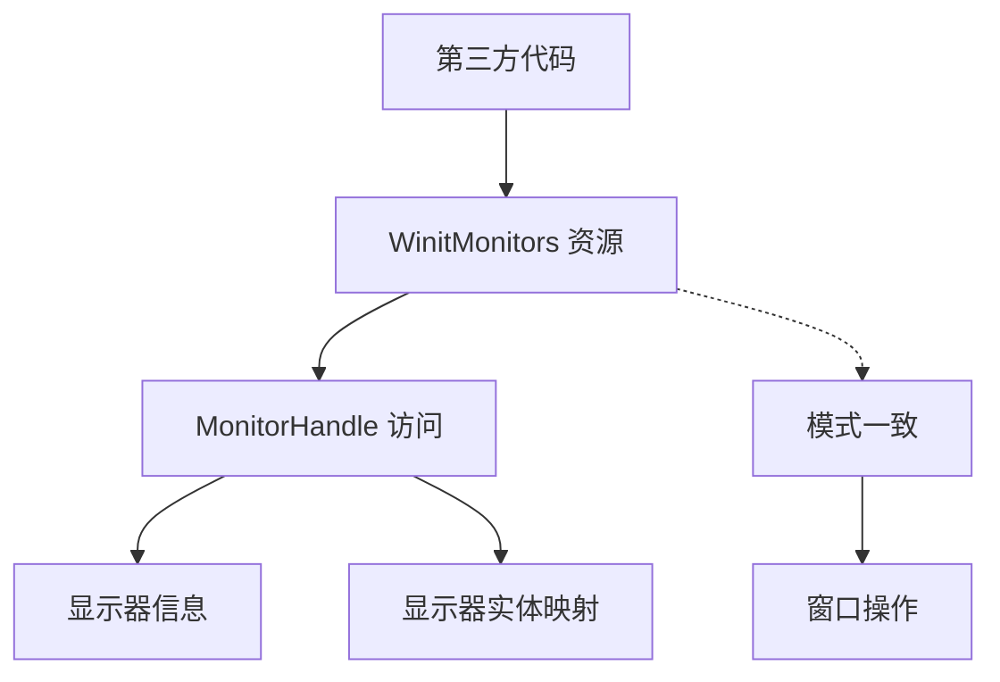

+++
title = "#21786 Make `WinitMonitors` public"
date = "2025-11-12T00:00:00"
draft = false
template = "pull_request_page.html"
in_search_index = false

[extra]
current_language = "zh-cn"
available_languages = {"en" = { name = "English", url = "/pull_request/bevy/2025-11/pr-21786-en-20251112" }, "zh-cn" = { name = "中文", url = "/pull_request/bevy/2025-11/pr-21786-zh-cn-20251112" }}
labels = ["C-Bug", "A-Windowing"]
+++

# Make `WinitMonitors` public

## Basic Information
- **Title**: Make `WinitMonitors` public
- **PR Link**: https://github.com/bevyengine/bevy/pull/21786
- **Author**: SludgePhD
- **Status**: MERGED
- **Labels**: C-Bug, A-Windowing, S-Ready-For-Final-Review
- **Created**: 2025-11-08T23:42:59Z
- **Merged**: 2025-11-09T18:46:09Z
- **Merged By**: alice-i-cecile

## Description Translation
目标

- 允许第三方代码与由 bevy `Monitor` 实体表示的 winit `MonitorHandle` 集成。

解决方案

- 重新导出此资源类型，就像 `WinitWindows` 一样。
- 它已经通过系统类型成为公共 API 的一部分。

## The Story of This Pull Request

这个 PR 解决了一个窗口系统集成中的可见性问题。在 Bevy 游戏引擎中，窗口管理通过 winit 库处理，而 `WinitMonitors` 资源负责管理显示器信息。虽然这个资源类型在系统参数中已经可以被访问，但第三方开发者无法直接导入和使用这个类型。

问题的核心在于 API 一致性。`WinitWindows` 资源已经被公开导出，允许开发者直接使用它进行窗口操作。然而，`WinitMonitors` 虽然功能完整且已经在系统 API 中可用，却没有被公开导出，这造成了 API 的不对称性。

开发者需要访问显示器信息来实现多显示器支持、显示器检测或跨显示器窗口管理等功能。例如，在开发需要检测可用显示器数量或分辨率的应用时，直接访问 `MonitorHandle` 是必要的。

解决方案非常直接：遵循现有的模式，将 `WinitMonitors` 公开导出。这包括两个关键修改：

首先，在 `lib.rs` 中添加重新导出语句，使得外部代码可以导入 `WinitMonitors` 类型：

```rust
// 在 crates/bevy_winit/src/lib.rs 中
pub use winit_monitors::*;
```

其次，为关键方法添加文档注释，提高 API 的可用性：

```rust
// 在 crates/bevy_winit/src/winit_monitors.rs 中
impl WinitMonitors {
    /// Gets the [`MonitorHandle`] at index `n`.
    pub fn nth(&self, n: usize) -> Option<MonitorHandle> {
        // 实现保持不变
    }

    /// Gets the [`MonitorHandle`] associated with a `Monitor` entity.
    pub fn find_entity(&self, entity: Entity) -> Option<MonitorHandle> {
        // 实现保持不变
    }
}
```

这个修改体现了良好的 API 设计原则：一致性。通过让 `WinitMonitors` 与 `WinitWindows` 具有相同的可见性级别，代码库变得更加一致和可预测。

从技术角度看，这个修改没有引入任何行为变化或性能影响。它纯粹是一个可见性调整，让原本就存在的功能对第三方开发者可用。这种类型的修改通常被称为"API 表面扩展"，是库成熟过程中的常见需求。

## Visual Representation



## Key Files Changed

### `crates/bevy_winit/src/lib.rs` (+1/-1)
这个文件的主要变化是添加了对 `winit_monitors` 模块的重新导出，并移除了不必要的直接导入。

```rust
// 修改前:
use crate::{
    accessibility::{AccessKitPlugin, WinitActionRequestHandlers},
    state::winit_runner,
    winit_monitors::WinitMonitors,  // 被移除
};

// 修改后:
pub use winit_monitors::*;  // 新增重新导出

use crate::{
    accessibility::{AccessKitPlugin, WinitActionRequestHandlers},
    state::winit_runner,
    // winit_monitors::WinitMonitors 被移除，因为现在通过重新导出可用
};
```

### `crates/bevy_winit/src/winit_monitors.rs` (+2/-0)
这个文件为关键方法添加了文档注释，提高了 API 的可用性。

```rust
// 修改前:
impl WinitMonitors {
    pub fn nth(&self, n: usize) -> Option<MonitorHandle> {
        self.monitors.get(n).map(|(monitor, _)| monitor.clone())
    }

    pub fn find_entity(&self, entity: Entity) -> Option<MonitorHandle> {
        self.monitors
            .iter()
            .find_map(|(monitor, monitor_entity)| (*monitor_entity == entity).then_some(monitor.clone()))
    }
}

// 修改后:
impl WinitMonitors {
    /// Gets the [`MonitorHandle`] at index `n`.
    pub fn nth(&self, n: usize) -> Option<MonitorHandle> {
        self.monitors.get(n).map(|(monitor, _)| monitor.clone())
    }

    /// Gets the [`MonitorHandle`] associated with a `Monitor` entity.
    pub fn find_entity(&self, entity: Entity) -> Option<MonitorHandle> {
        self.monitors
            .iter()
            .find_map(|(monitor, monitor_entity)| (*monitor_entity == entity).then_some(monitor.clone()))
    }
}
```

## Further Reading

- [Bevy 窗口系统文档](https://docs.rs/bevy_winit/latest/bevy_winit/)
- [winit MonitorHandle API 参考](https://docs.rs/winit/latest/winit/window/struct.MonitorHandle.html)
- [Rust 模块系统和可见性](https://doc.rust-lang.org/book/ch07-02-defining-modules-to-control-scope-and-privacy.html)