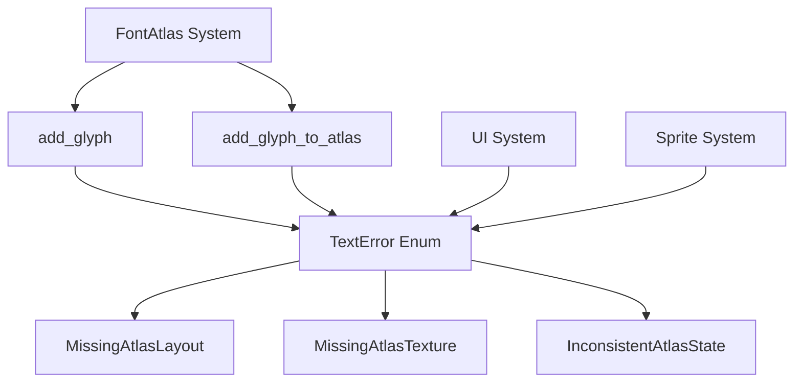

+++
title = "#21790 Replace unwrap() calls with proper error handling in font_atlas"
date = "2025-11-12T00:00:00"
draft = false
template = "pull_request_page.html"
in_search_index = true

[taxonomies]
list_display = ["show"]

[extra]
current_language = "en"
available_languages = {"en" = { name = "English", url = "/pull_request/bevy/2025-11/pr-21790-en-20251112" }, "zh-cn" = { name = "中文", url = "/pull_request/bevy/2025-11/pr-21790-zh-cn-20251112" }}
labels = ["A-UI", "C-Code-Quality", "C-Usability", "A-Text", "D-Straightforward"]
+++

# Title
Replace unwrap() calls with proper error handling in font_atlas

## Basic Information
- **Title**: Replace unwrap() calls with proper error handling in font_atlas
- **PR Link**: https://github.com/bevyengine/bevy/pull/21790
- **Author**: Breakdown-Dog
- **Status**: MERGED
- **Labels**: A-UI, C-Code-Quality, C-Usability, S-Ready-For-Final-Review, A-Text, D-Straightforward
- **Created**: 2025-11-09T07:12:30Z
- **Merged**: 2025-11-09T19:12:59Z
- **Merged By**: alice-i-cecile

## Description Translation
# Objective

- Replace unwrap() calls with proper error handling in `font_atlas.rs`'s `add_glyph()` and `add_glyph_to_atlas()` to prevent panics and provide clear information.

## Solution

- Add new variants to the TextError enum to provide more specific error messages.

## The Story of This Pull Request

This PR addresses a common code quality issue in Rust projects: the use of `unwrap()` calls that can cause runtime panics. The problem was concentrated in the font atlas system, specifically in two key functions responsible for adding glyphs to texture atlases.

The core issue was that `FontAtlas::add_glyph()` and `add_glyph_to_atlas()` were using `unwrap()` to access resources from Bevy's ECS storage. These unwraps would panic if the expected texture atlas layout or texture resources weren't available, which could happen in edge cases or during system initialization. This created unreliable behavior where text rendering could crash the entire application rather than handling the error gracefully.

The solution approach was straightforward but systematic. Instead of simply replacing `unwrap()` with `expect()` calls or other panic-based approaches, the developer implemented proper error handling by extending the existing `TextError` enum with three new specific error variants:

- `MissingAtlasLayout` for when the texture atlas layout resource is missing
- `MissingAtlasTexture` for when the texture resource is missing  
- `InconsistentAtlasState` for when a glyph can't be found after being added to the atlas

In the `FontAtlas::add_glyph()` method, the implementation changed from:

```rust
// Before:
let atlas_layout = atlas_layouts.get_mut(&self.texture_atlas).unwrap();
let atlas_texture = textures.get_mut(&self.texture).unwrap();
```

To:

```rust
// After:
let atlas_layout = atlas_layouts
    .get_mut(&self.texture_atlas)
    .ok_or(TextError::MissingAtlasLayout)?;
let atlas_texture = textures
    .get_mut(&self.texture)
    .ok_or(TextError::MissingAtlasTexture)?;
```

This change transforms potential panics into recoverable errors that can be handled by calling code. The `?` operator propagates the errors up the call stack, allowing systems to decide how to handle them appropriately.

Similarly, in `add_glyph_to_atlas()`, the code was refactored to avoid the `font_atlases.last_mut().unwrap()` pattern. Instead, the function now creates a local `new_atlas` variable, performs the glyph addition operation, and then pushes it to the font atlases collection. The final lookup uses proper error handling:

```rust
// After:
get_glyph_atlas_info(font_atlases, physical_glyph.cache_key)
    .ok_or(TextError::InconsistentAtlasState)
```

The technical insight here is that error handling in Rust should be explicit and type-safe. By extending the `TextError` enum rather than using generic error types, the code becomes more maintainable and provides better debugging information. Each error variant clearly communicates what went wrong, making it easier for developers to diagnose issues.

The impact of these changes is significant for code reliability. Previously, missing resources would cause immediate panics, potentially crashing the entire application. Now, these errors are properly propagated, allowing systems to handle them gracefully - either by retrying, logging the error, or taking other recovery actions.

However, it's important to note that in the UI and sprite text systems, these errors are still treated as fatal conditions that panic. This is evident in the updates to `bevy_ui/src/widget/text.rs` and `bevy_sprite/src/text2d.rs`, where the error matching patterns were extended to include the new error variants:

```rust
Err(
    e @ (TextError::FailedToAddGlyph(_)
    | TextError::FailedToGetGlyphImage(_)
    | TextError::MissingAtlasLayout
    | TextError::MissingAtlasTexture
    | TextError::InconsistentAtlasState),
) => {
    panic!("Fatal error when processing text: {e}.");
}
```

This suggests that while the immediate error handling was improved, the overall error strategy still considers these particular errors as unrecoverable in the context of text rendering. The improvement is that now the panics are explicit and provide clear error messages rather than generic unwrap panics.

## Visual Representation



## Key Files Changed

### `crates/bevy_text/src/error.rs` (+9/-0)
**Purpose**: Extended the TextError enum with three new error variants for specific font atlas failure scenarios.

**Key Changes**:
```rust
// New error variants added:
/// Missing texture atlas layout for the font
#[error("missing texture atlas layout for the font")]
MissingAtlasLayout,
/// Missing texture for the font atlas
#[error("missing texture for the font atlas")]
MissingAtlasTexture,
/// Failed to find glyph in atlas after it was added
#[error("failed to find glyph in atlas after it was added")]
InconsistentAtlasState,
```

### `crates/bevy_text/src/font_atlas.rs` (+14/-6)
**Purpose**: Replaced unwrap() calls with proper error handling in core font atlas functions.

**Key Changes**:
```rust
// Before:
let atlas_layout = atlas_layouts.get_mut(&self.texture_atlas).unwrap();
let atlas_texture = textures.get_mut(&self.texture).unwrap();

// After:
let atlas_layout = atlas_layouts
    .get_mut(&self.texture_atlas)
    .ok_or(TextError::MissingAtlasLayout)?;
let atlas_texture = textures
    .get_mut(&self.texture)
    .ok_or(TextError::MissingAtlasTexture)?;
```

```rust
// Before:
font_atlases.last_mut().unwrap().add_glyph(...)

// After:
let mut new_atlas = FontAtlas::new(...);
new_atlas.add_glyph(...)?;
font_atlases.push(new_atlas);
```

### `crates/bevy_ui/src/widget/text.rs` (+14/-2)
**Purpose**: Updated error handling to include new TextError variants, maintaining consistent fatal error behavior.

**Key Changes**:
```rust
// Updated error patterns to include new variants:
Err(
    e @ (TextError::FailedToAddGlyph(_)
    | TextError::FailedToGetGlyphImage(_)
    | TextError::MissingAtlasLayout
    | TextError::MissingAtlasTexture
    | TextError::InconsistentAtlasState),
) => {
    panic!("Fatal error when processing text: {e}.");
}
```

### `crates/bevy_sprite/src/text2d.rs` (+7/-1)
**Purpose**: Similarly updated 2D sprite text system to handle new error variants.

## Further Reading

- [Rust Error Handling](https://doc.rust-lang.org/book/ch09-00-error-handling.html) - Official Rust documentation on error handling
- [The `?` Operator](https://doc.rust-lang.org/rust-by-example/std/result/question_mark.html) - How the question mark operator works for error propagation
- [Bevy ECS System](https://bevyengine.org/learn/book/plugins/ecs/) - Bevy's Entity Component System documentation
- [Rust Unwrap vs Expect](https://doc.rust-lang.org/std/result/enum.Result.html#method.unwrap) - When to use unwrap vs proper error handling