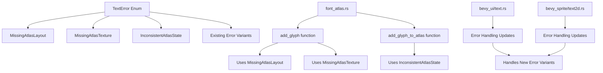

+++
title = "#21790 Replace unwrap() calls with proper error handling in font_altas"
date = "2025-11-12T00:00:00"
draft = false
template = "pull_request_page.html"
in_search_index = false

[extra]
current_language = "zh-cn"
available_languages = {"en" = { name = "English", url = "/pull_request/bevy/2025-11/pr-21790-en-20251112" }, "zh-cn" = { name = "中文", url = "/pull_request/bevy/2025-11/pr-21790-zh-cn-20251112" }}
labels = ["A-UI", "C-Code-Quality", "C-Usability", "A-Text", "D-Straightforward"]
+++

# Replace unwrap() calls with proper error handling in font_altas

## Basic Information
- **Title**: Replace unwrap() calls with proper error handling in font_altas
- **PR Link**: https://github.com/bevyengine/bevy/pull/21790
- **Author**: Breakdown-Dog
- **Status**: MERGED
- **Labels**: A-UI, C-Code-Quality, C-Usability, S-Ready-For-Final-Review, A-Text, D-Straightforward
- **Created**: 2025-11-09T07:12:30Z
- **Merged**: 2025-11-09T19:12:59Z
- **Merged By**: alice-i-cecile

## Description Translation
# 目标

- 在 `font_atlas.rs` 的 `add_glyph()` 和 `add_glyph_to_atlas()` 中替换 `unwrap()` 调用，使用适当的错误处理来防止 panic 并提供清晰的信息。

## 解决方案

- 在 TextError 枚举中添加新的变体以提供更具体的错误信息。

## The Story of This Pull Request

这个 PR 的核心问题是处理字体图集系统中的潜在 panic 风险。在原始的 `font_atlas.rs` 实现中，有几个关键位置使用了 `unwrap()` 方法来处理资源访问，这在资源不存在时会直接导致程序崩溃。对于游戏引擎这样的关键基础设施来说，这种硬崩溃是不可接受的，特别是在处理用户提供的字体资源时。

问题主要集中在两个核心函数上：`add_glyph()` 和 `add_glyph_to_atlas()`。在 `add_glyph()` 中，代码直接使用 `unwrap()` 来获取纹理图集布局和纹理资源：

```rust
// 修改前的问题代码
let atlas_layout = atlas_layouts.get_mut(&self.texture_atlas).unwrap();
let atlas_texture = textures.get_mut(&self.texture).unwrap();
```

这种写法假设这些资源总是存在的，但在实际运行中，如果资源管理出现问题或者异步加载未完成，就会导致 panic。同样，在 `add_glyph_to_atlas()` 的末尾，代码也使用了 `unwrap()` 来获取图集信息：

```rust
// 修改前的问题代码
Ok(get_glyph_atlas_info(font_atlases, physical_glyph.cache_key).unwrap())
```

解决方案采用了系统化的错误处理方式。首先，在 `error.rs` 中扩展了 `TextError` 枚举，添加了三个新的错误变体：

```rust
/// Missing texture atlas layout for the font
#[error("missing texture atlas layout for the font")]
MissingAtlasLayout,
/// Missing texture for the font atlas  
#[error("missing texture for the font atlas")]
MissingAtlasTexture,
/// Failed to find glyph in atlas after it was added
#[error("failed to find glyph in atlas after it was added")]
InconsistentAtlasState,
```

这些错误变体提供了明确的错误信息，帮助开发者快速定位问题所在。`MissingAtlasLayout` 和 `MissingAtlasTexture` 对应资源缺失的情况，而 `InconsistentAtlasState` 处理了字形添加后但在图集中找不到的不一致状态。

在 `add_glyph()` 函数中，`unwrap()` 被替换为使用 `ok_or()` 的错误传播：

```rust
// 修改后的正确实现
let atlas_layout = atlas_layouts
    .get_mut(&self.texture_atlas)
    .ok_or(TextError::MissingAtlasLayout)?;
let atlas_texture = textures
    .get_mut(&self.texture)
    .ok_or(TextError::MissingAtlasTexture)?;
```

这种修改不仅消除了 panic 风险，还通过 `?` 操作符实现了清晰的错误传播。当资源不存在时，函数会立即返回相应的错误，而不是崩溃。

在 `add_glyph_to_atlas()` 函数中，修改更加细致。原来的代码在创建新的字体图集后立即使用 `font_atlases.last_mut().unwrap()` 来访问它：

```rust
// 修改前的实现
font_atlases.push(FontAtlas::new(
    textures,
    texture_atlases,
    UVec2::splat(containing),
    font_smoothing,
));

font_atlases.last_mut().unwrap().add_glyph(
    textures,
    texture_atlases,
    physical_glyph.cache_key,
    &glyph_texture,
    offset,
)?;
```

修改后的版本使用临时变量来避免 `unwrap()`：

```rust
// 修改后的实现
let mut new_atlas = FontAtlas::new(
    textures,
    texture_atlases,
    UVec2::splat(containing),
    font_smoothing,
);

new_atlas.add_glyph(
    textures,
    texture_atlases,
    physical_glyph.cache_key,
    &glyph_texture,
    offset,
)?;

font_atlases.push(new_atlas);
```

这种重构不仅消除了 `unwrap()`，还使代码逻辑更加清晰。最后，获取图集信息的调用也改为使用错误处理：

```rust
get_glyph_atlas_info(font_atlases, physical_glyph.cache_key)
    .ok_or(TextError::InconsistentAtlasState)
```

为了保持错误处理的一致性，还需要在调用这些函数的地方更新错误处理逻辑。在 `bevy_ui/src/widget/text.rs` 和 `bevy_sprite/src/text2d.rs` 中，错误匹配模式被扩展以包含新的错误变体：

```rust
Err(
    e @ (TextError::FailedToAddGlyph(_)
    | TextError::FailedToGetGlyphImage(_)
    | TextError::MissingAtlasLayout
    | TextError::MissingAtlasTexture
    | TextError::InconsistentAtlasState),
) => {
    panic!("Fatal error when processing text: {e}.");
}
```

这种设计选择很有意思：虽然 PR 的目标是消除 `unwrap()` 调用，但在某些边界情况下，仍然选择 panic 而不是静默失败。这是因为字体处理失败通常表示系统处于不可恢复的状态，继续运行可能会导致更严重的问题。通过将 `unwrap()` 替换为明确的错误检查和 panic，代码提供了更好的错误信息和更可控的失败路径。

从技术角度来看，这个 PR 展示了 Rust 错误处理的最佳实践：
1. 使用枚举类型提供丰富的错误信息
2. 用 `ok_or()` 和 `?` 操作符替代 `unwrap()`
3. 在适当的层级处理错误（这里在字体处理层面捕获错误，但在系统层面决定如何处理）
4. 提供清晰的错误信息帮助调试

这个修改虽然代码量不大，但对系统的健壮性有显著提升。它确保了字体处理失败时能够提供有用的诊断信息，而不是简单地崩溃，这对于处理各种字体文件和用户输入的场景尤为重要。

## Visual Representation



## Key Files Changed

### `crates/bevy_text/src/error.rs` (+9/-0)
**目的**: 扩展错误枚举以支持新的错误类型

```rust
// 新增的错误变体
/// Missing texture atlas layout for the font
#[error("missing texture atlas layout for the font")]
MissingAtlasLayout,
/// Missing texture for the font atlas
#[error("missing texture for the font atlas")]  
MissingAtlasTexture,
/// Failed to find glyph in atlas after it was added
#[error("failed to find glyph in atlas after it was added")]
InconsistentAtlasState,
```

### `crates/bevy_text/src/font_atlas.rs` (+14/-6)
**目的**: 替换 `unwrap()` 调用为适当的错误处理

```rust
// 修改前:
let atlas_layout = atlas_layouts.get_mut(&self.texture_atlas).unwrap();
let atlas_texture = textures.get_mut(&self.texture).unwrap();

// 修改后:
let atlas_layout = atlas_layouts
    .get_mut(&self.texture_atlas)
    .ok_or(TextError::MissingAtlasLayout)?;
let atlas_texture = textures
    .get_mut(&self.texture)
    .ok_or(TextError::MissingAtlasTexture)?;
```

```rust
// 修改前:
font_atlases.push(FontAtlas::new(...));
font_atlases.last_mut().unwrap().add_glyph(...)?;

// 修改后:
let mut new_atlas = FontAtlas::new(...);
new_atlas.add_glyph(...)?;
font_atlases.push(new_atlas);
```

```rust
// 修改前:
Ok(get_glyph_atlas_info(font_atlases, physical_glyph.cache_key).unwrap())

// 修改后:
get_glyph_atlas_info(font_atlases, physical_glyph.cache_key)
    .ok_or(TextError::InconsistentAtlasState)
```

### `crates/bevy_ui/src/widget/text.rs` (+14/-2) 和 `crates/bevy_sprite/src/text2d.rs` (+7/-1)
**目的**: 更新错误处理以包含新的错误变体

```rust
// 修改后的错误匹配模式
Err(
    e @ (TextError::FailedToAddGlyph(_)
    | TextError::FailedToGetGlyphImage(_)
    | TextError::MissingAtlasLayout
    | TextError::MissingAtlasTexture
    | TextError::InconsistentAtlasState),
) => {
    panic!("Fatal error when processing text: {e}.");
}
```

## Further Reading

- [Rust 错误处理指南](https://doc.rust-lang.org/book/ch09-00-error-handling.html)
- [Bevy 引擎的 ECS 架构](https://bevyengine.org/learn/book/introduction/)
- [Rust 的 Option 和 Result 类型](https://doc.rust-lang.org/std/option/enum.Option.html)
- [游戏引擎中的资源管理模式](https://gameprogrammingpatterns.com/)