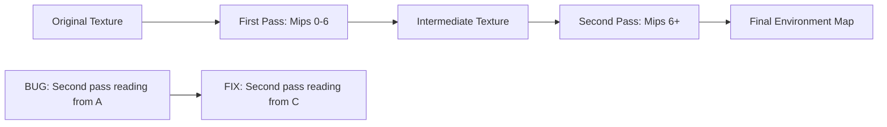

+++
title = "#21791 Fix binding in generated environment map downsampling pipeline"
date = "2025-11-12T00:00:00"
draft = false
template = "pull_request_page.html"
in_search_index = true

[taxonomies]
list_display = ["show"]

[extra]
current_language = "en"
available_languages = {"en" = { name = "English", url = "/pull_request/bevy/2025-11/pr-21791-en-20251112" }, "zh-cn" = { name = "中文", url = "/pull_request/bevy/2025-11/pr-21791-zh-cn-20251112" }}
labels = ["C-Bug", "A-Rendering", "O-WebGPU"]
+++

# Title

## Basic Information
- **Title**: Fix binding in generated environment map downsampling pipeline
- **PR Link**: https://github.com/bevyengine/bevy/pull/21791
- **Author**: ashivaram23
- **Status**: MERGED
- **Labels**: C-Bug, A-Rendering, O-WebGPU, S-Needs-Review
- **Created**: 2025-11-09T13:54:13Z
- **Merged**: 2025-11-09T20:05:45Z
- **Merged By**: alice-i-cecile

## Description Translation

# Objective

When Bevy splits mip generation for environment maps into two passes due to limits, the second pass binds a view to the the original texture when it's supposed to be the 6th mip level of an intermediate one. This causes an error on WebGPU in browsers if that original texture doesn't already have mipmaps.

This affects the atmosphere example on WebGPU, but there are other issues there too so it still won't work after this.

## Solution

Create texture view from the texture in the `IntermediateTextures` component instead of in `RenderEnvironmentMap`

## Testing

<details>

<summary>Example that doesn't work on WebGPU before this (replace square.png with any power of 2 square image that doesn't store mipmaps)</summary>

```rust
use bevy::prelude::*;

fn main() {
    App::new()
        .add_plugins(DefaultPlugins)
        .add_systems(Startup, setup)
        .run();
}

fn setup(
    mut commands: Commands,
    asset_server: Res<AssetServer>,
    mut meshes: ResMut<Assets<Mesh>>,
    mut materials: ResMut<Assets<StandardMaterial>>,
) {
    commands.spawn((
        Camera3d::default(),
        Transform::from_xyz(0.0, 0.0, 5.0),
        GeneratedEnvironmentMapLight {
            environment_map: asset_server.load("square.png"),
            intensity: 1000.0,
            ..Default::default()
        },
    ));

    commands.spawn((
        Mesh3d(meshes.add(Sphere::new(1.0).mesh().build())),
        MeshMaterial3d(materials.add(StandardMaterial {
            perceptual_roughness: 0.1,
            metallic: 1.0,
            ..Default::default()
        })),
    ));
}
```

</details>

## The Story of This Pull Request

This PR addresses a specific bug in Bevy's environment map downsampling pipeline that manifested primarily on WebGPU platforms. The issue occurred when the mipmap generation process for environment maps needed to be split into two passes due to hardware limitations.

The core problem was in the texture binding logic for the second pass of the split mip generation. When generating mipmaps, Bevy creates a pyramid of progressively smaller versions of the original texture. In cases where the hardware can't generate all mip levels in a single pass, the process splits into two passes. The first pass generates mips 0-6, and the second pass continues from mip 6 onward.

The bug was in how the second pass accessed its input texture. Instead of reading from the intermediate texture that contained the partially generated mip chain (specifically mip level 6), it was incorrectly trying to read from the original source texture. This caused WebGPU validation errors because the original texture often doesn't have pre-generated mipmaps, making mip level 6 inaccessible.

The fix was straightforward but critical: change the texture view creation to use the intermediate texture from the `IntermediateTextures` component rather than the original `RenderEnvironmentMap` texture. This ensures that when the second pass executes, it reads from the correct mip level that was generated by the first pass.

The implementation change is minimal but impactful. In the `prepare_generated_environment_map_bind_groups` function, the code now creates the texture view from `textures.environment_map.texture` instead of `env_map_texture`. This subtle difference ensures proper pipeline continuity between the two passes.

This bug is particularly relevant for WebGPU because WebGPU has stricter validation rules compared to native graphics APIs. While the incorrect binding might have worked on some native implementations due to more lenient validation, WebGPU correctly flags this as an error, making the bug more apparent in web environments.

The provided test case demonstrates the issue clearly - using a simple power-of-2 texture without pre-generated mipmaps would trigger the WebGPU validation error before this fix. While the atmosphere example still has other issues on WebGPU, this specific binding error is now resolved.

## Visual Representation



## Key Files Changed

### `crates/bevy_pbr/src/light_probe/generate.rs` (+10/-6)

This file contains the core logic for generating environment maps and their mip chains. The change fixes the texture binding in the split mip generation path.

**Key modification:**
```rust
// Before:
let input_env_map_second = env_map_texture.create_view(&TextureViewDescriptor {
    dimension: Some(TextureViewDimension::D2Array),
    base_mip_level: min(6, last_mip),
    mip_level_count: Some(1),
    ..Default::default()
});

// After:
let input_env_map_second =
    textures
        .environment_map
        .texture
        .create_view(&TextureViewDescriptor {
            dimension: Some(TextureViewDimension::D2Array),
            base_mip_level: min(6, last_mip),
            mip_level_count: Some(1),
            ..Default::default()
        });
```

The change ensures that when creating the texture view for the second pass of split mip generation, we use the intermediate texture (`textures.environment_map.texture`) that contains the partially generated mip chain, rather than the original source texture (`env_map_texture`). This maintains the correct data flow through the multi-pass mip generation pipeline.

## Further Reading

- [WebGPU Specification](https://www.w3.org/TR/webgpu/) - Understanding WebGPU's validation rules
- [Mipmapping Theory](https://en.wikipedia.org/wiki/Mipmap) - Background on mipmap generation
- [Bevy Rendering Documentation](https://bevyengine.org/learn/quick-start/3d/) - Bevy's 3D rendering pipeline
- [Texture Views in Graphics APIs](https://gpuweb.github.io/gpuweb/#texture-view-creation) - How texture views work in modern graphics APIs