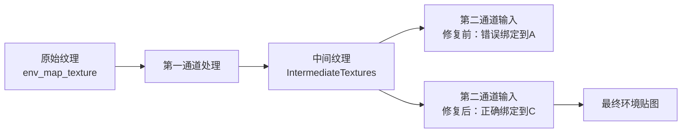

+++
title = "#21791 Fix binding in generated environment map downsampling pipeline"
date = "2025-11-12T00:00:00"
draft = false
template = "pull_request_page.html"
in_search_index = false

[extra]
current_language = "zh-cn"
available_languages = {"en" = { name = "English", url = "/pull_request/bevy/2025-11/pr-21791-en-20251112" }, "zh-cn" = { name = "中文", url = "/pull_request/bevy/2025-11/pr-21791-zh-cn-20251112" }}
labels = ["C-Bug", "A-Rendering", "O-WebGPU"]
+++

# Title
Fix binding in generated environment map downsampling pipeline

## Basic Information
- **Title**: Fix binding in generated environment map downsampling pipeline
- **PR Link**: https://github.com/bevyengine/bevy/pull/21791
- **Author**: ashivaram23
- **Status**: MERGED
- **Labels**: C-Bug, A-Rendering, O-WebGPU, S-Needs-Review
- **Created**: 2025-11-09T13:54:13Z
- **Merged**: 2025-11-09T20:05:45Z
- **Merged By**: alice-i-cecile

## Description Translation
# 目标

当 Bevy 由于限制将环境贴图的 mip 生成分成两个通道时，第二个通道将视图绑定到原始纹理，而它本应是中间纹理的第6个 mip 级别。如果该原始纹理尚未包含 mipmaps，这会在浏览器的 WebGPU 上导致错误。

这会影响 WebGPU 上的 atmosphere 示例，但那里还有其他问题，因此在此修复后它仍然无法工作。

## 解决方案

从 `IntermediateTextures` 组件中的纹理创建纹理视图，而不是在 `RenderEnvironmentMap` 中创建

## 测试

<details>

<summary>在修复前在 WebGPU 上无法工作的示例（将 square.png 替换为任何不存储 mipmaps 的 2 次幂方形图像）</summary>

```rust
use bevy::prelude::*;

fn main() {
    App::new()
        .add_plugins(DefaultPlugins)
        .add_systems(Startup, setup)
        .run();
}

fn setup(
    mut commands: Commands,
    asset_server: Res<AssetServer>,
    mut meshes: ResMut<Assets<Mesh>>,
    mut materials: ResMut<Assets<StandardMaterial>>,
) {
    commands.spawn((
        Camera3d::default(),
        Transform::from_xyz(0.0, 0.0, 5.0),
        GeneratedEnvironmentMapLight {
            environment_map: asset_server.load("square.png"),
            intensity: 1000.0,
            ..Default::default()
        },
    ));

    commands.spawn((
        Mesh3d(meshes.add(Sphere::new(1.0).mesh().build())),
        MeshMaterial3d(materials.add(StandardMaterial {
            perceptual_roughness: 0.1,
            metallic: 1.0,
            ..Default::default()
        })),
    ));
}
```

</details>

## The Story of This Pull Request

这个 PR 解决了一个在环境贴图 mipmap 生成过程中的资源绑定错误。问题出现在当 Bevy 需要将 mipmap 生成分成两个通道执行时 - 这种情况通常发生在硬件对单次通道中可处理的 mip 级别数量有限制时。

问题的核心在于第二个通道的错误纹理绑定。在分通道处理的情况下，第一个通道会生成中间纹理并填充前几个 mip 级别，然后第二个通道应该继续从这个中间纹理的第6个 mip 级别开始处理。但是，原始代码错误地从原始输入纹理创建了视图，而不是从中间纹理创建。

这在 WebGPU 环境中会导致严重问题，因为原始输入纹理（如示例中的 `square.png`）可能根本不包含 mipmaps。当尝试从这样的纹理创建指向第6个 mip 级别的视图时，WebGPU 会抛出错误，因为该 mip 级别不存在。

从技术实现的角度看，问题出现在 `prepare_generated_environment_map_bind_groups` 函数中。当检测到需要分通道处理时（`split_path` 为 true），代码创建第二个输入视图 `input_env_map_second`。修复前，这个视图是从 `env_map_texture`（原始纹理）创建的；修复后，改为从 `textures.environment_map.texture`（中间纹理）创建。

这个修复体现了资源生命周期管理的正确模式：在分通道处理的工作流中，后续通道应该依赖于前一个通道产生的中间结果，而不是回退到原始输入。这种模式在图形管道中很常见，特别是在需要多通道处理的复杂渲染效果中。

虽然这个修复解决了 WebGPU 上的特定错误，但作者也明确指出 atmosphere 示例仍有其他问题需要解决。这种诚实的技术评估很有价值，它帮助其他开发者理解这个修复的边界和局限性。

## Visual Representation



## Key Files Changed

### `crates/bevy_pbr/src/light_probe/generate.rs` (+10/-6)

这个文件包含了环境贴图生成的核心逻辑。主要修改在 `prepare_generated_environment_map_bind_groups` 函数中，修复了分通道处理时的纹理绑定错误。

**关键修改：**

```rust
// Before:
let input_env_map_second = env_map_texture.create_view(&TextureViewDescriptor {
    dimension: Some(TextureViewDimension::D2Array),
    base_mip_level: min(6, last_mip),
    mip_level_count: Some(1),
    ..Default::default()
});

// After:
let input_env_map_second =
    textures
        .environment_map
        .texture
        .create_view(&TextureViewDescriptor {
            dimension: Some(TextureViewDimension::D2Array),
            base_mip_level: min(6, last_mip),
            mip_level_count: Some(1),
            ..Default::default()
        });
```

这个修改将纹理视图的创建从原始纹理 (`env_map_texture`) 切换到中间纹理 (`textures.environment_map.texture`)，确保了在分通道处理的工作流中，后续通道能够正确访问前一个通道生成的中间结果。

## Further Reading

- [WebGPU Specification](https://www.w3.org/TR/webgpu/) - WebGPU 标准文档
- [Bevy Rendering Documentation](https://bevyengine.org/learn/book/rendering/) - Bevy 渲染系统文档
- [Mipmapping Theory](https://en.wikipedia.org/wiki/Mipmap) - Mipmap 技术原理
- [Texture Views in Graphics APIs](https://gpuweb.github.io/gpuweb/#texture-view-creation) - 图形 API 中的纹理视图概念