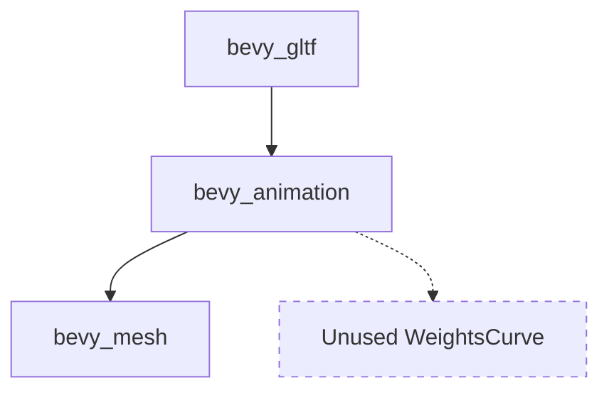

+++
title = "#21793 Delete unused WeightsCurve, and enable feature for bevy_animation."
date = "2025-11-15T00:00:00"
draft = false
template = "pull_request_page.html"
in_search_index = true

[taxonomies]
list_display = ["show"]

[extra]
current_language = "en"
available_languages = {"en" = { name = "English", url = "/pull_request/bevy/2025-11/pr-21793-en-20251115" }, "zh-cn" = { name = "中文", url = "/pull_request/bevy/2025-11/pr-21793-zh-cn-20251115" }}
labels = ["C-Bug", "D-Trivial", "A-glTF"]
+++

# Delete unused WeightsCurve, and enable feature for bevy_animation.

## Basic Information
- **Title**: Delete unused WeightsCurve, and enable feature for bevy_animation.
- **PR Link**: https://github.com/bevyengine/bevy/pull/21793
- **Author**: andriyDev
- **Status**: MERGED
- **Labels**: C-Bug, D-Trivial, S-Ready-For-Final-Review, A-glTF
- **Created**: 2025-11-09T21:03:17Z
- **Merged**: 2025-11-15T19:00:27Z
- **Merged By**: alice-i-cecile

## Description Translation
# Objective

- Fix `cargo b -p bevy_gltf --all-features`

## Solution

- Delete an unused symbol with the same name.
- Add the `bevy_mesh` feature on `bevy_animation` in `bevy_gltf`, so the correct WeightsCurve is chosen.

## Testing

- CI, and running with `--all-features`.

## The Story of This Pull Request

This PR addresses a build failure that occurred when compiling `bevy_gltf` with the `--all-features` flag. The root cause was a naming conflict between two different `WeightsCurve` types in the codebase, combined with missing feature dependencies.

The problem stemmed from having two separate `WeightsCurve` enum definitions in different parts of the codebase. One was defined in `bevy_animation/src/gltf_curves.rs` and the other was the intended implementation that properly integrated with the morph weights system from `bevy_mesh`. When building with all features enabled, the compiler encountered this duplicate symbol, causing the build to fail.

The solution involved two coordinated changes. First, the unused `WeightsCurve` definition in `bevy_animation` was completely removed since it wasn't being used anywhere in the codebase. This eliminated the naming conflict at its source. The removed code was a comprehensive enum definition that supported different interpolation modes for morph weight curves:

```rust
// File: crates/bevy_animation/src/gltf_curves.rs
// Removed code:
pub enum WeightsCurve {
    /// A curve which takes a constant value over its domain. Notably, this is how animations with
    /// only a single keyframe are interpreted.
    Constant(ConstantCurve<Vec<f32>>),

    /// A curve which interpolates weights linearly between keyframes.
    Linear(WideLinearKeyframeCurve<f32>),

    /// A curve which interpolates weights between keyframes in steps.
    Step(WideSteppedKeyframeCurve<f32>),

    /// A curve which interpolates between keyframes by using auxiliary tangent data to join
    /// adjacent keyframes with a cubic Hermite spline, which is then sampled.
    CubicSpline(WideCubicKeyframeCurve<f32>),
}
```

Second, the dependency configuration in `bevy_gltf` was updated to ensure that when the animation feature is enabled, it properly pulls in the `bevy_mesh` feature as well. This was necessary because the correct `WeightsCurve` implementation depends on types from `bevy_mesh`, specifically the `MorphWeights` type referenced in the documentation.

The Cargo.toml change ensures that the dependency chain is correctly established:

```toml
# File: crates/bevy_gltf/Cargo.toml
# Before:
bevy_animation = { path = "../bevy_animation", version = "0.18.0-dev", optional = true }

# After:
bevy_animation = { path = "../bevy_animation", version = "0.18.0-dev", optional = true, features = [
  "bevy_mesh",
] }
```

This fix demonstrates a common pattern in Rust projects where feature dependencies need to be explicitly declared to ensure that all necessary code paths are available when certain feature combinations are enabled. The unused code removal also follows good software engineering practices by eliminating dead code that could cause maintenance issues or confusion for developers working on the codebase.

The changes are minimal but effective - removing 26 lines of unused code and adding 3 lines to fix the feature dependency. This kind of cleanup is important for maintaining code quality and preventing build issues, especially in a large project like Bevy where multiple crates interact through complex feature flag combinations.

## Visual Representation



The diagram shows the dependency relationship where `bevy_gltf` depends on `bevy_animation`, which in turn should depend on `bevy_mesh` for the correct `WeightsCurve` implementation. The dashed line indicates the unused `WeightsCurve` that was removed.

## Key Files Changed

### `crates/bevy_animation/src/gltf_curves.rs` (+0/-26)
This file had an unused `WeightsCurve` enum definition that was causing a naming conflict. The entire enum and its documentation were removed.

**Key changes:**
- Removed unused `WeightsCurve` enum definition
- Eliminated duplicate symbol that conflicted with the intended implementation
- Cleaned up dead code that wasn't being used anywhere

### `crates/bevy_gltf/Cargo.toml` (+3/-1)
Updated the dependency configuration to ensure proper feature propagation.

**Key changes:**
```toml
# Before:
bevy_animation = { path = "../bevy_animation", version = "0.18.0-dev", optional = true }

# After:
bevy_animation = { path = "../bevy_animation", version = "0.18.0-dev", optional = true, features = [
  "bevy_mesh",
] }
```

This change ensures that when `bevy_gltf` uses the animation feature, it properly enables the `bevy_mesh` feature in `bevy_animation`, allowing access to the correct `WeightsCurve` implementation.

## Further Reading

- [Rust Cargo Features Documentation](https://doc.rust-lang.org/cargo/reference/features.html)
- [Bevy Engine Documentation](https://bevyengine.org/learn/)
- [glTF Animation System](https://github.com/KhronosGroup/glTF/tree/main/specification/2.0#animations)