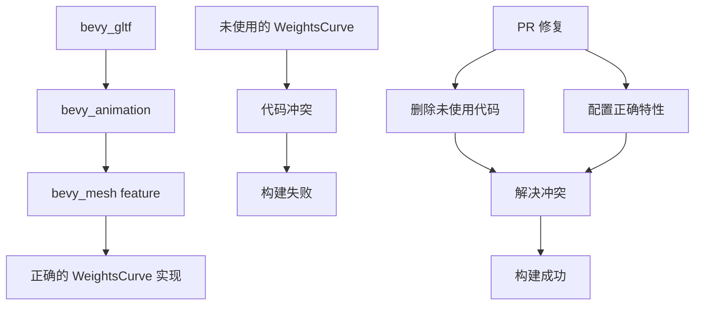

+++
title = "#21793 Delete unused WeightsCurve, and enable feature for bevy_animation."
date = "2025-11-15T00:00:00"
draft = false
template = "pull_request_page.html"
in_search_index = false

[extra]
current_language = "zh-cn"
available_languages = {"en" = { name = "English", url = "/pull_request/bevy/2025-11/pr-21793-en-20251115" }, "zh-cn" = { name = "中文", url = "/pull_request/bevy/2025-11/pr-21793-zh-cn-20251115" }}
labels = ["C-Bug", "D-Trivial", "A-glTF"]
+++

# Title

## Basic Information
- **Title**: Delete unused WeightsCurve, and enable feature for bevy_animation.
- **PR Link**: https://github.com/bevyengine/bevy/pull/21793
- **Author**: andriyDev
- **Status**: MERGED
- **Labels**: C-Bug, D-Trivial, S-Ready-For-Final-Review, A-glTF
- **Created**: 2025-11-09T21:03:17Z
- **Merged**: 2025-11-15T19:00:27Z
- **Merged By**: alice-i-cecile

## Description Translation
**目标**
- 修复 `cargo b -p bevy_gltf --all-features`

**解决方案**
- 删除一个同名的未使用符号。
- 在 `bevy_gltf` 中的 `bevy_animation` 上添加 `bevy_mesh` 特性，以便选择正确的 WeightsCurve。

**测试**
- CI，以及使用 `--all-features` 运行。

## The Story of This Pull Request

这个PR解决了一个在构建bevy_gltf时出现的编译问题。当开发者尝试使用`--all-features`标志构建bevy_gltf时，构建会失败。问题的根源在于符号冲突和特性配置不正确。

问题的核心是`WeightsCurve`类型存在重复定义。在bevy_animation模块中定义了一个未使用的`WeightsCurve`枚举，这个定义与bevy_mesh中实际使用的`WeightsCurve`产生了冲突。当启用所有特性时，编译器无法确定应该使用哪个定义。

开发者采取了两个直接的措施来解决这个问题。首先，他们完全删除了bevy_animation中未使用的`WeightsCurve`定义。这个枚举有四个变体，分别对应不同的插值模式：Constant、Linear、Step和CubicSpline，但由于未被实际使用，删除它是安全的清理操作。

```rust
// 被删除的代码：
pub enum WeightsCurve {
    Constant(ConstantCurve<Vec<f32>>),
    Linear(WideLinearKeyframeCurve<f32>),
    Step(WideSteppedKeyframeCurve<f32>),
    CubicSpline(WideCubicKeyframeCurve<f32>),
}
```

第二个措施是在bevy_gltf的Cargo.toml中为bevy_animation依赖添加了bevy_mesh特性。这个配置确保当bevy_gltf使用bevy_animation时，正确的WeightsCurve实现会被选择。

```toml
// 修改前：
bevy_animation = { path = "../bevy_animation", version = "0.18.0-dev", optional = true }

// 修改后：
bevy_animation = { path = "../bevy_animation", version = "0.18.0-dev", optional = true, features = [
  "bevy_mesh",
] }
```

从技术角度来看，这个PR展示了Rust特性系统的一个实际应用场景。特性标志允许条件编译，确保只有需要的代码路径被包含在最终二进制中。在这种情况下，bevy_mesh特性控制了哪个WeightsCurve实现被编译和使用。

这个修复虽然简单，但很重要，因为它恢复了项目的完整构建能力。在大型项目中，保持所有构建配置正常工作对于持续集成和开发者体验至关重要。通过删除未使用的代码和正确配置依赖特性，PR不仅解决了立即的构建问题，还改善了代码库的维护性。

## Visual Representation



## Key Files Changed

### crates/bevy_animation/src/gltf_curves.rs
**变更：** 删除未使用的WeightsCurve枚举定义（26行代码）

这个文件中的WeightsCurve枚举已经完全不再使用，但依然存在于代码库中，导致了符号冲突。删除这个未使用的定义解决了编译时的命名冲突问题。

```rust
// 被删除的完整代码块：
/// A curve specifying the [`MorphWeights`] for a mesh in animation. The variants are broken
/// down by interpolation mode (with the exception of `Constant`, which never interpolates).
///
/// This type is, itself, a `Curve<Vec<f32>>`; however, in order to avoid allocation, it is
/// recommended to use its implementation of the [`IterableCurve`] trait, which allows iterating
/// directly over information derived from the curve without allocating.
///
/// [`MorphWeights`]: bevy_mesh::morph::MorphWeights
#[derive(Debug, Clone, Reflect)]
#[reflect(Clone)]
pub enum WeightsCurve {
    /// A curve which takes a constant value over its domain. Notably, this is how animations with
    /// only a single keyframe are interpreted.
    Constant(ConstantCurve<Vec<f32>>),

    /// A curve which interpolates weights linearly between keyframes.
    Linear(WideLinearKeyframeCurve<f32>),

    /// A curve which interpolates weights between keyframes in steps.
    Step(WideSteppedKeyframeCurve<f32>),

    /// A curve which interpolates between keyframes by using auxiliary tangent data to join
    /// adjacent keyframes with a cubic Hermite spline, which is then sampled.
    CubicSpline(WideCubicKeyframeCurve<f32>),
}
```

### crates/bevy_gltf/Cargo.toml
**变更：** 为bevy_animation依赖添加bevy_mesh特性

这个修改确保在构建bevy_gltf时，bevy_animation模块会启用bevy_mesh特性，从而使用正确的WeightsCurve实现。

```toml
// 修改前：
bevy_animation = { path = "../bevy_animation", version = "0.18.0-dev", optional = true }

// 修改后：
bevy_animation = { path = "../bevy_animation", version = "0.18.0-dev", optional = true, features = [
  "bevy_mesh",
] }
```

## Further Reading

- [Rust Cargo Features Documentation](https://doc.rust-lang.org/cargo/reference/features.html) - 了解Rust特性系统的工作原理
- [Bevy Engine Documentation](https://bevyengine.org/learn/) - Bevy游戏引擎的官方文档
- [Conditional Compilation in Rust](https://doc.rust-lang.org/reference/attributes/conditional-compilation.html) - Rust条件编译的详细说明