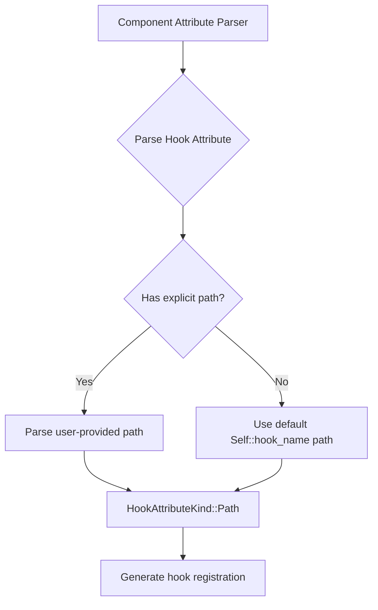

+++
title = "#21800 Improve Component Hook Ergonomics"
date = "2025-11-12T00:00:00"
draft = false
template = "pull_request_page.html"
in_search_index = true

[taxonomies]
list_display = ["show"]

[extra]
current_language = "en"
available_languages = {"en" = { name = "English", url = "/pull_request/bevy/2025-11/pr-21800-en-20251112" }, "zh-cn" = { name = "中文", url = "/pull_request/bevy/2025-11/pr-21800-zh-cn-20251112" }}
labels = ["A-ECS", "C-Usability"]
+++

# Improve Component Hook Ergonomics

## Basic Information
- **Title**: Improve Component Hook Ergonomics
- **PR Link**: https://github.com/bevyengine/bevy/pull/21800
- **Author**: VasanthakumarV
- **Status**: MERGED
- **Labels**: A-ECS, C-Usability, S-Needs-Review
- **Created**: 2025-11-10T10:43:50Z
- **Merged**: 2025-11-12T23:21:16Z
- **Merged By**: cart

## Description Translation
# Objective

Fixes: https://github.com/bevyengine/bevy/issues/21794

## Solution

- If a hook-path is not provided by the user we insert the default path.

## Testing

Added a doctest (Edit).

Ran and looked at the expanded macro of the following example,

```rust
use bevy_ecs::lifecycle::HookContext;
use bevy_ecs::prelude::*;
use bevy_ecs::world::DeferredWorld;

#[derive(Component)]
#[component(on_add, on_insert, on_despawn, on_remove=on_remove)]
struct Tile;

impl Tile {
    fn on_add(_world: DeferredWorld, _context: HookContext) {
        println!("added");
    }
    fn on_insert(_world: DeferredWorld, _context: HookContext) {
        println!("inserted");
    }
    fn on_despawn(_world: DeferredWorld, _context: HookContext) {
        println!("despawned");
    }
}

fn on_remove(_world: DeferredWorld, _context: HookContext) {
    println!("removed");
}

fn main() {
    let mut world = World::new();
    let entity = world.spawn(Tile);
    entity.despawn();
}
```

## The Story of This Pull Request

This PR addresses a common ergonomic issue in Bevy's ECS system where developers had to explicitly specify hook function paths even when using conventional naming patterns. The problem was that component lifecycle hooks required verbose syntax that didn't align with common Rust conventions.

The core issue was in the macro parsing logic for component attributes. Previously, when a developer wrote `#[component(on_add)]` without specifying a function path, the macro system would fail to parse the attribute. Users were forced to write `#[component(on_add = Self::on_add)]` even when the hook function followed the expected naming convention.

The solution involved modifying the `HookAttributeKind` parsing logic to provide sensible defaults when no explicit path is specified. The key insight was that for common lifecycle events like `on_add`, `on_insert`, `on_remove`, etc., the default behavior should assume a method on the component struct itself with the same name.

The implementation introduces a new `parse` method on `HookAttributeKind` that checks if the user provided an explicit path using the `=` syntax. If they did, it parses the expression normally. If not, it uses a closure-provided default path. This approach maintains backward compatibility while adding the new ergonomic feature.

```rust
// Before: Required explicit path specification
#[component(on_add = Self::on_add, on_insert = Self::on_insert)]

// After: Can use conventional naming without explicit paths  
#[component(on_add, on_insert)]
```

The changes are concentrated in the macro parsing layer, specifically in how attribute meta items are processed. Each hook type (`on_add`, `on_insert`, `on_replace`, `on_remove`, `on_despawn`) now gets a default path generated using `parse_quote! { Self::on_add }` and similar patterns.

This change significantly reduces boilerplate for common use cases while maintaining full flexibility for advanced scenarios. Developers can still specify custom function paths when needed, but for the 80% case where they follow conventional naming, the syntax is much cleaner.

The PR includes comprehensive documentation updates and tests to ensure the new behavior works correctly and is well-documented for users.

## Visual Representation



## Key Files Changed

### `crates/bevy_ecs/macros/src/component.rs` (+27/-11)

This file contains the core macro logic for parsing component attributes. The main change replaces the simple `Parse` trait implementation with a custom parsing method that handles default paths.

**Key changes:**

```rust
// Before: Simple parsing that required explicit paths
impl Parse for HookAttributeKind {
    fn parse(input: syn::parse::ParseStream) -> Result<Self> {
        input.parse::<Expr>().and_then(Self::from_expr)
    }
}

// After: Smart parsing with default paths
impl HookAttributeKind {
    fn parse(
        input: syn::parse::ParseStream,
        default_hook_path: impl FnOnce() -> ExprPath,
    ) -> Result<Self> {
        if input.peek(Token![=]) {
            input.parse::<Token![=]>()?;
            input.parse::<Expr>().and_then(Self::from_expr)
        } else {
            Ok(Self::Path(default_hook_path()))
        }
    }
}
```

The attribute parsing calls were updated to use the new method:

```rust
// Before
attrs.on_add = Some(nested.value()?.parse::<HookAttributeKind>()?);

// After  
attrs.on_add = Some(HookAttributeKind::parse(nested.input, || {
    parse_quote! { Self::on_add }
})?);
```

### `crates/bevy_ecs/macros/src/lib.rs` (+1/-0)

Updated macro documentation to reflect the new elision capability:

```rust
/// `function` can be elided if the path is `Self::on_add`, `Self::on_insert` etc.
```

### `crates/bevy_ecs/src/component/mod.rs` (+23/-0)

Added comprehensive documentation with a practical example showing the new syntax:

```rust
/// A hook's function path can be elided if it is `Self::on_add`, `Self::on_insert` etc.
/// ```
/// # use bevy_ecs::lifecycle::HookContext;
/// # use bevy_ecs::prelude::*;
/// # use bevy_ecs::world::DeferredWorld;
/// #
/// #[derive(Component, Debug)]
/// #[component(on_add)]
/// struct DoubleOnSpawn(usize);
///
/// impl DoubleOnSpawn {
///     fn on_add(mut world: DeferredWorld, context: HookContext) {
///         let mut entity = world.get_mut::<Self>(context.entity).unwrap();
///         entity.0 *= 2;
///     }
/// }
/// #
/// # let mut world = World::new();
/// # let entity = world.spawn(DoubleOnSpawn(2));
/// # assert_eq!(entity.get::<DoubleOnSpawn>().unwrap().0, 4);
/// ```
```

## Further Reading

- [Bevy ECS Component Documentation](https://docs.rs/bevy_ecs/latest/bevy_ecs/component/trait.Component.html)
- [Syn crate for procedural macros](https://docs.rs/syn/latest/syn/)
- [Rust Attribute Macros Guide](https://doc.rust-lang.org/reference/procedural-macros.html#attribute-macros)