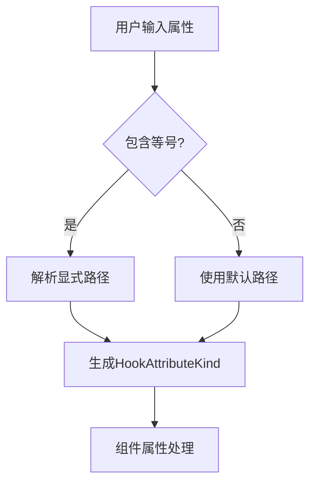

+++
title = "#21800 Improve Component Hook Ergonomics"
date = "2025-11-12T00:00:00"
draft = false
template = "pull_request_page.html"
in_search_index = false

[extra]
current_language = "zh-cn"
available_languages = {"en" = { name = "English", url = "/pull_request/bevy/2025-11/pr-21800-en-20251112" }, "zh-cn" = { name = "中文", url = "/pull_request/bevy/2025-11/pr-21800-zh-cn-20251112" }}
+++

# Improve Component Hook Ergonomics

## 基本信息
- **标题**: Improve Component Hook Ergonomics
- **PR 链接**: https://github.com/bevyengine/bevy/pull/21800
- **作者**: VasanthakumarV
- **状态**: 已合并
- **标签**: A-ECS, C-Usability, S-Needs-Review
- **创建时间**: 2025-11-10T10:43:50Z
- **合并时间**: 2025-11-12T23:21:16Z
- **合并者**: cart

## 描述翻译

**目标**

修复: https://github.com/bevyengine/bevy/issues/21794

**解决方案**

- 如果用户没有提供钩子路径(hook-path)，我们插入默认路径。

**测试**

添加了一个文档测试（已编辑）。

运行并查看了以下示例的扩展宏：

```rust
use bevy_ecs::lifecycle::HookContext;
use bevy_ecs::prelude::*;
use bevy_ecs::world::DeferredWorld;

#[derive(Component)]
#[component(on_add, on_insert, on_despawn, on_remove=on_remove)]
struct Tile;

impl Tile {
    fn on_add(_world: DeferredWorld, _context: HookContext) {
        println!("added");
    }
    fn on_insert(_world: DeferredWorld, _context: HookContext) {
        println!("inserted");
    }
    fn on_despawn(_world: DeferredWorld, _context: HookContext) {
        println!("despawned");
    }
}

fn on_remove(_world: DeferredWorld, _context: HookContext) {
    println!("removed");
}

fn main() {
    let mut world = World::new();
    let entity = world.spawn(Tile);
    entity.despawn();
}
```

## 这个 Pull Request 的故事

### 问题和背景

在 Bevy ECS 中，组件钩子(component hooks)允许开发者在组件的生命周期事件（如添加、插入、移除、销毁）上执行自定义逻辑。然而，在使用这些钩子时，开发者需要显式指定钩子函数的完整路径，即使这些函数是组件本身的默认方法。

例如，之前开发者必须这样写：
```rust
#[derive(Component)]
#[component(on_add = Self::on_add, on_insert = Self::on_insert)]
struct MyComponent;
```

这种语法显得冗余，特别是当钩子函数使用标准的命名约定（如 `on_add`、`on_insert` 等）时。开发者需要重复指定 `Self::` 前缀，这增加了不必要的样板代码。

### 解决方案

这个 PR 通过引入智能默认值来解决这个问题。核心思路是：当用户在组件属性宏中没有显式提供钩子路径时，系统会自动推断并使用默认路径。

具体实现是在 `HookAttributeKind` 结构中添加了一个新的 `parse` 方法，该方法接受一个解析流(ParseStream)和一个生成默认路径的闭包。如果解析流中检测到等号(`=`)，就按照原有的方式解析显式提供的路径；如果没有等号，就使用闭包返回的默认路径。

### 实现细节

主要的实现集中在 `HookAttributeKind::parse` 方法中：

```rust
fn parse(
    input: syn::parse::ParseStream,
    default_hook_path: impl FnOnce() -> ExprPath,
) -> Result<Self> {
    if input.peek(Token![=]) {
        input.parse::<Token![=]>()?;
        input.parse::<Expr>().and_then(Self::from_expr)
    } else {
        Ok(Self::Path(default_hook_path()))
    }
}
```

这个方法检查输入流中是否包含等号。如果包含，就解析等号后面的表达式作为钩子路径；如果不包含，就使用提供的默认路径。

在属性解析过程中，对于每个钩子类型（`on_add`、`on_insert`、`on_replace`、`on_remove`、`on_despawn`），现在都使用这个新的解析方法，并传入相应的默认路径：

```rust
} else if nested.path.is_ident(ON_ADD) {
    attrs.on_add = Some(HookAttributeKind::parse(nested.input, || {
        parse_quote! { Self::on_add }
    })?);
    Ok(())
}
```

这里的 `parse_quote! { Self::on_add }` 会生成一个表示 `Self::on_add` 路径的表达式。

### 技术洞察

这个实现有几个关键的技术考虑：

1. **向后兼容性**：新的语法是完全向后兼容的。现有的显式路径指定方式（使用等号）仍然有效，这确保了不会破坏现有的代码。

2. **宏解析逻辑**：实现使用了 `syn` 库的 `peek` 方法来前瞻性地检查输入流，这是一个在宏开发中常用的技术，用于在不消费 token 的情况下检查语法结构。

3. **默认路径生成**：使用 `parse_quote!` 宏来动态生成默认路径表达式，这比手动构造语法树更简洁且不易出错。

### 影响

这个改进显著提升了开发者体验。现在开发者可以写更简洁的代码：

```rust
// 之前
#[component(on_add = Self::on_add, on_insert = Self::on_insert)]

// 之后  
#[component(on_add, on_insert)]
```

同时仍然支持自定义路径：
```rust
#[component(on_remove = some_custom_function)]
```

这种改进减少了样板代码，使组件定义更加清晰，同时保持了灵活性和向后兼容性。

## 视觉表示



## 关键文件更改

### 1. `crates/bevy_ecs/macros/src/component.rs` (+27/-11)

这是主要的实现文件，包含了钩子属性解析逻辑的核心改进。

**关键修改：**
```rust
// 新增的parse方法
fn parse(
    input: syn::parse::ParseStream,
    default_hook_path: impl FnOnce() -> ExprPath,
) -> Result<Self> {
    if input.peek(Token![=]) {
        input.parse::<Token![=]>()?;
        input.parse::<Expr>().and_then(Self::from_expr)
    } else {
        Ok(Self::Path(default_hook_path()))
    }
}

// 修改的属性解析逻辑
} else if nested.path.is_ident(ON_ADD) {
    attrs.on_add = Some(HookAttributeKind::parse(nested.input, || {
        parse_quote! { Self::on_add }
    })?);
    Ok(())
}
```

### 2. `crates/bevy_ecs/macros/src/lib.rs` (+1/-0)

更新了派生宏的文档，说明新的语法特性。

**修改：**
```rust
/// `function` can be elided if the path is `Self::on_add`, `Self::on_insert` etc.
```

### 3. `crates/bevy_ecs/src/component/mod.rs` (+23/-0)

添加了文档示例，展示新的简化语法用法。

**新增的文档示例：**
```rust
/// A hook's function path can be elided if it is `Self::on_add`, `Self::on_insert` etc.
/// ```
/// # use bevy_ecs::lifecycle::HookContext;
/// # use bevy_ecs::prelude::*;
/// # use bevy_ecs::world::DeferredWorld;
/// #
/// #[derive(Component, Debug)]
/// #[component(on_add)]
/// struct DoubleOnSpawn(usize);
///
/// impl DoubleOnSpawn {
///     fn on_add(mut world: DeferredWorld, context: HookContext) {
///         let mut entity = world.get_mut::<Self>(context.entity).unwrap();
///         entity.0 *= 2;
///     }
/// }
/// #
/// # let mut world = World::new();
/// # let entity = world.spawn(DoubleOnSpawn(2));
/// # assert_eq!(entity.get::<DoubleOnSpawn>().unwrap().0, 4);
/// ```
```

## 进一步阅读

- [Rust 过程宏开发指南](https://doc.rust-lang.org/reference/procedural-macros.html)
- [syn 库文档](https://docs.rs/syn/latest/syn/) - 用于解析 Rust 代码的库
- [quote 库文档](https://docs.rs/quote/latest/quote/) - 用于生成 Rust 代码的库
- [Bevy ECS 组件文档](https://docs.rs/bevy_ecs/latest/bevy_ecs/component/index.html)