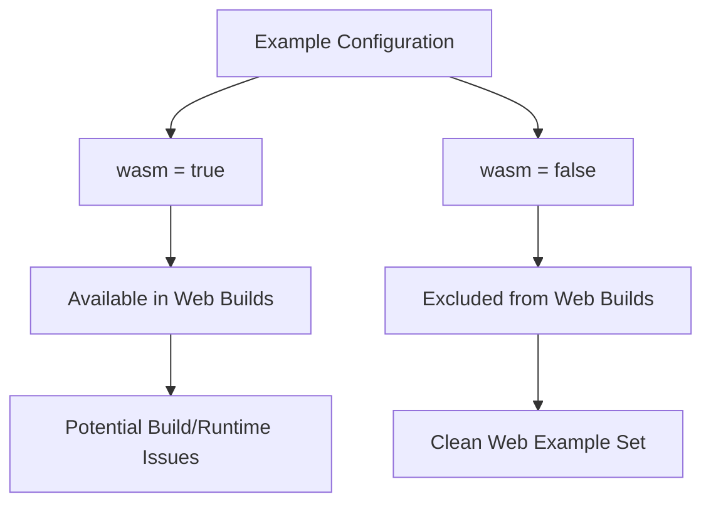

+++
title = "#21804 Remove `viewport_debug` from web examples"
date = "2025-11-14T00:00:00"
draft = false
template = "pull_request_page.html"
in_search_index = true

[taxonomies]
list_display = ["show"]

[extra]
current_language = "en"
available_languages = {"en" = { name = "English", url = "/pull_request/bevy/2025-11/pr-21804-en-20251114" }, "zh-cn" = { name = "中文", url = "/pull_request/bevy/2025-11/pr-21804-zh-cn-20251114" }}
labels = ["C-Bug", "D-Trivial", "C-Examples"]
+++

# Title

## Basic Information
- **Title**: Remove `viewport_debug` from web examples
- **PR Link**: https://github.com/bevyengine/bevy/pull/21804
- **Author**: ickshonpe
- **Status**: MERGED
- **Labels**: C-Bug, D-Trivial, C-Examples, S-Ready-For-Final-Review
- **Created**: 2025-11-10T22:40:11Z
- **Merged**: 2025-11-14T00:09:41Z
- **Merged By**: mockersf

## Description Translation
# Objective

Fixes #21803

## Solution

Set `wasm = false` for the example.

## The Story of This Pull Request

This pull request addresses a straightforward but important configuration issue in the Bevy engine's example system. The problem was that the `viewport_debug` example was incorrectly configured to be available for WebAssembly (WASM) builds when it shouldn't have been.

The issue originated from the example's metadata configuration in Cargo.toml. Bevy uses a custom metadata system to organize and categorize examples, with the `wasm` flag controlling whether an example should be included in web builds. When this flag is set to `true`, the example becomes available for WASM compilation and can be run in web browsers.

The problem manifested as issue #21803, though the exact symptoms aren't detailed in the PR description. Typically, when an example isn't properly configured for web deployment, it can cause build failures, runtime errors, or unexpected behavior when users try to run the example in a web environment.

The solution implemented by ickshonpe was minimal and surgical: changing a single configuration flag from `wasm = true` to `wasm = false`. This change effectively removes the `viewport_debug` example from the set of examples available for web compilation while preserving its availability for native builds.

This type of configuration fix is common in cross-platform game engines like Bevy, where different examples may have varying levels of web compatibility. Some examples might rely on platform-specific features, system APIs, or performance characteristics that aren't available or don't work well in web environments.

The implementation follows Bevy's established pattern for example configuration. Each example in the Bevy codebase has metadata that controls its behavior across different platforms, and the `wasm` flag is a standard part of this configuration system.

From an engineering perspective, this change demonstrates the importance of proper platform targeting in cross-platform development. Even though the fix was simple, it prevents potential issues for users trying to run this example in web environments and maintains the overall quality of the web example ecosystem.

## Visual Representation



## Key Files Changed

The only file modified in this PR was the project's Cargo.toml, specifically the metadata configuration for the `viewport_debug` example:

```toml
# File: Cargo.toml
# Before:
[[example]]
name = "Viewport Debug"
description = "An example for debugging viewport coordinates"
category = "UI (User Interface)"
wasm = true

# After:
[[example]]
name = "Viewport Debug"
description = "An example for debugging viewport coordinates"
category = "UI (User Interface)"
wasm = false
```

This change affects how the example is processed during build configuration. When `wasm = false`, the example is excluded from web compilation targets, preventing potential compatibility issues while maintaining its availability for native desktop builds.

## Further Reading

- [Bevy Examples Documentation](https://bevyengine.org/learn/book/getting-started/examples/)
- [Rust and WebAssembly Guide](https://rustwasm.github.io/docs/book/)
- [Cargo Workspace Configuration](https://doc.rust-lang.org/cargo/reference/workspaces.html)

# Full Code Diff
diff --git a/Cargo.toml b/Cargo.toml
index 55b5f4a459753..83fc686e331ed 100644
--- a/Cargo.toml
+++ b/Cargo.toml
@@ -3801,7 +3801,7 @@ doc-scrape-examples = true
 name = "Viewport Debug"
 description = "An example for debugging viewport coordinates"
 category = "UI (User Interface)"
-wasm = true
+wasm = false
 
 [[example]]
 name = "viewport_node"