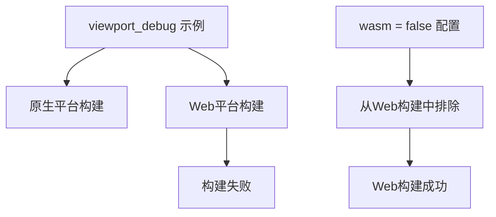

+++
title = "#21804 Remove `viewport_debug` from web examples"
date = "2025-11-14T00:00:00"
draft = false
template = "pull_request_page.html"
in_search_index = false

[extra]
current_language = "zh-cn"
available_languages = {"en" = { name = "English", url = "/pull_request/bevy/2025-11/pr-21804-en-20251114" }, "zh-cn" = { name = "中文", url = "/pull_request/bevy/2025-11/pr-21804-zh-cn-20251114" }}
labels = ["C-Bug", "D-Trivial", "C-Examples"]
+++

# Title

## Basic Information
- **Title**: Remove `viewport_debug` from web examples
- **PR Link**: https://github.com/bevyengine/bevy/pull/21804
- **Author**: ickshonpe
- **Status**: MERGED
- **Labels**: C-Bug, D-Trivial, C-Examples, S-Ready-For-Final-Review
- **Created**: 2025-11-10T22:40:11Z
- **Merged**: 2025-11-14T00:09:41Z
- **Merged By**: mockersf

## Description Translation
**目标**

修复 #21803

**解决方案**

为示例设置 `wasm = false`

## The Story of This Pull Request

这个PR解决了一个具体而直接的问题：`viewport_debug` 示例在Web环境下无法正常工作。问题的核心在于该示例使用了某些在WebAssembly目标下不兼容的功能或API。

在Bevy的示例配置系统中，每个示例都可以通过`wasm`标志来控制是否应该为Web目标构建。当`wasm = true`时，该示例会被包含在Web版本的构建中；当`wasm = false`时，则只会在原生平台上构建。

开发者发现了问题#21803，即`viewport_debug`示例在尝试为Web构建时失败。经过分析，确定这是因为该示例依赖于某些只能在原生平台上使用的功能。最简单的解决方案就是将该示例从Web构建中排除。

这个修复采用了最直接的方法：在`Cargo.toml`中将`viewport_debug`示例的`wasm`标志从`true`改为`false`。这种修改确保了：

1. Web构建过程不会尝试编译这个不兼容的示例
2. 原生平台上的功能保持不变
3. 避免了复杂的代码重构需求

从工程角度看，这是一个典型的配置修复案例。开发者识别到了平台兼容性问题，并通过调整构建配置而非修改代码逻辑来解决问题。这种方法既高效又安全，因为它不会引入新的代码缺陷，同时保持了现有功能的完整性。

这个修改体现了良好的软件工程实践：当遇到平台特定的兼容性问题时，通过构建配置来隔离问题通常比修改核心代码更可取。它保持了代码的清晰性，同时确保了不同目标平台的构建稳定性。

## Visual Representation



## Key Files Changed

### `Cargo.toml` (+1/-1)

这是唯一被修改的文件，包含了示例配置的变更：

```toml
# 修改前：
[[example]]
name = "Viewport Debug"
description = "An example for debugging viewport coordinates"
category = "UI (User Interface)"
wasm = true

# 修改后：
[[example]]
name = "Viewport Debug"
description = "An example for debugging viewport coordinates"
category = "UI (User Interface)"
wasm = false
```

这个修改将`viewport_debug`示例从Web构建目标中排除，解决了Web平台的构建失败问题。

## Further Reading

- [Bevy Examples Documentation](https://bevyengine.org/learn/book/getting-started/examples/) - Bevy官方示例文档
- [Cargo Workspace Configuration](https://doc.rust-lang.org/cargo/reference/workspaces.html) - Cargo工作区配置文档
- [WebAssembly and Rust](https://rustwasm.github.io/docs/book/) - Rust WebAssembly开发指南

# Full Code Diff
```diff
diff --git a/Cargo.toml b/Cargo.toml
index 55b5f4a459753..83fc686e331ed 100644
--- a/Cargo.toml
+++ b/Cargo.toml
@@ -3801,7 +3801,7 @@ doc-scrape-examples = true
 name = "Viewport Debug"
 description = "An example for debugging viewport coordinates"
 category = "UI (User Interface)"
-wasm = true
+wasm = false
 
 [[example]]
 name = "viewport_node"
```