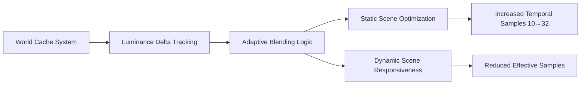

+++
title = "#21810 Solari: More reactive world cache"
date = "2025-11-25T00:00:00"
draft = false
template = "pull_request_page.html"
in_search_index = true

[taxonomies]
list_display = ["show"]

[extra]
current_language = "en"
available_languages = {"en" = { name = "English", url = "/pull_request/bevy/2025-11/pr-21810-en-20251125" }, "zh-cn" = { name = "中文", url = "/pull_request/bevy/2025-11/pr-21810-zh-cn-20251125" }}
labels = ["A-Rendering", "C-Refinement"]
+++

# Title
Solari: More reactive world cache

## Basic Information
- **Title**: Solari: More reactive world cache
- **PR Link**: https://github.com/bevyengine/bevy/pull/21810
- **Author**: JMS55
- **Status**: MERGED
- **Labels**: A-Rendering, S-Ready-For-Final-Review, C-Refinement
- **Created**: 2025-11-11T22:23:06Z
- **Merged**: 2025-11-25T01:12:50Z
- **Merged By**: alice-i-cecile

## Description Translation
Thanks to Guillaume Boissé, the world cache is both more stable in static scenarios, and more reactive in dynamic scenarios!

https://bsky.app/profile/gboisse.bsky.social/post/3m5blga3ftk2a

## The Story of This Pull Request

This PR addresses a fundamental challenge in real-time global illumination: balancing temporal stability against responsiveness to lighting changes. The world cache system in Bevy's Solari renderer needed to handle both static scenes where lighting remains constant and dynamic scenarios where lighting changes rapidly.

The core problem was that the existing implementation used a fixed temporal accumulation approach. It would blend new lighting samples with previous frames using a simple average based on `WORLD_CACHE_MAX_TEMPORAL_SAMPLES`. While this provided good stability for static scenes, it was too slow to respond when lighting conditions changed dramatically, such as when lights are turned on/off or objects move.

The solution introduces an adaptive temporal blending mechanism that monitors luminance changes and adjusts the blending rate accordingly. When lighting is stable, the system maintains high temporal accumulation for noise reduction. When significant lighting changes are detected, it rapidly adapts by reducing the effective sample count, allowing the cache to converge to the new lighting state much faster.

The implementation centers around tracking luminance deltas - the changes in brightness between frames. A new `world_cache_luminance_deltas` buffer was added to store these values for each cache cell. During the update phase, the system calculates the relative luminance change and uses it to compute an adaptive blend factor:

```wgsl
let alpha = abs(luminance_delta) / max(luminance(old_radiance.rgb), 0.001);
let max_sample_count = mix(WORLD_CACHE_MAX_TEMPORAL_SAMPLES, 1.0, pow(saturate(alpha), 1.0 / 8.0));
let blend_amount = 1.0 / min(sample_count, max_sample_count);
```

This approach provides the best of both worlds: when luminance changes are small (static scenes), it uses the full temporal accumulation up to the new maximum of 32 samples. When changes are large, it reduces the effective sample count toward 1, making the cache much more responsive.

The luminance delta itself is also smoothed over time using an exponential moving average with an 1/8 blend factor, preventing the system from overreacting to transient changes while still tracking persistent lighting shifts.

From an architectural perspective, the changes required adding a new storage buffer for luminance deltas and updating multiple shader stages to incorporate this new data. The binding indices were adjusted throughout the pipeline to accommodate the new buffer, and the compaction stage was updated to properly reset luminance deltas when cells are removed.

## Visual Representation



## Key Files Changed

### `crates/bevy_solari/src/realtime/world_cache_update.wgsl` (+10/-1)
This file contains the core adaptive blending logic that makes the world cache responsive to lighting changes.

```wgsl
// Key addition: luminance-based adaptive blending
let alpha = abs(luminance_delta) / max(luminance(old_radiance.rgb), 0.001);
let max_sample_count = mix(WORLD_CACHE_MAX_TEMPORAL_SAMPLES, 1.0, pow(saturate(alpha), 1.0 / 8.0));
let blend_amount = 1.0 / min(sample_count, max_sample_count);

let blended_radiance = mix(old_radiance.rgb, new_radiance, blend_amount);
let blended_luminance_delta = mix(luminance_delta, luminance(blended_radiance) - luminance(old_radiance.rgb), 1.0 / 8.0);
```

### `crates/bevy_solari/src/realtime/world_cache_query.wgsl` (+7/-6)
Updated binding indices and increased maximum temporal samples for better static scene performance.

```wgsl
// Increased from 10 to 32 for better static scene quality
const WORLD_CACHE_MAX_TEMPORAL_SAMPLES: f32 = 32.0;

// Updated bindings to accommodate new luminance_deltas buffer
@group(1) @binding(18) var<storage, read_write> world_cache_luminance_deltas: array<f32, #{WORLD_CACHE_SIZE}>;
```

### `crates/bevy_solari/src/realtime/world_cache_compact.wgsl` (+12/-1)
Added cleanup for the new luminance deltas buffer when cells are removed.

```wgsl
fn decay_world_cache(@builtin(global_invocation_id) global_id: vec3<u32>) {
    if life == 0u {
        world_cache_checksums[global_id.x] = WORLD_CACHE_EMPTY_CELL;
        world_cache_radiance[global_id.x] = vec4(0.0);
        world_cache_luminance_deltas[global_id.x] = 0.0;  // New cleanup
    }
}
```

### `crates/bevy_solari/src/realtime/prepare.rs` (+9/-0)
Added buffer creation for the new luminance deltas storage buffer.

```rust
let world_cache_luminance_deltas = render_device.create_buffer(&BufferDescriptor {
    label: Some("solari_lighting_world_cache_luminance_deltas"),
    size: WORLD_CACHE_SIZE * size_of::<f32>() as u64,
    usage: BufferUsages::STORAGE,
    mapped_at_creation: false,
});
```

### `crates/bevy_solari/src/realtime/node.rs` (+2/-0)
Updated the node to include the new buffer in its binding set.

```rust
// Added to the binding list
s.world_cache_luminance_deltas.as_entire_binding(),
```

## Further Reading

- [Original inspiration from Guillaume Boissé](https://bsky.app/profile/gboisse.bsky.social/post/3m5blga3ftk2a)
- Temporal anti-aliasing and accumulation techniques in real-time rendering
- Exponential moving averages for signal smoothing
- Luminance calculations and their applications in graphics programming