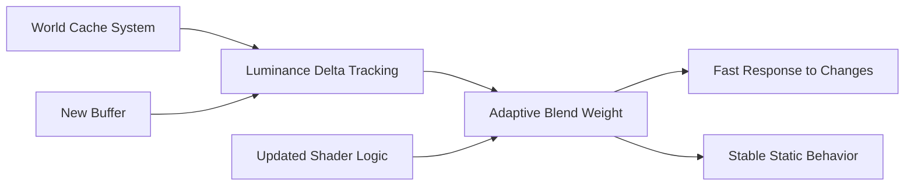

+++
title = "#21810 Solari: More reactive world cache"
date = "2025-11-25T00:00:00"
draft = false
template = "pull_request_page.html"
in_search_index = false

[extra]
current_language = "zh-cn"
available_languages = {"en" = { name = "English", url = "/pull_request/bevy/2025-11/pr-21810-en-20251125" }, "zh-cn" = { name = "中文", url = "/pull_request/bevy/2025-11/pr-21810-zh-cn-20251125" }}
labels = ["A-Rendering", "C-Refinement"]
+++

# Solari: More reactive world cache

## Basic Information
- **Title**: Solari: More reactive world cache
- **PR Link**: https://github.com/bevyengine/bevy/pull/21810
- **Author**: JMS55
- **Status**: MERGED
- **Labels**: A-Rendering, S-Ready-For-Final-Review, C-Refinement
- **Created**: 2025-11-11T22:23:06Z
- **Merged**: 2025-11-25T01:12:50Z
- **Merged By**: alice-i-cecile

## Description Translation
感谢 Guillaume Boissé，世界缓存在静态场景下更加稳定，在动态场景下更加敏感！

https://bsky.app/profile/gboisse.bsky.social/post/3m5blga3ftk2a

## The Story of This Pull Request

这个 PR 解决了 Solari 光照系统中世界缓存（world cache）在动态场景下的响应性问题。世界缓存是实时全局光照系统的核心组件，它存储了场景中各个位置的辐射度信息，用于在后续帧中重用计算结果以提高性能。

**问题背景**

原有的世界缓存系统使用固定的时间采样次数（`WORLD_CACHE_MAX_TEMPORAL_SAMPLES`）来控制缓存更新的灵敏度。这种方法在静态场景中表现良好，但在动态光照条件下反应不够迅速。当场景中的光照发生剧烈变化时，缓存需要较长时间才能收敛到新的正确值，导致光照更新滞后。

**解决方案**

PR 引入了一个新的亮度变化跟踪系统。核心思想是监测每个缓存单元亮度（luminance）的变化幅度，并根据变化程度动态调整缓存更新的混合权重。当检测到较大的亮度变化时，系统会快速响应；在稳定状态下，则保持较高的稳定性。

**实现细节**

实现主要在 WGSL shader 代码中完成。新增了一个 `world_cache_luminance_deltas` 缓冲区来存储每个缓存单元的亮度变化值。在 `world_cache_update.wgsl` 中，关键的计算逻辑如下：

```wgsl
let luminance_delta = world_cache_luminance_deltas[cell_index];
let alpha = abs(luminance_delta) / max(luminance(old_radiance.rgb), 0.001);
let max_sample_count = mix(WORLD_CACHE_MAX_TEMPORAL_SAMPLES, 1.0, pow(saturate(alpha), 1.0 / 8.0));
let blend_amount = 1.0 / min(sample_count, max_sample_count);
```

这段代码计算相对亮度变化 `alpha`，然后根据变化程度在最大采样次数和最小采样次数之间插值。当亮度变化较大时，`max_sample_count` 趋近于 1，导致混合权重 `blend_amount` 变大，缓存快速更新；变化较小时，保持原有的稳定行为。

**技术洞察**

这种自适应方法体现了实时渲染中常见的权衡：在稳定性和响应性之间找到平衡点。通过指数平滑（使用 1/8 的混合系数）来更新亮度变化值，系统能够平滑地跟踪变化趋势，避免因单帧的剧烈变化而产生不稳定的行为。

同时，PR 将 `WORLD_CACHE_MAX_TEMPORAL_SAMPLES` 从 10 提高到 32，这意味着在静态场景中缓存可以累积更多样本，获得更好的收敛效果和更低的噪声。

**影响**

这些改进使得世界缓存系统在两种场景下都表现更好：
- 静态场景：更高的最大采样次数带来更好的稳定性和更低的噪声
- 动态场景：自适应机制确保快速响应光照变化

整个实现保持了向后兼容性，只是增加了新的缓冲区和修改了更新逻辑，没有破坏现有的接口。

## Visual Representation



## Key Files Changed

### `crates/bevy_solari/src/realtime/world_cache_update.wgsl` (+10/-1)
核心算法改进，实现了自适应的缓存更新逻辑：
```wgsl
// 新增亮度变化跟踪和自适应混合
let luminance_delta = world_cache_luminance_deltas[cell_index];
let alpha = abs(luminance_delta) / max(luminance(old_radiance.rgb), 0.001);
let max_sample_count = mix(WORLD_CACHE_MAX_TEMPORAL_SAMPLES, 1.0, pow(saturate(alpha), 1.0 / 8.0));
let blend_amount = 1.0 / min(sample_count, max_sample_count);

let blended_radiance = mix(old_radiance.rgb, new_radiance, blend_amount);
let blended_luminance_delta = mix(luminance_delta, luminance(blended_radiance) - luminance(old_radiance.rgb), 1.0 / 8.0);

world_cache_radiance[cell_index] = vec4(blended_radiance, sample_count);
world_cache_luminance_deltas[cell_index] = blended_luminance_delta;
```

### `crates/bevy_solari/src/realtime/prepare.rs` (+9/-0)
新增亮度变化缓冲区的创建：
```rust
let world_cache_luminance_deltas = render_device.create_buffer(&BufferDescriptor {
    label: Some("solari_lighting_world_cache_luminance_deltas"),
    size: WORLD_CACHE_SIZE * size_of::<f32>() as u64,
    usage: BufferUsages::STORAGE,
    mapped_at_creation: false,
});
```

### `crates/bevy_solari/src/realtime/world_cache_compact.wgsl` (+12/-1)
在缓存压缩时重置亮度变化值：
```wgsl
if life == 0u {
    world_cache_checksums[global_id.x] = WORLD_CACHE_EMPTY_CELL;
    world_cache_radiance[global_id.x] = vec4(0.0);
    world_cache_luminance_deltas[global_id.x] = 0.0;  // 新增重置
}
```

### `crates/bevy_solari/src/realtime/world_cache_query.wgsl` (+7/-6)
调整绑定顺序并提高最大采样次数：
```wgsl
// 从 10.0 提高到 32.0
const WORLD_CACHE_MAX_TEMPORAL_SAMPLES: f32 = 32.0;

// 新增亮度变化缓冲区绑定
@group(1) @binding(18) var<storage, read_write> world_cache_luminance_deltas: array<f32, #{WORLD_CACHE_SIZE}>;
```

### `crates/bevy_solari/src/realtime/node.rs` (+2/-0)
在渲染节点中添加新缓冲区的绑定。

## Further Reading

- [实时全局光照技术概述](https://advances.realtimerendering.com/s2021/index.html)
- [时间累积和抗锯齿技术](https://developer.nvidia.com/gpugems/gpugems3/part-iv-image-effects/chapter-27-motion-blur-post-processing-effect)
- [WGSL 着色语言规范](https://www.w3.org/TR/WGSL/)