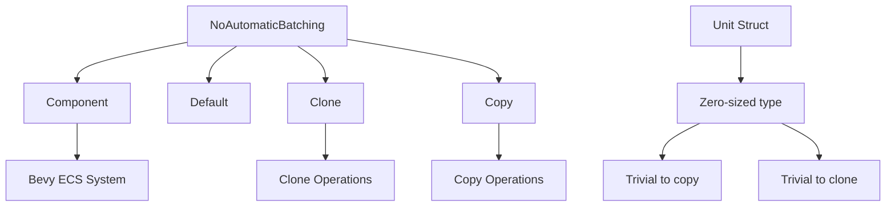

+++
title = "#21813 fix: NoAutomaticBatching Copy and Clone"
date = "2025-11-12T00:00:00"
draft = false
template = "pull_request_page.html"
in_search_index = true

[taxonomies]
list_display = ["show"]

[extra]
current_language = "en"
available_languages = {"en" = { name = "English", url = "/pull_request/bevy/2025-11/pr-21813-en-20251112" }, "zh-cn" = { name = "中文", url = "/pull_request/bevy/2025-11/pr-21813-zh-cn-20251112" }}
+++

# Title

## Basic Information
- **Title**: fix: NoAutomaticBatching Copy and Clone
- **PR Link**: https://github.com/bevyengine/bevy/pull/21813
- **Author**: lizelive
- **Status**: MERGED
- **Labels**: None
- **Created**: 2025-11-12T06:51:41Z
- **Merged**: 2025-11-12T19:57:01Z
- **Merged By**: mockersf

## Description Translation
**Objective**

it;s a unit struct. should support Copy and Clone

**Solution**

- Describe the solution used to achieve the objective above.

**Testing**

- Did you test these changes? If so, how?
- Are there any parts that need more testing?
- How can other people (reviewers) test your changes? Is there anything specific they need to know?
- If relevant, what platforms did you test these changes on, and are there any important ones you can't test?

---

**Showcase**

> This section is optional. If this PR does not include a visual change or does not add a new feature, you can delete this section.

- Help others understand the result of this PR by showcasing your awesome work!
- If this PR adds a new feature or public API, consider adding a brief pseudo-code snippet of it in action
- If this PR includes a visual change, consider adding a screenshot, GIF, or video
  - If you want, you could even include a before/after comparison!
- If the Migration Guide adequately covers the changes, you can delete this section

While a showcase should aim to be brief and digestible, you can use a toggleable section to save space on longer showcases:

<details>
  <summary>Click to view showcase</summary>

```rust
println!("My super cool code.");
```

</details>

## The Story of This Pull Request

This PR addresses a straightforward but important consistency issue in the Bevy engine's rendering system. The problem centers around the `NoAutomaticBatching` component, which is used to mark mesh entities that should be excluded from automatic batching optimizations during rendering.

The core issue was that `NoAutomaticBatching` was defined as a unit struct - a struct with no fields - but was missing the `Copy` and `Clone` traits in its derive macro. In Rust, unit structs are zero-sized types (ZSTs) that don't contain any data, making them prime candidates for both `Copy` and `Clone` traits. Without these traits, developers couldn't easily duplicate instances of this component or use it in contexts that require these traits.

The solution was simple and direct: add `Clone` and `Copy` to the existing derive macro. This change aligns with Rust best practices for unit structs and makes the component more ergonomic to use throughout the codebase. The implementation required only a single-line modification, changing the derive attributes from `#[derive(Component, Default)]` to `#[derive(Component, Default, Clone, Copy)]`.

From a technical perspective, this change is safe because:
1. Unit structs have no data to copy, so implementing `Copy` is trivial
2. The `Clone` implementation for unit structs is essentially a no-op
3. Both traits are automatically derived by the compiler when requested

The impact of this change is primarily about developer experience and API consistency. While it doesn't change runtime behavior, it prevents potential friction when working with the `NoAutomaticBatching` component in scenarios that require copying or cloning, such as when creating multiple entities with this component or when using it in generic contexts that require these trait bounds.

## Visual Representation



## Key Files Changed

### `crates/bevy_render/src/batching/mod.rs`

**Change Description**: Added `Clone` and `Copy` traits to the `NoAutomaticBatching` component derivation.

**Code Snippets**:

```rust
// Before:
#[derive(Component, Default)]
pub struct NoAutomaticBatching;

// After:
#[derive(Component, Default, Clone, Copy)]
pub struct NoAutomaticBatching;
```

**Relation to PR Purpose**: This single-line change implements the core fix by adding the missing `Clone` and `Copy` traits to the unit struct, making it consistent with Rust conventions for zero-sized types.

## Further Reading

- [Rust Reference: Zero-Sized Types](https://doc.rust-lang.org/reference/zero-sized-types.html)
- [Rust Book: Derivable Traits](https://doc.rust-lang.org/book/appendix-03-derivable-traits.html)
- [Bevy Engine: Components](https://bevyengine.org/learn/book/ecs/components/)

# Full Code Diff
```diff
diff --git a/crates/bevy_render/src/batching/mod.rs b/crates/bevy_render/src/batching/mod.rs
index 40ce7ce3b4aa3..bceca626417cd 100644
--- a/crates/bevy_render/src/batching/mod.rs
+++ b/crates/bevy_render/src/batching/mod.rs
@@ -20,7 +20,7 @@ pub mod gpu_preprocessing;
 pub mod no_gpu_preprocessing;
 
 /// Add this component to mesh entities to disable automatic batching
-#[derive(Component, Default)]
+#[derive(Component, Default, Clone, Copy)]
 pub struct NoAutomaticBatching;
 
 /// Data necessary to be equal for two draw commands to be mergeable
```