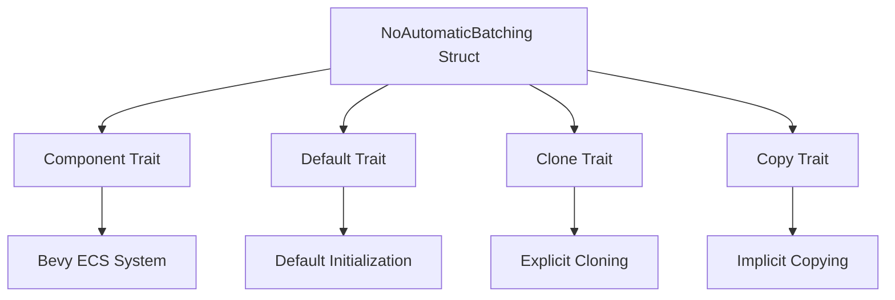

+++
title = "#21813 fix: NoAutomaticBatching Copy and Clone"
date = "2025-11-12T00:00:00"
draft = false
template = "pull_request_page.html"
in_search_index = false

[extra]
current_language = "zh-cn"
available_languages = {"en" = { name = "English", url = "/pull_request/bevy/2025-11/pr-21813-en-20251112" }, "zh-cn" = { name = "中文", url = "/pull_request/bevy/2025-11/pr-21813-zh-cn-20251112" }}
+++

# Title

## Basic Information
- **Title**: fix: NoAutomaticBatching Copy and Clone
- **PR Link**: https://github.com/bevyengine/bevy/pull/21813
- **Author**: lizelive
- **Status**: MERGED
- **Labels**: None
- **Created**: 2025-11-12T06:51:41Z
- **Merged**: 2025-11-12T19:57:01Z
- **Merged By**: mockersf

## Description Translation
# 目标

这是一个单元结构体。应该支持 Copy 和 Clone

## 解决方案

- 描述了用于实现上述目标的解决方案。

## 测试

- 你测试了这些更改吗？如果是，如何测试的？
- 是否有任何部分需要更多测试？
- 其他人（审阅者）如何测试你的更改？他们需要了解什么特定信息吗？
- 如果相关，你在哪些平台上测试了这些更改，有哪些重要的平台你无法测试？

---

## 展示

> 此部分是可选的。如果此 PR 不包含视觉更改或不添加新功能，你可以删除此部分。

- 通过展示你的出色工作来帮助其他人理解此 PR 的结果！
- 如果此 PR 添加了新功能或公共 API，请考虑添加一个简短的伪代码片段来展示其运行情况
- 如果此 PR 包含视觉更改，请考虑添加截图、GIF 或视频
  - 如果你愿意，甚至可以包含前后对比！
- 如果迁移指南充分覆盖了更改，你可以删除此部分

虽然展示应该力求简洁易懂，但你可以使用可切换的部分来节省较长展示的空间：

<details>
  <summary>点击查看展示</summary>

```rust
println!("我的超酷代码。");
```

</details>

## The Story of This Pull Request

这个 PR 解决了一个在 Bevy 渲染系统中关于组件特征实现的简单但重要的问题。`NoAutomaticBatching` 是一个标记组件（marker component），用于指示特定的网格实体应该禁用自动批处理功能。

**问题识别**

在原始的代码实现中，`NoAutomaticBatching` 结构体只派生了 `Component` 和 `Default` 特征：

```rust
#[derive(Component, Default)]
pub struct NoAutomaticBatching;
```

作为一个单元结构体（unit struct），它不包含任何数据字段，本质上是一个零大小的类型。这种类型的结构体可以安全地实现 `Copy` 和 `Clone` 特征，因为复制操作只是简单的位拷贝，没有任何运行时开销。

**解决方案分析**

开发者识别到这个缺失，并通过简单地在派生宏中添加 `Clone` 和 `Copy` 特征来解决这个问题：

```rust
#[derive(Component, Default, Clone, Copy)]
pub struct NoAutomaticBatching;
```

这个修改虽然看起来很小，但实际上解决了几个潜在的使用问题：

1. **组件复制**：在 ECS 系统中，有时需要复制或克隆组件实例
2. **模式匹配**：在模式匹配中，`Copy` 特征可以避免所有权转移的问题
3. **API 一致性**：与 Bevy 代码库中其他类似的标记组件保持一致

**技术实现细节**

在 Rust 中，`Copy` 特征表示类型可以通过简单的位拷贝进行复制，而 `Clone` 特征提供了显式的克隆方法。对于单元结构体，这两个特征的实现都是零成本的：

- `Copy` 允许在赋值时自动复制值，而不是移动所有权
- `Clone` 提供了显式的 `.clone()` 方法

由于 `NoAutomaticBatching` 不包含任何字段，这两个特征的实现都是完全安全的，不会引入任何运行时开销。

**影响评估**

这个修改虽然简单，但提升了代码的可用性和一致性。现在开发者可以：

- 自由地在函数间传递 `NoAutomaticBatching` 实例
- 在需要时克隆组件实例
- 在模式匹配中使用而不用担心所有权问题

这种修改遵循了 Rust 的最佳实践：对于可以安全复制的简单类型，应该实现 `Copy` 和 `Clone` 特征。

## Visual Representation



## Key Files Changed

### `crates/bevy_render/src/batching/mod.rs`

这个文件包含了批处理系统的核心定义，`NoAutomaticBatching` 组件用于标记那些不应该参与自动批处理的网格实体。

**修改前：**
```rust
/// Add this component to mesh entities to disable automatic batching
#[derive(Component, Default)]
pub struct NoAutomaticBatching;
```

**修改后：**
```rust
/// Add this component to mesh entities to disable automatic batching
#[derive(Component, Default, Clone, Copy)]
pub struct NoAutomaticBatching;
```

这个修改确保了 `NoAutomaticBatching` 组件现在支持复制和克隆操作，使其在使用上更加灵活，并与其他类似的标记组件保持一致。

## Further Reading

- [Rust Book: Derivable Traits](https://doc.rust-lang.org/book/appendix-03-derivable-traits.html) - 了解 Rust 中可派生特征的概念
- [Bevy ECS Components](https://bevy-cheatbook.github.io/programming/components.html) - Bevy ECS 系统中组件的使用指南
- [Rust Copy and Clone Traits](https://doc.rust-lang.org/std/clone/trait.Clone.html) - Rust 官方文档中关于 Clone 和 Copy 特征的详细说明

# Full Code Diff
```diff
diff --git a/crates/bevy_render/src/batching/mod.rs b/crates/bevy_render/src/batching/mod.rs
index 40ce7ce3b4aa3..bceca626417cd 100644
--- a/crates/bevy_render/src/batching/mod.rs
+++ b/crates/bevy_render/src/batching/mod.rs
@@ -20,7 +20,7 @@ pub mod gpu_preprocessing;
 pub mod no_gpu_preprocessing;
 
 /// Add this component to mesh entities to disable automatic batching
-#[derive(Component, Default)]
+#[derive(Component, Default, Clone, Copy)]
 pub struct NoAutomaticBatching;
 
 /// Data necessary to be equal for two draw commands to be mergeable
```