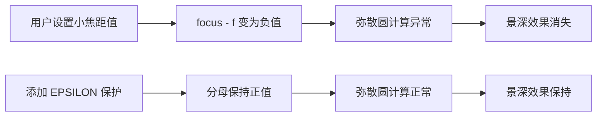

+++
title = "#21816 Prevent DoF effect disappearing at small `focus_distances`"
date = "2025-11-12T00:00:00"
draft = false
template = "pull_request_page.html"
in_search_index = false

[extra]
current_language = "zh-cn"
available_languages = {"en" = { name = "English", url = "/pull_request/bevy/2025-11/pr-21816-en-20251112" }, "zh-cn" = { name = "中文", url = "/pull_request/bevy/2025-11/pr-21816-zh-cn-20251112" }}
labels = ["C-Bug", "A-Rendering"]
+++

# Title
防止景深效果在小焦距值下消失的修复分析

## Basic Information
- **Title**: Prevent DoF effect disappearing at small `focus_distances`
- **PR Link**: https://github.com/bevyengine/bevy/pull/21816
- **Author**: Breakdown-Dog
- **Status**: MERGED
- **Labels**: C-Bug, A-Rendering, S-Needs-Review
- **Created**: 2025-11-12T14:29:44Z
- **Merged**: 2025-11-12T19:54:36Z
- **Merged By**: mockersf

## Description Translation
### 目标
- 在 `depth_of_field` 示例中，将 `focal_distance` 设置为小值（<= 0.02）会导致景深效果意外消失。


- 我认为小焦距值使得 `(focus - f)` 变为零或负数。这导致 candidate_coc 非正，然后被钳制到 0.0，实际上禁用了景深效果。

- 虽然公式在物理上是准确的，但我们不能假设用户对景深效果有深入理解。这会让用户感到困惑。

### 解决方案
- 使用 `max(focus - f, EPSILON)` 确保分母始终为正数。

- 现在效果看起来正确了。


### 测试
- CI

---

## The Story of This Pull Request

### 问题发现与背景
在 Bevy 引擎的景深效果实现中，开发者发现了一个边界情况的问题。当用户在 `depth_of_field` 示例中将焦距设置为非常小的值（小于等于 0.02）时，景深效果会完全消失。这个问题本质上是一个数值稳定性问题。

从技术角度看，景深效果的核心是计算弥散圆直径。在原来的实现中，计算公式为：

```wgsl
let candidate_coc = scale * abs(depth - focus) / (depth * (focus - f));
```

当 `focus - f` 接近零或变为负数时，分母会变得非常小或为负，导致计算出的 `candidate_coc` 变为非正值。由于后续的钳制操作 `clamp(candidate_coc * framebuffer_size.y, 0.0, max_coc_diameter)`，这个值会被设置为 0.0，从而完全禁用景深效果。

### 解决方案的设计思路
修复这个问题的关键在于确保分母始终为正数。开发者选择了使用一个极小的正数 `EPSILON` 来避免分母为零或负的情况。这种方法在图形编程中很常见，用于处理数值稳定性问题。

选择的具体值是 `1.19209290e-07`，这是 32 位浮点数能够表示的最小正规格化数，通常被称为机器精度。这个值足够小，不会在正常使用情况下影响视觉效果，同时又足够大，能够避免浮点精度问题。

### 具体实现细节
主要的修改在景深着色器文件中：

```wgsl
// 新增 EPSILON 常量定义
const EPSILON: f32 = 1.19209290e-07;

// 修改弥散圆计算
let candidate_coc = scale * abs(depth - focus) / (depth * max(focus - f, EPSILON));
```

这个修改确保了分母 `(focus - f)` 永远不会小于 `EPSILON`，从而避免了除零错误和负值问题。即使在实际焦距小于镜头焦距的物理上不可能的情况下，也能产生合理的视觉效果。

另外，在示例代码中还有一个小的格式化修改，将光圈值的显示精度从两位小数改为三位小数，这有助于更精确地调试和观察参数变化。

### 技术考量与权衡
这种解决方案在物理准确性和用户体验之间做出了权衡。从纯物理角度看，当实际焦距小于镜头焦距时，确实不应该产生有效的景深效果。然而，从用户体验角度，用户期望在调整参数时能看到连续平滑的效果变化，而不是突然消失。

使用 `EPSILON` 的方法有几个优点：
1. 计算开销极小
2. 保持代码的简洁性
3. 提供连续的用户体验
4. 向后兼容，不影响现有功能

### 影响与改进
这个修复确保了景深效果在所有参数范围内都能正常工作，提高了功能的健壮性。用户现在可以在整个参数范围内平滑调整焦距，而不会遇到效果突然消失的问题。

从更广泛的角度看，这个修复体现了在实时图形编程中处理数值边界情况的重要性。类似的数值稳定性问题在其他后处理效果中也可能会出现，这个解决方案提供了一个很好的参考模式。

## Visual Representation



## Key Files Changed

### 1. `crates/bevy_post_process/src/dof/dof.wgsl`

这是景深效果的核心着色器文件，包含了弥散圆计算的实现。

**修改内容：**
- 添加了 EPSILON 常量定义
- 修改了弥散圆计算公式，使用 max() 函数保护分母

**代码对比：**
```wgsl
// 修改前：
let candidate_coc = scale * abs(depth - focus) / (depth * (focus - f));

// 修改后：
const EPSILON: f32 = 1.19209290e-07;
let candidate_coc = scale * abs(depth - focus) / (depth * max(focus - f, EPSILON));
```

### 2. `examples/3d/depth_of_field.rs`

这是景深效果的示例文件，用于演示和测试功能。

**修改内容：**
- 改进了光圈值的显示精度

**代码对比：**
```rust
// 修改前：
"Aperture F-stops: f/{:.2} (Press Left/Right to change)"

// 修改后：
"Aperture F-stops: f/{:.3} (Press Left/Right to change)"
```

## Further Reading

- [Bevy 引擎景深效果文档](https://bevyengine.org/learn/books/reference/3d-rendering/post-processing/depth-of-field/)
- [计算机图形学中的数值稳定性问题](https://en.wikipedia.org/wiki/Numerical_stability)
- [实时渲染中的浮点精度处理](https://developer.nvidia.com/content/understanding-floating-point-precision-aka-why-0-1-02)