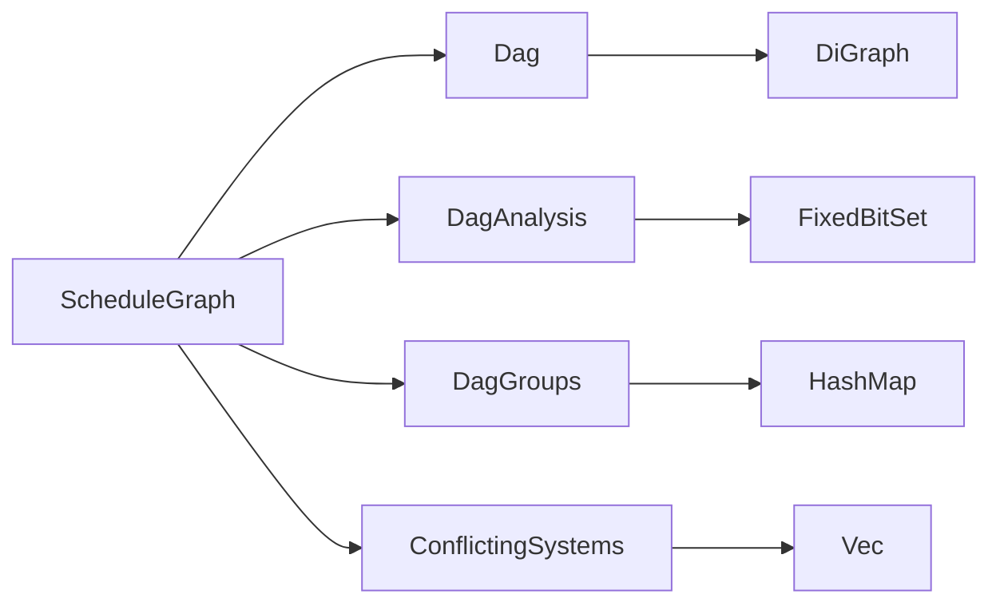

+++
title = "#21817 Move more functions off of `ScheduleGraph`"
date = "2025-11-20T00:00:00"
draft = false
template = "pull_request_page.html"
in_search_index = true

[taxonomies]
list_display = ["show"]

[extra]
current_language = "en"
available_languages = {"en" = { name = "English", url = "/pull_request/bevy/2025-11/pr-21817-en-20251120" }, "zh-cn" = { name = "中文", url = "/pull_request/bevy/2025-11/pr-21817-zh-cn-20251120" }}
labels = ["A-ECS", "C-Code-Quality", "C-Usability", "M-Migration-Guide", "D-Modest"]
+++

# Move more functions off of `ScheduleGraph`

## Basic Information
- **Title**: Move more functions off of `ScheduleGraph`
- **PR Link**: https://github.com/bevyengine/bevy/pull/21817
- **Author**: ItsDoot
- **Status**: MERGED
- **Labels**: A-ECS, C-Code-Quality, C-Usability, S-Ready-For-Final-Review, M-Migration-Guide, D-Modest
- **Created**: 2025-11-12T20:50:40Z
- **Merged**: 2025-11-20T01:00:48Z
- **Merged By**: alice-i-cecile

## Description Translation

## Objective

- Part of #20115
- Reduce `ScheduleGraph` implementation surface and extract reusable parts.

## Solution

- Upgraded and exposed `Dag<N>` as a fully-fledged directed acyclic graph type.
    - The validity of the cached topological order is now tracked by a `dirty` flag. All modifications to the graph (via `DerefMut` or `Dag::graph_mut`) cause the DAG to be marked as dirty.
    - Added `Dag::toposort`: if the DAG is dirty, computes topological order, caches it, and marks the DAG as clean. If already clean, returns the cached topological order. We now also reuse the previous toposort `Vec` allocation.
    - Added `Dag::get_toposort`: can be used to access the topological order with `&self`, with the stipulation that it returns an `Option`, and `None` if the DAG is dirty.
    - Replaced `check_graph` with `Dag::analyze`, and made it publicly accessible.
    - Added `Dag::remove_redundant_edges`, which uses the output of `Dag::analyze`.
- Renamed `CheckGraphResults` to `DagAnalysis`.
    - Added `DagAnalysis::check_for_redundant_edges`, replacing `ScheduleGraph::optionally_check_hierarchy_conflicts`.
    - Added `DagAnalysis::check_for_cross_dependencies`, replacing `ScheduleGraph::check_for_cross_dependencies`. It now takes two full `DagAnalysis` for comparison.
    - Added `DagAnalysis::check_for_cross_intersection`, replacing `ScheduleGraph::check_order_but_intersect`.
- Added `DagGroups` to encapsulate the `HashMap<SystemSetKey, Vec<SystemKey>>` with additional capabilities:
    - `DagGroups::flatten` and `DagGroups::flatten_undirected` handle the graph reduction operations previously performed by functions on `ScheduleGraph`.
- Added `ConflictingSystems` to encapsulate `Vec<(SystemKey, SystemKey, ComponentId)>` with additional capabilities and type safety.

See the included migration guide for breaking changes.

# Testing

- Ran examples
- Added new tests for `Dag`, `DagAnalysis`, and `DagGroups` functionality.

# Future work

- Consider replacing `HashSet<SystemKey>` with a `FixedBitSet`-like type for better performance.

## The Story of This Pull Request

This PR addresses a common problem in large codebases: the accumulation of functionality in a single class that should be distributed across multiple focused components. The `ScheduleGraph` struct in Bevy's ECS had become a dumping ground for graph operations, making it difficult to maintain and test individual pieces of functionality.

The core issue was that `ScheduleGraph` contained both schedule-specific logic and general-purpose graph algorithms mixed together. This made it hard to reuse the graph functionality elsewhere in the codebase and made the schedule building code more complex than necessary.

The solution approach was to extract the general graph algorithms into dedicated data structures while keeping schedule-specific logic in `ScheduleGraph`. This follows the single responsibility principle and makes the code more modular. The developer created three main new types: `Dag` for directed acyclic graph operations, `DagAnalysis` for graph analysis results, and `DagGroups` for managing system set groupings.

The implementation centers around the new `Dag<N>` struct, which encapsulates a directed acyclic graph with caching for topological sorting. A key insight was tracking graph modifications with a `dirty` flag to avoid unnecessary recomputation of topological order:

```rust
pub struct Dag<N: GraphNodeId, S: BuildHasher = FixedHasher> {
    graph: DiGraph<N, S>,
    toposort: Vec<N>,
    dirty: bool,
}
```

This caching mechanism is smart about when to invalidate the cache - any mutation through `DerefMut` or `graph_mut()` marks the graph as dirty, forcing recomputation on the next topological sort request.

The `Dag::toposort()` method demonstrates the practical benefit of this approach:

```rust
pub fn toposort(&mut self) -> Result<&[N], DiGraphToposortError<N>> {
    self.ensure_toposorted()?;
    Ok(&self.toposort)
}
```

This method only computes the topological sort when the graph is dirty, otherwise returning the cached result. It also reuses the previous allocation for the topological sort vector, reducing memory allocations.

Another significant improvement is the `Dag::analyze()` method, which replaces the previous `check_graph` function. This method computes various graph properties including reachability matrices, transitive reductions, and transitive closures using an efficient algorithm from academic literature.

The `DagGroups` struct addresses the problem of managing system set hierarchies by providing type-safe operations for flattening graph structures. This is particularly important in Bevy's scheduling system where system sets can contain other sets, creating complex hierarchies that need to be flattened for execution.

The migration to these new types required careful API design. For example, the `Dag::get_toposort()` method returns an `Option` to clearly indicate when the cached topological sort is unavailable due to graph modifications:

```rust
pub fn get_toposort(&self) -> Option<&[N]> {
    if self.dirty {
        None
    } else {
        Some(&self.toposort)
    }
}
```

This explicit API design helps prevent accidental use of stale topological sorts.

The impact of these changes is substantial. The `ScheduleGraph` struct lost over 450 lines of code while gaining clearer separation of concerns. The extracted functionality is now reusable across the codebase and better tested through dedicated unit tests. The caching mechanism in `Dag` provides performance benefits by avoiding redundant topological sort computations during schedule building.

From an architectural perspective, this change makes the schedule building code more maintainable. Graph operations are now encapsulated in dedicated types with clear interfaces, making it easier to understand and modify the schedule building process. The type safety improvements in `ConflictingSystems` and `DagGroups` reduce the likelihood of runtime errors.

The technical lessons from this PR demonstrate the value of extracting general-purpose algorithms from domain-specific containers. By separating the graph algorithms from schedule-specific logic, both become easier to test, maintain, and optimize independently.

## Visual Representation



## Key Files Changed

### `crates/bevy_ecs/src/schedule/graph/dag.rs` (+998/-0)
This new file contains the core `Dag`, `DagAnalysis`, and `DagGroups` implementations that were extracted from `ScheduleGraph`. The `Dag` struct provides cached topological sorting and graph analysis capabilities.

Key code example:
```rust
pub struct Dag<N: GraphNodeId, S: BuildHasher = FixedHasher> {
    graph: DiGraph<N, S>,
    toposort: Vec<N>,
    dirty: bool,
}

impl<N: GraphNodeId, S: BuildHasher> Dag<N, S> {
    pub fn toposort(&mut self) -> Result<&[N], DiGraphToposortError<N>> {
        self.ensure_toposorted()?;
        Ok(&self.toposort)
    }
    
    pub fn analyze(&mut self) -> Result<DagAnalysis<N, S>, DiGraphToposortError<N>> {
        let (toposort, graph) = self.toposort_and_graph()?;
        Ok(DagAnalysis::new(graph, toposort))
    }
}
```

### `crates/bevy_ecs/src/schedule/schedule.rs` (+113/-456)
This file saw the largest reduction in code size as graph operations were moved to the new `dag` module. The `ScheduleGraph` struct now delegates to the new graph types instead of implementing graph algorithms itself.

Key changes:
- Replaced manual graph analysis with `Dag::analyze()`
- Replaced custom flattening logic with `DagGroups::flatten()`
- Simplified conflict detection using the new graph types

### `crates/bevy_ecs/src/schedule/node.rs` (+150/-8)
This file gained new type-safe containers for system conflicts and system set ambiguity errors. The `ConflictingSystems` struct provides better encapsulation for conflict data.

Key addition:
```rust
#[derive(Clone, Debug, Default)]
pub struct ConflictingSystems(pub Vec<(SystemKey, SystemKey, Box<[ComponentId]>)>);

impl ConflictingSystems {
    pub fn check_if_not_empty(&self) -> Result<(), AmbiguousSystemConflictsWarning> {
        if self.0.is_empty() {
            Ok(())
        } else {
            Err(AmbiguousSystemConflictsWarning(self.clone()))
        }
    }
}
```

### `crates/bevy_ecs/src/schedule/graph/mod.rs` (+3/-148)
This module file was simplified by removing the `check_graph` function and related types, which were moved to the new `dag` module.

### `crates/bevy_ecs/src/schedule/error.rs` (+29/-21)
The error types were updated to work with the new graph types, wrapping the new error structs instead of containing raw data directly.

## Further Reading

- [Bevy ECS Documentation](https://docs.rs/bevy_ecs/latest/bevy_ecs/) - Official Bevy ECS documentation
- [Directed Acyclic Graphs](https://en.wikipedia.org/wiki/Directed_acyclic_graph) - Wikipedia article on DAGs
- [Transitive Reduction](https://en.wikipedia.org/wiki/Transitive_reduction) - Explanation of transitive reduction algorithm
- [Tarjan's Algorithm](https://en.wikipedia.org/wiki/Tarjan%27s_strongly_connected_components_algorithm) - Algorithm used for cycle detection
- [Single Responsibility Principle](https://en.wikipedia.org/wiki/Single-responsibility_principle) - Software design principle demonstrated in this PR