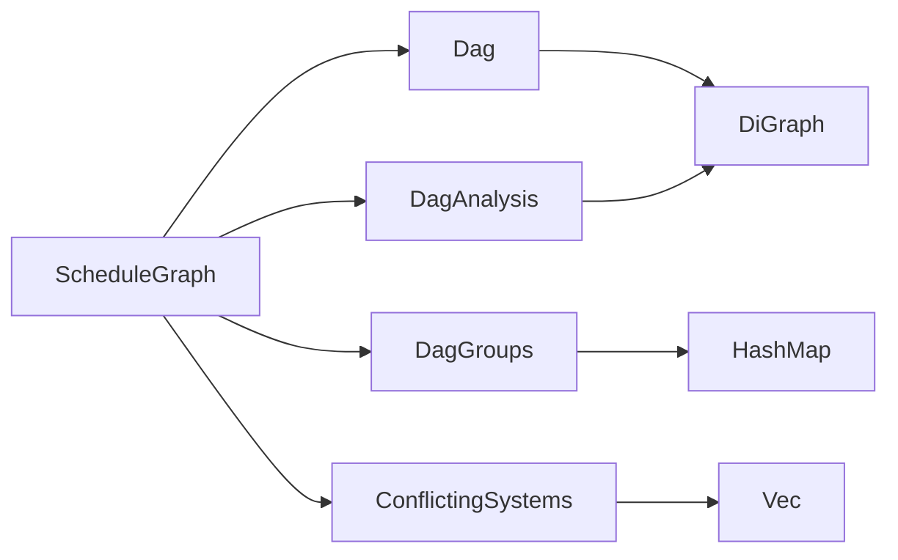

+++
title = "#21817 Move more functions off of `ScheduleGraph"
date = "2025-11-20T00:00:00"
draft = false
template = "pull_request_page.html"
in_search_index = false

[extra]
current_language = "zh-cn"
available_languages = {"en" = { name = "English", url = "/pull_request/bevy/2025-11/pr-21817-en-20251120" }, "zh-cn" = { name = "中文", url = "/pull_request/bevy/2025-11/pr-21817-zh-cn-20251120" }}
+++

# Move more functions off of `ScheduleGraph`

## 基本信息
- **标题**: Move more functions off of `ScheduleGraph`
- **PR链接**: https://github.com/bevyengine/bevy/pull/21817
- **作者**: ItsDoot
- **状态**: MERGED
- **标签**: A-ECS, C-Code-Quality, C-Usability, S-Ready-For-Final-Review, M-Migration-Guide, D-Modest
- **创建时间**: 2025-11-12T20:50:40Z
- **合并时间**: 2025-11-20T01:00:48Z
- **合并者**: alice-i-cecile

## 描述翻译

## 目标

- #20115 的一部分
- 减少 `ScheduleGraph` 的实现表面积并提取可重用部分。

## 解决方案

- 将 `Dag<N>` 升级并公开为功能完整的有向无环图类型。
    - 现在通过 `dirty` 标志跟踪缓存的拓扑排序的有效性。所有对图的修改（通过 `DerefMut` 或 `Dag::graph_mut`）都会将 DAG 标记为脏。
    - 添加了 `Dag::toposort`：如果 DAG 是脏的，计算拓扑排序，缓存它，并将 DAG 标记为干净。如果已经是干净的，返回缓存的拓扑排序。我们现在还重用之前的拓扑排序 `Vec` 分配。
    - 添加了 `Dag::get_toposort`：可用于通过 `&self` 访问拓扑排序，但前提是它返回一个 `Option`，如果 DAG 是脏的则返回 `None`。
    - 用 `Dag::analyze` 替换了 `check_graph`，并使其公开可访问。
    - 添加了 `Dag::remove_redundant_edges`，它使用 `Dag::analyze` 的输出。
- 将 `CheckGraphResults` 重命名为 `DagAnalysis`。
    - 添加了 `DagAnalysis::check_for_redundant_edges`，替换 `ScheduleGraph::optionally_check_hierarchy_conflicts`。
    - 添加了 `DagAnalysis::check_for_cross_dependencies`，替换 `ScheduleGraph::check_for_cross_dependencies`。现在它接受两个完整的 `DagAnalysis` 进行比较。
    - 添加了 `DagAnalysis::check_for_cross_intersection`，替换 `ScheduleGraph::check_order_but_intersect`。
- 添加了 `DagGroups` 来封装 `HashMap<SystemSetKey, Vec<SystemKey>>` 并提供额外功能：
    - `DagGroups::flatten` 和 `DagGroups::flatten_undirected` 处理之前由 `ScheduleGraph` 上的函数执行的图简化操作。
- 添加了 `ConflictingSystems` 来封装 `Vec<(SystemKey, SystemKey, ComponentId)>` 并提供额外功能和类型安全。

请参阅包含的迁移指南以了解破坏性更改。

# 测试

- 运行了示例
- 为 `Dag`、`DagAnalysis` 和 `DagGroups` 功能添加了新测试。

# 未来工作

- 考虑用类似 `FixedBitSet` 的类型替换 `HashSet<SystemKey>` 以获得更好的性能。

## 这个PR的故事

### 问题与背景

在 Bevy 的 ECS 调度系统中，`ScheduleGraph` 承担了过多的职责，包含了大量处理有向无环图（DAG）操作和调度的逻辑。随着系统复杂度的增加，这个类变得臃肿且难以维护。PR #20115 的目标是重构调度系统，而这个 PR 是其中的一部分，专注于将通用图操作从 `ScheduleGraph` 中分离出来。

主要问题包括：
- `ScheduleGraph` 包含了大量特定于 DAG 操作的实现细节
- 缺乏可重用的图数据结构
- 图分析功能与调度逻辑紧密耦合
- 代码重复和缺乏类型安全

### 解决方案方法

开发者采用了模块化设计的方法，将通用图操作提取到专门的类型中。核心思路是：

1. **增强 `Dag` 类型**：将原有的简单 DAG 包装器升级为功能完整的图数据结构
2. **提取分析逻辑**：将图分析功能分离到独立的 `DagAnalysis` 类型
3. **引入类型安全包装器**：创建 `DagGroups` 和 `ConflictingSystems` 来封装特定领域的数据结构
4. **保持向后兼容**：通过新的错误类型包装器最小化破坏性更改

### 具体实现

#### Dag 类型的增强

新的 `Dag` 结构体现在是一个功能完整的 DAG 实现，具有缓存和脏标记机制：

```rust
pub struct Dag<N: GraphNodeId, S: BuildHasher = FixedHasher> {
    graph: DiGraph<N, S>,
    toposort: Vec<N>,
    dirty: bool,
}
```

关键改进包括：
- **脏标记机制**：跟踪图是否被修改，避免不必要的拓扑排序计算
- **缓存重用**：重用之前的拓扑排序向量分配
- **分析方法**：提供统一的图分析接口

```rust
// 拓扑排序现在支持缓存和脏检查
pub fn toposort(&mut self) -> Result<&[N], DiGraphToposortError<N>> {
    self.ensure_toposorted()?;
    Ok(&self.toposort)
}
```

#### DagAnalysis 的引入

原来的 `CheckGraphResults` 被重构为功能更丰富的 `DagAnalysis`：

```rust
pub struct DagAnalysis<N: GraphNodeId, S: BuildHasher = FixedHasher> {
    reachable: FixedBitSet,
    connected: HashSet<(N, N), S>,
    disconnected: Vec<(N, N)>,
    transitive_edges: Vec<(N, N)>,
    transitive_reduction: DiGraph<N, S>,
    transitive_closure: DiGraph<N, S>,
}
```

新的分析类型提供了检查冗余边、交叉依赖和重叠组的方法：

```rust
pub fn check_for_redundant_edges(&self) -> Result<(), DagRedundancyError<N>>
pub fn check_for_cross_dependencies(&self, other: &Self) -> Result<(), DagCrossDependencyError<N>>
```

#### 类型安全包装器

引入了 `DagGroups` 来封装系统集到系统的映射：

```rust
pub struct DagGroups<K, V, S = FixedHasher>(HashMap<K, HashSet<V, S>, S>);
```

以及 `ConflictingSystems` 来封装系统冲突信息：

```rust
pub struct ConflictingSystems(pub Vec<(SystemKey, SystemKey, Box<[ComponentId]>)>);
```

### 技术洞察

这个重构展示了几个重要的软件工程原则：

1. **单一职责原则**：将图操作、分析和调度逻辑分离到不同的类型中
2. **性能优化**：通过脏标记和缓存重用避免了不必要的拓扑排序计算
3. **类型安全**：使用专门的类型来封装特定领域的数据结构，减少错误
4. **算法效率**：基于 Habib、Morvan 和 Rampon 的论文实现了高效的传递归约算法

### 影响

这些更改带来了显著的改进：

- **代码质量**：`ScheduleGraph` 的代码量减少了约 400 行
- **可维护性**：图操作现在集中在专门的模块中
- **性能**：通过缓存和重用分配减少了计算开销
- **可扩展性**：新的抽象为未来的优化提供了更好的基础

## 可视化表示



## 关键文件更改

### `crates/bevy_ecs/src/schedule/graph/dag.rs` (+998/-0)

这是新增的核心文件，包含了完整的 DAG 实现：

```rust
// 关键结构定义
pub struct Dag<N: GraphNodeId, S: BuildHasher = FixedHasher> {
    graph: DiGraph<N, S>,
    toposort: Vec<N>,
    dirty: bool,
}

// 拓扑排序方法
pub fn toposort(&mut self) -> Result<&[N], DiGraphToposortError<N>> {
    self.ensure_toposorted()?;
    Ok(&self.toposort)
}
```

### `crates/bevy_ecs/src/schedule/schedule.rs` (+113/-456)

大幅简化的调度图实现：

```rust
// 重构前：复杂的图分析逻辑
let hier_results = check_graph(&self.hierarchy.graph, &self.hierarchy.topsort);
// ... 大量手动图操作

// 重构后：使用新的 Dag 类型
let hierarchy_analysis = self.hierarchy.analyze().map_err(ScheduleBuildError::HierarchySort)?;
```

### `crates/bevy_ecs/src/schedule/node.rs` (+150/-8)

新增了系统冲突检测和系统集歧义检查的方法：

```rust
pub fn get_conflicting_systems(
    &self,
    flat_dependency_analysis: &DagAnalysis<SystemKey>,
    // ... 参数
) -> ConflictingSystems {
    // 系统冲突检测逻辑
}
```

### `crates/bevy_ecs/src/schedule/graph/mod.rs` (+3/-148)

移除了旧的图分析函数，导出了新的 DAG 模块：

```rust
// 移除了 check_graph 函数和相关类型
// 导出了新的 dag 模块
pub use dag::*;
```

### `crates/bevy_ecs/src/schedule/error.rs` (+29/-21)

更新了错误类型以包装新的错误结构：

```rust
// 错误类型现在包装新的专用错误
#[error("`{:?}` and `{:?}` have both `in_set` and `before`-`after` relationships (these might be transitive). This combination is unsolvable as a system cannot run before or after a set it belongs to.", .0.0, .0.1)]
CrossDependency(#[from] DagCrossDependencyError<NodeId>),
```

## 进一步阅读

- [有向无环图（DAG）](https://en.wikipedia.org/wiki/Directed_acyclic_graph)
- [拓扑排序算法](https://en.wikipedia.org/wiki/Topological_sorting)
- [传递归约算法](https://doi.org/10.1016/0012-365X(93)90164-O)
- [Bevy ECS 调度系统文档](https://bevyengine.org/learn/quick-start/ecs/systems/)