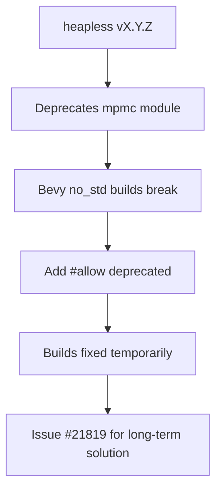

+++
title = "#21818 Allow deprecated `heapless::mpmc` to fix no_std builds"
date = "2025-11-16T00:00:00"
draft = false
template = "pull_request_page.html"
in_search_index = true

[taxonomies]
list_display = ["show"]

[extra]
current_language = "en"
available_languages = {"en" = { name = "English", url = "/pull_request/bevy/2025-11/pr-21818-en-20251116" }, "zh-cn" = { name = "中文", url = "/pull_request/bevy/2025-11/pr-21818-zh-cn-20251116" }}
labels = ["C-Bug", "P-High", "O-Embedded"]
+++

# Title

## Basic Information
- **Title**: Allow deprecated `heapless::mpmc` to fix no_std builds
- **PR Link**: https://github.com/bevyengine/bevy/pull/21818
- **Author**: cart
- **Status**: MERGED
- **Labels**: C-Bug, P-High, S-Ready-For-Final-Review, O-Embedded
- **Created**: 2025-11-12T21:26:43Z
- **Merged**: 2025-11-16T07:14:47Z
- **Merged By**: alice-i-cecile

## Description Translation
# Objective

`heapless` just deprecated their `mpmc` module in a minor version, which broke our `no_std` builds (because we choose to break our break our builds on warnings).

https://github.com/rust-embedded/heapless/issues/583
https://docs.rs/heapless/latest/heapless/mpmc/index.html

## Solution

Short term, fix our builds by allowing this usage of a deprecated function. However it is worth investigating: https://github.com/bevyengine/bevy/issues/21819

## The Story of This Pull Request

This PR addresses a straightforward but critical build failure in Bevy's no_std environment. The problem emerged when the `heapless` crate, a dependency used for embedded systems programming, deprecated its `mpmc` (multi-producer multi-consumer) module in a minor version update. Since Bevy's CI configuration treats warnings as errors, this deprecation warning immediately broke all no_std builds.

The core issue was in the `edge_executor.rs` file, where Bevy's task execution system uses `heapless::mpmc::Queue` to manage task queues in no_std environments. The deprecation of this module meant that any usage of `heapless::mpmc::Queue::new()` would generate a compilation error due to Bevy's strict warning policy.

The solution implemented here is a pragmatic short-term fix: adding `#[allow(deprecated)]` attribute to suppress the deprecation warning for this specific usage. This approach maintains the existing functionality while allowing builds to succeed, buying time for a more comprehensive solution.

The technical implementation is minimal but targeted. In the `State<C>::new` function, where the mpmc queue is initialized, the code now includes the deprecation allowance:

```rust
#[allow(deprecated)]
queue: heapless::mpmc::Queue::new(),
```

This change demonstrates a common pattern in Rust development where deprecated APIs can be temporarily allowed while migration strategies are developed. The PR author explicitly acknowledges this is a temporary measure by referencing issue #21819, which tracks the investigation of a longer-term solution.

The PR also includes a minor formatting improvement in the test module, where imports are reorganized for better readability:

```rust
use bevy_tasks::{
    block_on,
    futures_lite::{pending, poll_once},
};
```

This formatting change, while not functionally necessary, improves code maintainability and follows Rust's idiomatic import organization patterns.

The engineering decision here reflects a balance between immediate build stability and long-term code health. By allowing the deprecated usage temporarily, the team ensures that no_std builds continue to work while they investigate whether to migrate to a different queue implementation, update to a newer heapless API, or find an alternative approach entirely.

## Visual Representation



## Key Files Changed

**File: `crates/bevy_tasks/src/edge_executor.rs`** (+5/-1)

This file contains the core change that fixes the build issue:

1. **Primary Fix**: Added `#[allow(deprecated)]` attribute to suppress the deprecation warning for the heapless mpmc queue initialization.

```rust
// Before:
queue: heapless::mpmc::Queue::new(),

// After:
#[allow(deprecated)]
queue: heapless::mpmc::Queue::new(),
```

2. **Code Formatting**: Improved import organization in the test module for better readability.

```rust
// Before:
use bevy_tasks::{block_on, futures_lite::{pending, poll_once}};

// After:
use bevy_tasks::{
    block_on,
    futures_lite::{pending, poll_once},
};
```

These changes directly address the build failure while maintaining the existing functionality of the task execution system in no_std environments.

## Further Reading

- [Rust Deprecation Attributes](https://doc.rust-lang.org/reference/attributes/diagnostics.html#the-deprecated-attribute)
- [heapless crate documentation](https://docs.rs/heapless/latest/heapless/)
- [Bevy no_std support documentation](https://github.com/bevyengine/bevy/blob/main/docs/plugins_guidelines.md#no_std-support)
- [Rust Embedded Working Group](https://github.com/rust-embedded/wg)