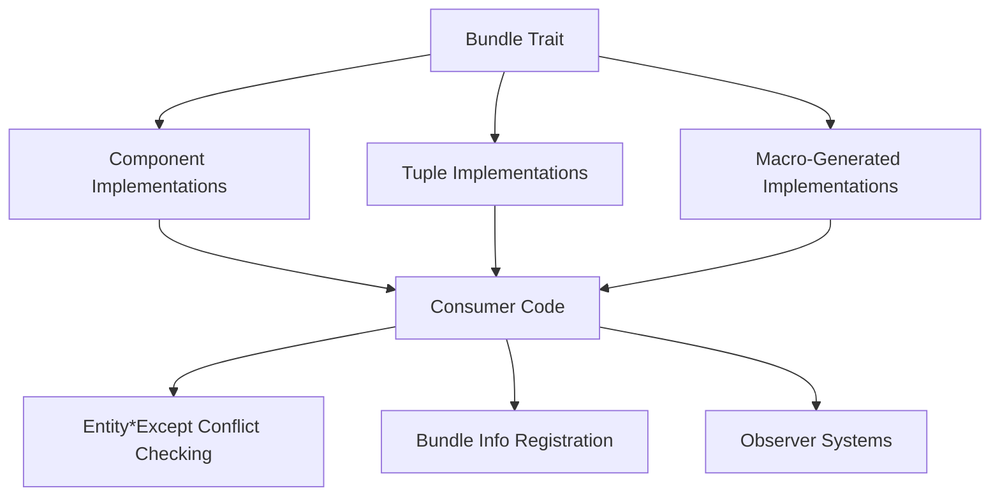

+++
title = "#21821 Change `Bundle::component_ids` to return an iterator"
date = "2025-11-14T00:00:00"
draft = false
template = "pull_request_page.html"
in_search_index = true

[taxonomies]
list_display = ["show"]

[extra]
current_language = "en"
available_languages = {"en" = { name = "English", url = "/pull_request/bevy/2025-11/pr-21821-en-20251114" }, "zh-cn" = { name = "中文", url = "/pull_request/bevy/2025-11/pr-21821-zh-cn-20251114" }}
labels = ["A-ECS", "C-Code-Quality", "C-Usability", "D-Macros"]
+++

# Change `Bundle::component_ids` to return an iterator

## Basic Information
- **Title**: Change `Bundle::component_ids` to return an iterator
- **PR Link**: https://github.com/bevyengine/bevy/pull/21821
- **Author**: hymm
- **Status**: MERGED
- **Labels**: A-ECS, C-Code-Quality, C-Usability, S-Ready-For-Final-Review, X-Uncontroversial, D-Macros
- **Created**: 2025-11-13T00:08:42Z
- **Merged**: 2025-11-13T23:23:03Z
- **Merged By**: mockersf

## Description Translation
# Objective

- As part of #21780, I need a way to iterate over the component ids of a bundle for `Entity*Except` conflict checking without allocating. Pulled this out as it changes some unrelated code too.

## Solution

- Change `Bundle::component_ids` and `Bundle::get_component_ids` to return an iterator instead of taking a closure. In theory I would expect this to compile to the same asm. I would also argue that using an iterator is a more natural api for this than the closure. It probably took a closure before because expressing that the iterator doesn't capture the `&mut ComponentRegistrator` lifetime wasn't possible without the `use` syntax. 
- Removed some #[allow(deprecated)] in the Bundle macro that was missed.

## Testing

- Checked the asm for  `hook_on_add` in the observers example for to confirm it was still the same. This is a pretty simple example though, so not sure how good of a check this is.
- None of the code touched are in any hot paths, but ran the spawn and insert benches. Any changes seem to be in the noise.

## The Story of This Pull Request

This PR addresses a specific performance optimization need that arose during the development of Entity*Except conflict checking in PR #21780. The core problem was straightforward: the existing `Bundle::component_ids` method required allocation when collecting component IDs, which wasn't ideal for performance-critical code paths.

The original implementation used a closure-based approach where component IDs were passed to a callback function. While functional, this pattern often forced callers to allocate vectors to collect the results. The developer recognized that switching to an iterator-based API would provide more flexibility, potentially eliminating allocations while maintaining the same underlying performance characteristics.

The implementation involved changing the `Bundle` trait's method signatures across the entire codebase. The key insight was that by returning iterators instead of using callbacks, consumers could choose whether to collect results into a vector or process them lazily. This was particularly valuable for the Entity*Except conflict checking use case, where the component IDs only needed to be checked for existence rather than stored.

One notable technical challenge was handling lifetime constraints. The original closure-based approach implicitly captured the lifetime of the `ComponentsRegistrator`, but with iterators, this needed to be made explicit. The solution used Rust's `use` syntax in the return type to specify which generic parameters the iterator depends on, without capturing the mutable reference lifetime.

The changes were systematically applied across multiple implementation layers:
- The core `Bundle` trait definition
- Manual implementations for components and tuples
- The derive macro for automatically implementing `Bundle`
- All consumer code throughout the ECS system

Performance validation was conducted through both micro-benchmarks and assembly inspection. The developer confirmed that the generated assembly for the observers example remained identical, suggesting no performance regression. Broader benchmarks on spawn and insert operations showed only noise-level differences, indicating the changes didn't negatively impact performance.

The migration was comprehensive, including the addition of a migration guide to help users update their code. The guide provided clear before-and-after examples for both implementors and consumers of the `Bundle` trait.

## Visual Representation



## Key Files Changed

### `crates/bevy_ecs/src/bundle/mod.rs`
This file contains the core `Bundle` trait definition. The method signatures were changed from closure-based to iterator-based.

```rust
// Before:
fn component_ids(components: &mut ComponentsRegistrator, ids: &mut impl FnMut(ComponentId));
fn get_component_ids(components: &Components, ids: &mut impl FnMut(Option<ComponentId>));

// After:
fn component_ids(components: &mut ComponentsRegistrator) -> impl Iterator<Item = ComponentId> + use<Self>;
fn get_component_ids(components: &Components) -> impl Iterator<Item = Option<ComponentId>>;
```

### `crates/bevy_ecs/src/bundle/impls.rs`
Contains implementations of `Bundle` for individual components and tuples. The implementations were updated to use iterator combinators.

```rust
// Component implementation:
// Before:
fn component_ids(components: &mut ComponentsRegistrator, ids: &mut impl FnMut(ComponentId)) {
    ids(components.register_component::<C>());
}

// After:
fn component_ids(components: &mut ComponentsRegistrator) -> impl Iterator<Item = ComponentId> + use<C> {
    iter::once(components.register_component::<C>())
}
```

### `crates/bevy_ecs/macros/src/lib.rs`
The derive macro for `Bundle` was updated to generate iterator-based implementations instead of closure-based ones.

```rust
// Before:
unsafe impl #impl_generics #ecs_path::bundle::Bundle for #struct_name #ty_generics #where_clause {
    fn component_ids(components: &mut #ecs_path::component::ComponentsRegistrator, ids: &mut impl FnMut(#ecs_path::component::ComponentId)) {
        #(<#active_field_types as #ecs_path::bundle::Bundle>::component_ids(components, ids);)*
    }
}

// After:
unsafe impl #impl_generics #ecs_path::bundle::Bundle for #struct_name #ty_generics #where_clause {
    fn component_ids(components: &mut #ecs_path::component::ComponentsRegistrator) -> impl Iterator<Item = #ecs_path::component::ComponentId> + use<#(#generics_ty_list,)*> {
        core::iter::empty()#(.chain(<#active_field_types as #ecs_path::bundle::Bundle>::component_ids(components)))*
    }
}
```

### `crates/bevy_ecs/src/query/fetch.rs`
Consumer code was updated to use the new iterator API, often eliminating intermediate allocations.

```rust
// Before:
B::component_ids(&mut world.components_registrator(), &mut |id| {
    access.remove_component_read(id);
});

// After:
for id in B::component_ids(&mut world.components_registrator()) {
    access.remove_component_read(id);
}
```

### `release-content/migration-guides/bundle_component_ids.md`
A new migration guide was added to help users transition from the old closure-based API to the new iterator-based API.

## Further Reading

- [Rust Iterator Documentation](https://doc.rust-lang.org/std/iter/trait.Iterator.html) - Comprehensive guide to Rust's iterator pattern
- [Bevy ECS Bundle Documentation](https://docs.rs/bevy_ecs/latest/bevy_ecs/bundle/trait.Bundle.html) - Official documentation for the Bundle trait
- [Rust `use` in return position](https://github.com/rust-lang/rust/issues/100013) - Discussion about the `use` syntax in return types
- [PR #21780](https://github.com/bevyengine/bevy/pull/21780) - The original PR that motivated this change