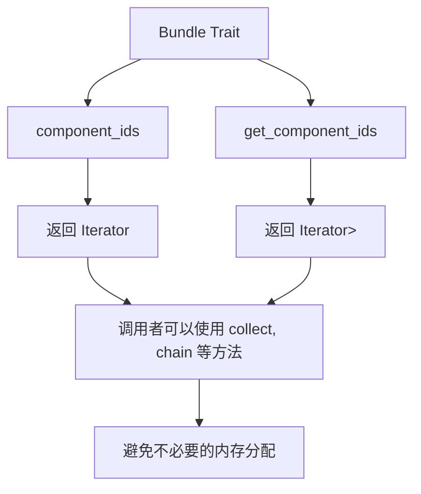

+++
title = "#21821 Change `Bundle::component_ids` to return an iterator"
date = "2025-11-14T00:00:00"
draft = false
template = "pull_request_page.html"
in_search_index = false

[extra]
current_language = "zh-cn"
available_languages = {"en" = { name = "English", url = "/pull_request/bevy/2025-11/pr-21821-en-20251114" }, "zh-cn" = { name = "中文", url = "/pull_request/bevy/2025-11/pr-21821-zh-cn-20251114" }}
labels = ["A-ECS", "C-Code-Quality", "C-Usability", "D-Macros"]
+++

# Change `Bundle::component_ids` to return an iterator

## Basic Information
- **Title**: Change `Bundle::component_ids` to return an iterator
- **PR Link**: https://github.com/bevyengine/bevy/pull/21821
- **Author**: hymm
- **Status**: MERGED
- **Labels**: A-ECS, C-Code-Quality, C-Usability, S-Ready-For-Final-Review, X-Uncontroversial, D-Macros
- **Created**: 2025-11-13T00:08:42Z
- **Merged**: 2025-11-13T23:23:03Z
- **Merged By**: mockersf

## Description Translation
### 目标
- 作为 #21780 的一部分，我需要一种在不分配内存的情况下迭代bundle的组件ID的方法，用于`Entity*Except`冲突检查。将此更改单独提出，因为它也改变了一些不相关的代码。

### 解决方案
- 将`Bundle::component_ids`和`Bundle::get_component_ids`改为返回迭代器而不是接受闭包。理论上，我希望这能编译成相同的汇编代码。我也认为使用迭代器比闭包更自然。之前可能使用闭包是因为在没有`use`语法的情况下，无法表达迭代器不捕获`&mut ComponentRegistrator`生命周期。
- 移除了Bundle宏中一些被遗漏的`#[allow(deprecated)]`。

### 测试
- 检查了observers示例中`hook_on_add`的汇编代码，确认它仍然相同。不过这是一个相当简单的示例，所以不确定这是否是一个很好的检查。
- 被修改的代码都不在热点路径上，但运行了spawn和insert的基准测试。任何变化似乎都在噪声范围内。

## The Story of This Pull Request

这个PR起源于一个具体的性能需求：在实现`Entity*Except`冲突检查时，需要在不分配内存的情况下迭代bundle的组件ID。开发者hymm发现现有的`Bundle::component_ids`方法接受一个闭包回调，这在使用时往往需要分配一个Vec来收集结果，不符合性能要求。

问题的核心在于API设计。原有的`Bundle`trait定义了两个方法：
- `component_ids`: 接受一个闭包回调，用于在组件注册时获取组件ID
- `get_component_ids`: 同样接受闭包回调，用于获取已注册组件的ID

这种设计导致调用者必须分配内存来存储结果，即使他们只需要迭代而不需要收集所有ID。

解决方案是将这两个方法改为返回迭代器。这在技术上是一个重大改变，因为涉及到：
1. 修改trait定义本身
2. 更新所有现有的Bundle实现
3. 修改所有调用这些方法的代码

在实现过程中，开发者面临一个技术挑战：如何确保迭代器不捕获`ComponentsRegistrator`的可变引用生命周期。Rust的`use`语法在这里发挥了关键作用，它允许显式指定迭代器应该捕获哪些泛型参数，而不捕获方法参数的生命周期。

从性能角度看，这种改变理论上应该产生相同的汇编代码，因为迭代器可以被优化为与闭包回调相同的结构。开发者通过检查observers示例的汇编代码和运行基准测试来验证这一点。

这个改变不仅仅是性能优化，更是API设计的改进。使用迭代器比闭包回调更符合Rust的惯用法，使代码更清晰、更易于理解。调用者现在可以使用标准的迭代器方法如`collect()`、`chain()`等，而不需要编写自定义的闭包逻辑。

## Visual Representation



## Key Files Changed

### 1. `crates/bevy_ecs/src/bundle/mod.rs`
这是Bundle trait定义的核心文件，修改了方法签名：

```rust
// 修改前：
fn component_ids(components: &mut ComponentsRegistrator, ids: &mut impl FnMut(ComponentId));
fn get_component_ids(components: &Components, ids: &mut impl FnMut(Option<ComponentId>));

// 修改后：
fn component_ids(
    components: &mut ComponentsRegistrator,
) -> impl Iterator<Item = ComponentId> + use<Self>;

fn get_component_ids(
    components: &Components,
) -> impl Iterator<Item = Option<ComponentId>>;
```

### 2. `crates/bevy_ecs/src/bundle/impls.rs`
实现了单个组件和元组的Bundle trait：

```rust
// 单个组件的实现
unsafe impl<C: Component> Bundle for C {
    fn component_ids(
        components: &mut ComponentsRegistrator,
    ) -> impl Iterator<Item = ComponentId> + use<C> {
        iter::once(components.register_component::<C>())
    }

    fn get_component_ids(components: &Components) -> impl Iterator<Item = Option<ComponentId>> {
        iter::once(components.get_id(TypeId::of::<C>()))
    }
}

// 元组的实现使用chain组合迭代器
unsafe impl<$($name: Bundle),*> Bundle for ($($name,)*) {
    fn component_ids<'a>(components: &'a mut ComponentsRegistrator) -> impl Iterator<Item = ComponentId> + use<$($name,)*> {
        iter::empty()$(.chain(<$name as Bundle>::component_ids(components)))*
    }

    fn get_component_ids(components: &Components) -> impl Iterator<Item = Option<ComponentId>> {
        iter::empty()$(.chain(<$name as Bundle>::get_component_ids(components)))*
    }
}
```

### 3. `crates/bevy_ecs/macros/src/lib.rs`
更新了派生宏来生成新的迭代器代码：

```rust
// 生成的代码现在返回迭代器链
unsafe impl #impl_generics #ecs_path::bundle::Bundle for #struct_name #ty_generics #where_clause {
    fn component_ids(
        components: &mut #ecs_path::component::ComponentsRegistrator,
    ) -> impl Iterator<Item = #ecs_path::component::ComponentId> + use<#(#generics_ty_list,)*> {
        core::iter::empty()#(.chain(<#active_field_types as #ecs_path::bundle::Bundle>::component_ids(components)))*
    }

    fn get_component_ids(
        components: &#ecs_path::component::Components,
    ) -> impl Iterator<Item = Option<#ecs_path::component::ComponentId>> {
        core::iter::empty()#(.chain(<#active_field_types as #ecs_path::bundle::Bundle>::get_component_ids(components)))*
    }
}
```

### 4. `crates/bevy_ecs/src/query/fetch.rs`
更新了查询相关的代码来使用新的迭代器API：

```rust
// 修改前：
B::component_ids(&mut world.components_registrator(), &mut |id| {
    access.remove_component_read(id);
});

// 修改后：
for id in B::component_ids(&mut world.components_registrator()) {
    access.remove_component_read(id);
}
```

### 5. `release-content/migration-guides/bundle_component_ids.md`
新增了迁移指南，展示了如何更新代码：

```rust
// 调用者的迁移示例
// 修改前：
let mut components = vec![];
MyBundle::component_ids(&mut world.components_registrator(), &mut |id| {
    components.push(id);
});

// 修改后：
let components: Vec<_> = B::component_ids(&mut world.components_registrator()).collect();
```

## Further Reading

- [Rust迭代器文档](https://doc.rust-lang.org/std/iter/index.html) - 了解Rust迭代器的基本概念和使用方法
- [Bevy ECS文档](https://bevyengine.org/learn/book/ecs/) - 了解Bevy的ECS架构
- [Rust的use语法](https://doc.rust-lang.org/reference/types/impl-trait.html) - 了解impl Trait中use语法的用法
- [PR #21780](https://github.com/bevyengine/bevy/pull/21780) - 这个PR的原始需求来源