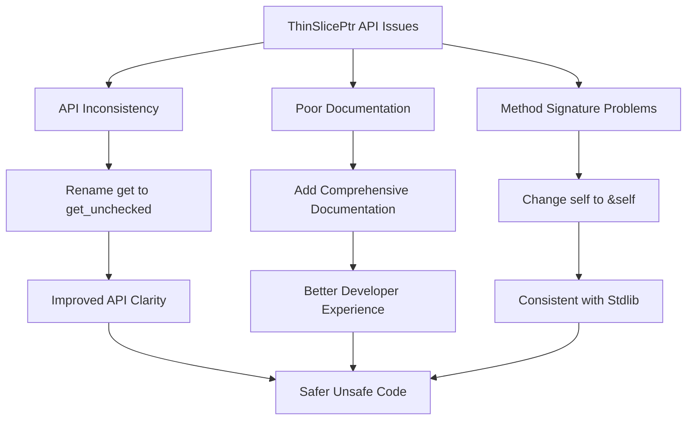

+++
title = "#21823 Improve `ThinSlicePtr` API"
date = "2025-11-28T00:00:00"
draft = false
template = "pull_request_page.html"
in_search_index = false

[extra]
current_language = "zh-cn"
available_languages = {"en" = { name = "English", url = "/pull_request/bevy/2025-11/pr-21823-en-20251128" }, "zh-cn" = { name = "中文", url = "/pull_request/bevy/2025-11/pr-21823-zh-cn-20251128" }}
labels = ["C-Docs", "C-Code-Quality", "M-Migration-Guide", "A-Pointers", "D-Straightforward", "D-Unsafe"]
+++

# Improve `ThinSlicePtr` API

## Basic Information
- **Title**: Improve `ThinSlicePtr` API
- **PR Link**: https://github.com/bevyengine/bevy/pull/21823
- **Author**: BD103
- **Status**: MERGED
- **Labels**: C-Docs, C-Code-Quality, S-Ready-For-Final-Review, M-Migration-Guide, A-Pointers, D-Straightforward, D-Unsafe
- **Created**: 2025-11-13T02:10:27Z
- **Merged**: 2025-11-28T08:30:42Z
- **Merged By**: mockersf

## Description Translation
# 目标

- 尽管是不安全的，`ThinSlicePtr::get()` 并没有明确表示它不执行边界检查，除非你对这个API很熟悉。
- `ThinSlicePtr::get()` 接受 `self`，而不是 `&self`，意味着每次调用 `get()` 都会消耗 `ThinSlicePtr`。这与 [`slice.get()`](https://doc.rust-lang.org/stable/std/primitive.slice.html#method.get) 的行为不匹配，后者接受 `&self`。
  - 这个小问题被 `ThinSlicePtr` 实现了 `Copy` 这一事实所掩盖。这不是一个大问题，因为最终编译出的机器代码是一样的，但是 `get()` 要求 `self` 是没有意义的。
- `ThinSlicePtr` 可以使用更好的文档，并且可以在某些方面稍作改进。

## 解决方案

- 将 `ThinSlicePtr::get()` 重命名为 `get_unchecked()`，使API镜像 [`slice.get_unchecked()`](https://doc.rust-lang.org/stable/std/primitive.slice.html#method.get_unchecked)。旧的 `get()` 作为已弃用的方法保留，将在 1.19.0 中移除。
- 使新的 `slice.get_unchecked()` 接受 `&self` 而不是 `self`。
- 添加更多文档并稍微重新整理代码，同时保持原始行为。

## 测试

- 任何意外的更改都应该被 Rust 编译器和 Miri 捕获！

## The Story of This Pull Request

这个PR的核心问题是关于API设计和开发者体验的改进。`ThinSlicePtr` 是一个性能优化的数据结构，它在概念上等价于 `&[T]`，但为了性能原因去掉了长度信息。然而，原有的API设计存在几个问题，可能给开发者带来困惑。

问题的根源在于 `ThinSlicePtr::get()` 方法的设计与Rust标准库的惯例不一致。在标准库中，`get()` 方法通常进行边界检查并返回 `Option`，而不进行边界检查的方法通常命名为 `get_unchecked()`。原有的 `ThinSlicePtr::get()` 实际上是不安全的，因为它不进行边界检查，但名称并没有明确传达这一点。

此外，方法签名也存在不一致性。`ThinSlicePtr::get()` 接受 `self` 而不是 `&self`，这意味着每次调用都会消耗所有权。虽然由于 `ThinSlicePtr` 实现了 `Copy` trait，这在实践中不会造成问题，但这种设计与标准库的切片API不一致，可能让开发者感到困惑。

解决方案采用了渐进式改进的方法。首先，引入新的 `get_unchecked()` 方法，它接受 `&self` 参数，与标准库保持一致。同时，将原有的 `get()` 方法标记为已弃用，为开发者提供迁移路径。这种方法确保了向后兼容性，同时引导开发者转向更清晰、更符合惯例的API。

在实现层面，PR还对代码进行了重构以提高可读性。特别是在调试模式下，现在使用了 `assert!` 而不是 `debug_assert!` 来进行边界检查，因为 `self.len` 字段在非调试模式下不存在。这种改进使得调试体验更加友好。

文档方面也得到了显著加强。现在 `ThinSlicePtr` 有了完整的文档说明，包括使用示例和安全性要求，这有助于开发者正确理解和使用这个API。

整个PR的影响是双重的：一方面，它提高了API的一致性和可预测性，使开发者更容易理解代码的行为；另一方面，它通过更好的文档和错误消息改善了开发体验。这些改进虽然看起来很小，但对于一个底层的数据结构来说至关重要，因为它直接影响到底层系统的可维护性和可靠性。

## Visual Representation



## Key Files Changed

### `crates/bevy_ptr/src/lib.rs` (+48/-11)

这是主要的修改文件，包含了 `ThinSlicePtr` API 的核心改进：

```rust
// 主要改进：重命名方法并改进参数
// Before:
pub unsafe fn get(self, index: usize) -> &'a T {
    #[cfg(debug_assertions)]
    debug_assert!(index < self.len);
    
    let ptr = self.ptr.as_ptr();
    unsafe { &*ptr.add(index) }
}

// After:
pub unsafe fn get_unchecked(&self, index: usize) -> &'a T {
    #[cfg(debug_assertions)]
    assert!(index < self.len, "tried to index out-of-bounds of a slice");
    
    unsafe { &*self.ptr.add(index).as_ptr() }
}

// 保留向后兼容的已弃用方法
#[deprecated(since = "0.18.0", note = "use get_unchecked() instead")]
pub unsafe fn get(self, index: usize) -> &'a T {
    unsafe { self.get_unchecked(index) }
}
```

```rust
// 改进的 From 实现
// Before:
fn from(slice: &'a [T]) -> Self {
    let ptr = slice.as_ptr().cast_mut();
    Self {
        ptr: unsafe { NonNull::new_unchecked(ptr.debug_ensure_aligned()) },
        #[cfg(debug_assertions)]
        len: slice.len(),
        _marker: PhantomData,
    }
}

// After:
fn from(slice: &'a [T]) -> Self {
    let ptr = slice.as_ptr().cast_mut().debug_ensure_aligned();
    
    Self {
        ptr: unsafe { NonNull::new_unchecked(ptr) },
        #[cfg(debug_assertions)]
        len: slice.len(),
        _marker: PhantomData,
    }
}
```

### `release-content/migration-guides/thin_slice_ptr_get_unchecked.md` (+21/-0)

新增了迁移指南，帮助开发者从旧API迁移到新API：

```markdown
---
title: Rename `ThinSlicePtr::get()` to `ThinSlicePtr::get_unchecked()`
pull_requests: [21823]
---

`ThinSlicePtr::get()` has been deprecated in favor of the new `ThinSlicePtr::get_unchecked()`
method in order to more clearly signal that bounds checking is not performed. Beyond the name
change, the only difference between these two methods is that `get_unchecked()` takes `&self` while
`get()` takes `self`. In order to migrate, simply rename all usages of `get()` with
`get_unchecked()`:

```rust
let slice: &[u32] = &[2, 4, 8];
let thin_slice = ThinSlicePtr::from(slice);

// 0.17
let x = unsafe { thin_slice.get(0) };

// 0.18
let x = unsafe { thin_slice.get_unchecked(0) };
```
```

### `crates/bevy_ecs/src/query/fetch.rs` (+11/-9) 和 `crates/bevy_ecs/src/query/filter.rs` (+2/-2)

这些文件更新了使用 `ThinSlicePtr` 的代码，将 `.get()` 调用改为 `.get_unchecked()`：

```rust
// 在多个地方进行了类似的更新
// Before:
let item = unsafe { table.get(table_row.index()) };

// After:
let item = unsafe { table.get_unchecked(table_row.index()) };
```

这些更新确保了整个代码库与新的API保持一致。

## Further Reading

- [Rust Standard Library - slice::get_unchecked](https://doc.rust-lang.org/stable/std/primitive.slice.html#method.get_unchecked)
- [Rustonomicon - Working with Unsafe Code](https://doc.rust-lang.org/nomicon/working-with-unsafe.html)
- [Bevy Engine - Unsafe Code Guidelines](https://github.com/bevyengine/bevy/blob/main/UNSAFE_GUIDELINES.md)
- [Rust API Guidelines - Naming Conventions](https://rust-lang.github.io/api-guidelines/naming.html)

# Full Code Diff
diff --git a/crates/bevy_ecs/src/query/fetch.rs b/crates/bevy_ecs/src/query/fetch.rs
index 82f4976c49f1d..d672b6ae4d0b7 100644
--- a/crates/bevy_ecs/src/query/fetch.rs
+++ b/crates/bevy_ecs/src/query/fetch.rs
@@ -1653,7 +1653,7 @@ unsafe impl<T: Component> QueryData for &T {
                 // SAFETY: set_table was previously called
                 let table = unsafe { table.debug_checked_unwrap() };
                 // SAFETY: Caller ensures `table_row` is in range.
-                let item = unsafe { table.get(table_row.index()) };
+                let item = unsafe { table.get_unchecked(table_row.index()) };
                 item.deref()
             },
             |sparse_set| {
@@ -1841,13 +1841,14 @@ unsafe impl<'__w, T: Component> QueryData for Ref<'__w, T> {
                     unsafe { table.debug_checked_unwrap() };
 
                 // SAFETY: The caller ensures `table_row` is in range.
-                let component = unsafe { table_components.get(table_row.index()) };
+                let component = unsafe { table_components.get_unchecked(table_row.index()) };
                 // SAFETY: The caller ensures `table_row` is in range.
-                let added = unsafe { added_ticks.get(table_row.index()) };
+                let added = unsafe { added_ticks.get_unchecked(table_row.index()) };
                 // SAFETY: The caller ensures `table_row` is in range.
-                let changed = unsafe { changed_ticks.get(table_row.index()) };
+                let changed = unsafe { changed_ticks.get_unchecked(table_row.index()) };
                 // SAFETY: The caller ensures `table_row` is in range.
-                let caller = callers.map(|callers| unsafe { callers.get(table_row.index()) });
+                let caller =
+                    callers.map(|callers| unsafe { callers.get_unchecked(table_row.index()) });
 
                 Ref {
                     value: component.deref(),
@@ -2053,13 +2054,14 @@ unsafe impl<'__w, T: Component<Mutability = Mutable>> QueryData for &'__w mut T
                     unsafe { table.debug_checked_unwrap() };
 
                 // SAFETY: The caller ensures `table_row` is in range.
-                let component = unsafe { table_components.get(table_row.index()) };
+                let component = unsafe { table_components.get_unchecked(table_row.index()) };
                 // SAFETY: The caller ensures `table_row` is in range.
-                let added = unsafe { added_ticks.get(table_row.index()) };
+                let added = unsafe { added_ticks.get_unchecked(table_row.index()) };
                 // SAFETY: The caller ensures `table_row` is in range.
-                let changed = unsafe { changed_ticks.get(table_row.index()) };
+                let changed = unsafe { changed_ticks.get_unchecked(table_row.index()) };
                 // SAFETY: The caller ensures `table_row` is in range.
-                let caller = callers.map(|callers| unsafe { callers.get(table_row.index()) });
+                let caller =
+                    callers.map(|callers| unsafe { callers.get_unchecked(table_row.index()) });
 
                 Mut {
                     value: component.deref_mut(),
diff --git a/crates/bevy_ecs/src/query/filter.rs b/crates/bevy_ecs/src/query/filter.rs
index d0261fae976a4..f8578d5d21705 100644
--- a/crates/bevy_ecs/src/query/filter.rs
+++ b/crates/bevy_ecs/src/query/filter.rs
@@ -850,7 +850,7 @@ unsafe impl<T: Component> QueryFilter for Added<T> {
                 // SAFETY: set_table was previously called
                 let table = unsafe { table.debug_checked_unwrap() };
                 // SAFETY: The caller ensures `table_row` is in range.
-                let tick = unsafe { table.get(table_row.index()) };
+                let tick = unsafe { table.get_unchecked(table_row.index()) };
 
                 tick.deref().is_newer_than(fetch.last_run, fetch.this_run)
             },
@@ -1078,7 +1078,7 @@ unsafe impl<T: Component> QueryFilter for Changed<T> {
                 // SAFETY: set_table was previously called
                 let table = unsafe { table.debug_checked_unwrap() };
                 // SAFETY: The caller ensures `table_row` is in range.
-                let tick = unsafe { table.get(table_row.index()) };
+                let tick = unsafe { table.get_unchecked(table_row.index()) };
 
                 tick.deref().is_newer_than(fetch.last_run, fetch.this_run)
             },
diff --git a/crates/bevy_ptr/src/lib.rs b/crates/bevy_ptr/src/lib.rs
index d4db3462d6af9..e76fcc9f57250 100644
--- a/crates/bevy_ptr/src/lib.rs
+++ b/crates/bevy_ptr/src/lib.rs
@@ -1056,7 +1056,29 @@ impl<'a> OwningPtr<'a, Unaligned> {
     }
 }
 
-/// Conceptually equivalent to `&'a [T]` but with length information cut out for performance reasons
+/// Conceptually equivalent to `&'a [T]` but with length information cut out for performance
+/// reasons.
+///
+/// Because this type does not store the length of the slice, it is unable to do any sort of bounds
+/// checking. As such, only [`Self::get_unchecked()`] is available for indexing into the slice,
+/// where the user is responsible for checking the bounds.
+///
+/// When compiled in debug mode (`#[cfg(debug_assertion)]`), this type will store the length of the
+/// slice and perform bounds checking in [`Self::get_unchecked()`].
+///
+/// # Example
+///
+/// ```
+/// # use core::mem::size_of;
+/// # use bevy_ptr::ThinSlicePtr;
+/// #
+/// let slice: &[u32] = &[2, 4, 8];
+/// let thin_slice = ThinSlicePtr::from(slice);
+///
+/// assert_eq!(*unsafe { thin_slice.get_unchecked(0) }, 2);
+/// assert_eq!(*unsafe { thin_slice.get_unchecked(1) }, 4);
+/// assert_eq!(*unsafe { thin_slice.get_unchecked(2) }, 8);
+/// ```
 pub struct ThinSlicePtr<'a, T> {
     ptr: NonNull<T>,
     #[cfg(debug_assertions)]
@@ -1065,18 +1087,32 @@ pub struct ThinSlicePtr<'a, T> {
 }
 
 impl<'a, T> ThinSlicePtr<'a, T> {
-    #[inline]
-    /// Indexes the slice without doing bounds checks
+    /// Indexes the slice without performing bounds checks.
     ///
     /// # Safety
+    ///
     /// `index` must be in-bounds.
-    pub unsafe fn get(self, index: usize) -> &'a T {
+    #[inline]
+    pub unsafe fn get_unchecked(&self, index: usize) -> &'a T {
+        // We cannot use `debug_assert!` here because `self.len` does not exist when not in debug
+        // mode.
         #[cfg(debug_assertions)]
-        debug_assert!(index < self.len);
+        assert!(index < self.len, "tried to index out-of-bounds of a slice");
 
-        let ptr = self.ptr.as_ptr();
-        // SAFETY: `index` is in-bounds so the resulting pointer is valid to dereference.
-        unsafe { &*ptr.add(index) }
+        // SAFETY: The caller guarantees `index` is in-bounds so that the resulting pointer is
+        // valid to dereference.
+        unsafe { &*self.ptr.add(index).as_ptr() }
+    }
+
+    /// Indexes the slice without performing bounds checks.
+    ///
+    /// # Safety
+    ///
+    /// `index` must be in-bounds.
+    #[deprecated(since = "0.18.0", note = "use get_unchecked() instead")]
+    pub unsafe fn get(self, index: usize) -> &'a T {
+        // SAFETY: The caller guarantees that `index` is in-bounds.
+        unsafe { self.get_unchecked(index) }
     }
 }
 
@@ -1091,10 +1127,11 @@ impl<'a, T> Copy for ThinSlicePtr<'a, T> {}
 impl<'a, T> From<&'a [T]> for ThinSlicePtr<'a, T> {
     #[inline]
     fn from(slice: &'a [T]) -> Self {
-        let ptr = slice.as_ptr().cast_mut();
+        let ptr = slice.as_ptr().cast_mut().debug_ensure_aligned();
+
         Self {
-            // SAFETY: a reference can never be null
-            ptr: unsafe { NonNull::new_unchecked(ptr.debug_ensure_aligned()) },
+            // SAFETY: A reference can never be null.
+            ptr: unsafe { NonNull::new_unchecked(ptr) },
             #[cfg(debug_assertions)]
             len: slice.len(),
             _marker: PhantomData,
diff --git a/release-content/migration-guides/thin_slice_ptr_get_unchecked.md b/release-content/migration-guides/thin_slice_ptr_get_unchecked.md
new file mode 100644
index 0000000000000..b9101992783c8
--- /dev/null
+++ b/release-content/migration-guides/thin_slice_ptr_get_unchecked.md
@@ -0,0 +1,21 @@
+---
+title: Rename `ThinSlicePtr::get()` to `ThinSlicePtr::get_unchecked()`
+pull_requests: [21823]
+---
+
+`ThinSlicePtr::get()` has been deprecated in favor of the new `ThinSlicePtr::get_unchecked()`
+method in order to more clearly signal that bounds checking is not performed. Beyond the name
+change, the only difference between these two methods is that `get_unchecked()` takes `&self` while
+`get()` takes `self`. In order to migrate, simply rename all usages of `get()` with
+`get_unchecked()`:
+
+```rust
+let slice: &[u32] = &[2, 4, 8];
+let thin_slice = ThinSlicePtr::from(slice);
+
+// 0.17
+let x = unsafe { thin_slice.get(0) };
+
+// 0.18
+let x = unsafe { thin_slice.get_unchecked(0) };
+```
+```