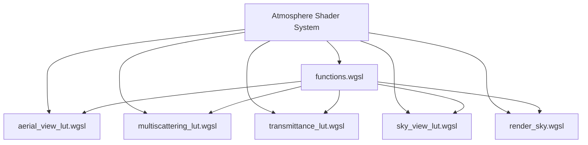

+++
title = "#21829 Trim imports atmosphere shaders"
date = "2025-11-26T00:00:00"
draft = false
template = "pull_request_page.html"
in_search_index = true

[taxonomies]
list_display = ["show"]

[extra]
current_language = "en"
available_languages = {"en" = { name = "English", url = "/pull_request/bevy/2025-11/pr-21829-en-20251126" }, "zh-cn" = { name = "中文", url = "/pull_request/bevy/2025-11/pr-21829-zh-cn-20251126" }}
labels = ["A-Rendering", "C-Code-Quality", "D-Shaders"]
+++

# Title
Trim imports atmosphere shaders

## Basic Information
- **Title**: Trim imports atmosphere shaders
- **PR Link**: https://github.com/bevyengine/bevy/pull/21829
- **Author**: hukasu
- **Status**: MERGED
- **Labels**: A-Rendering, C-Code-Quality, S-Ready-For-Final-Review, D-Shaders
- **Created**: 2025-11-14T01:18:37Z
- **Merged**: 2025-11-26T22:35:50Z
- **Merged By**: mockersf

## Description Translation
# Objective

Some shaders on the `atmosphere` module of `bevy_pbr` have many unused imports

## Solution

Trim imports of the offending shaders.

## Testing

`atmosphere` example

## The Story of This Pull Request

This PR addresses a common code quality issue in the Bevy engine's atmosphere rendering system: unused import statements in WGSL shader files. The problem emerged as the atmosphere shader code evolved over time, accumulating import statements that were no longer needed due to refactoring or changes in implementation approach.

The developer identified six shader files in the `bevy_pbr/src/atmosphere` module that contained unnecessary imports. These imports were likely left behind during previous development cycles when functions or types were moved between modules or when shader implementations were simplified. While unused imports don't affect runtime performance in compiled shaders, they create maintenance overhead and reduce code clarity.

The solution approach was straightforward but systematic: carefully analyze each shader file to identify which imports were actually being used, then remove the unused ones. This required understanding the dependencies between different shader modules and ensuring that no required functionality was accidentally removed. The testing approach was practical - verifying that the atmosphere example still rendered correctly, confirming that the visual output remained unchanged.

The implementation touches multiple shader files, each serving a specific role in the atmosphere rendering pipeline:

- `aerial_view_lut.wgsl` handles aerial perspective calculations
- `multiscattering_lut.wgsl` computes multiple scattering effects  
- `transmittance_lut.wgsl` calculates light transmission through atmosphere
- `sky_view_lut.wgsl` generates sky view look-up tables
- `render_sky.wgsl` performs the final sky rendering
- `functions.wgsl` contains shared utility functions

Each file showed a similar pattern of cleanup - removing imports for types, bindings, and functions that weren't referenced in the actual shader code. For example, several shaders were importing lighting-related types from `mesh_view_types` that weren't used in atmospheric calculations. Other shaders had imports for mathematical functions or Bruneton atmosphere model utilities that had been superseded by different implementations.

One notable aspect of these changes is the preservation of code formatting and style. In `multiscattering_lut.wgsl`, the developer fixed a minor formatting issue by adding a missing comma in an import statement, demonstrating attention to code quality beyond just the functional changes.

The technical impact of this PR is primarily on code maintainability. By removing unused imports, the shader code becomes easier to read and understand. New developers working on the atmosphere system can more clearly see which dependencies each shader actually uses. Additionally, future refactoring becomes safer since there are fewer unused imports that could potentially mask missing dependencies.

This type of cleanup is particularly valuable in shader code, where debugging can be challenging. With cleaner import statements, it's easier to trace the flow of data and functions through the rendering pipeline. The changes also reduce the cognitive load for developers reviewing shader code, as they don't need to mentally filter out irrelevant imports.

## Visual Representation



## Key Files Changed

### `crates/bevy_pbr/src/atmosphere/aerial_view_lut.wgsl` (+4/-9)
This shader handles aerial view look-up table generation. The changes removed unused imports related to lighting types and various atmosphere functions that weren't actually used in the implementation.

```wgsl
// Before:
#import bevy_pbr::{
    mesh_view_types::{Lights, DirectionalLight},
    atmosphere::{
        types::{Atmosphere, AtmosphereSettings},
        bindings::{atmosphere, settings, view, lights, aerial_view_lut_out},
        functions::{
            sample_transmittance_lut, sample_density_lut, rayleigh, henyey_greenstein,
            sample_multiscattering_lut, AtmosphereSample, sample_local_inscattering,
            uv_to_ndc, max_atmosphere_distance, uv_to_ray_direction, 
            MIDPOINT_RATIO, get_view_position, MIN_EXTINCTION, ABSORPTION_DENSITY,
            SCATTERING_DENSITY,
        },
    }
}

// After:
#import bevy_pbr::{
    atmosphere::{
        bindings::settings,
        functions::{
            sample_density_lut, sample_local_inscattering, uv_to_ray_direction, get_view_position,
            MIDPOINT_RATIO, MIN_EXTINCTION, ABSORPTION_DENSITY, SCATTERING_DENSITY,
        },
    }
}
```

### `crates/bevy_pbr/src/atmosphere/multiscattering_lut.wgsl` (+4/-9)
This shader computes multiple scattering effects. The cleanup removed unused lighting imports and several mathematical functions that weren't referenced.

```wgsl
// Before:
#import bevy_pbr::{
    mesh_view_types::{Lights, DirectionalLight},
    atmosphere::{
        types::{Atmosphere, AtmosphereSettings},
        bindings::{atmosphere, settings},
        functions::{
            multiscattering_lut_uv_to_r_mu, sample_transmittance_lut,
            get_local_r, get_local_up, sample_density_lut, FRAC_4_PI,
            max_atmosphere_distance, rayleigh, henyey_greenstein,
            zenith_azimuth_to_ray_dir, MIN_EXTINCTION, ABSORPTION_DENSITY,
            SCATTERING_DENSITY,
        },
        bruneton_functions::{
            distance_to_top_atmosphere_boundary, distance_to_bottom_atmosphere_boundary, ray_intersects_ground
        }
    }
}

#import bevy_render::maths::{PI,PI_2}

// After:
#import bevy_pbr::{
    atmosphere::{
        bindings::{atmosphere, settings},
        functions::{
            multiscattering_lut_uv_to_r_mu, sample_transmittance_lut,
            get_local_r, get_local_up, sample_density_lut, FRAC_4_PI,
            max_atmosphere_distance,
            MIN_EXTINCTION, ABSORPTION_DENSITY, SCATTERING_DENSITY,
        },
        bruneton_functions::ray_intersects_ground
    }
}

#import bevy_render::maths::{PI, PI_2}
```

### `crates/bevy_pbr/src/atmosphere/transmittance_lut.wgsl` (+6/-5)
This shader handles transmittance calculations. The changes streamlined the imports to only include necessary bindings and functions.

```wgsl
// Before:
#import bevy_pbr::atmosphere::{
    types::{Atmosphere, AtmosphereSettings},
    bindings::{settings, atmosphere},
    functions::{AtmosphereSample, sample_density_lut, get_local_r, max_atmosphere_distance, MIDPOINT_RATIO, ABSORPTION_DENSITY, SCATTERING_DENSITY},
    bruneton_functions::{transmittance_lut_uv_to_r_mu, distance_to_bottom_atmosphere_boundary, distance_to_top_atmosphere_boundary},
}

// After:
#import bevy_pbr::atmosphere::{
    bindings::settings,
    functions::{
        sample_density_lut, get_local_r, max_atmosphere_distance,
        MIDPOINT_RATIO, ABSORPTION_DENSITY, SCATTERING_DENSITY
    },
    bruneton_functions::transmittance_lut_uv_to_r_mu,
}
```

### `crates/bevy_pbr/src/atmosphere/functions.wgsl` (+3/-4)
This file contains shared utility functions. The cleanup removed two unused Bruneton function imports.

```wgsl
// Before:
#import bevy_pbr::{
    atmosphere::{
        types::Atmosphere,
        bindings::{
            atmosphere, settings, view, lights, transmittance_lut, atmosphere_lut_sampler,
            multiscattering_lut, sky_view_lut, aerial_view_lut, atmosphere_transforms, 
            medium_density_lut, medium_scattering_lut, medium_sampler,
        },
        bruneton_functions::{
            transmittance_lut_r_mu_to_uv, transmittance_lut_uv_to_r_mu, 
            ray_intersects_ground, distance_to_top_atmosphere_boundary, 
            distance_to_bottom_atmosphere_boundary
        },
    }
}

// After:
#import bevy_pbr::{
    atmosphere::{
        types::Atmosphere,
        bindings::{
            atmosphere, settings, view, lights, transmittance_lut, atmosphere_lut_sampler,
            multiscattering_lut, sky_view_lut, aerial_view_lut, atmosphere_transforms,
            medium_density_lut, medium_scattering_lut, medium_sampler,
        },
        bruneton_functions::{
            transmittance_lut_r_mu_to_uv, ray_intersects_ground,
            distance_to_top_atmosphere_boundary, distance_to_bottom_atmosphere_boundary
        },
    }
}
```

### `crates/bevy_pbr/src/atmosphere/render_sky.wgsl` (+1/-3)
This is the main sky rendering shader. The changes removed unused atmosphere type imports and view-related imports.

```wgsl
// Before:
#import bevy_pbr::atmosphere::{
    types::{Atmosphere, AtmosphereSettings},
    bindings::{atmosphere, view, atmosphere_transforms, settings},
    functions::{
        sample_transmittance_lut, sample_transmittance_lut_segment,
        sample_sky_view_lut, direction_world_to_atmosphere,
        direction_atmosphere_to_world, sample_aerial_view_lut,
        get_view_position, max_atmosphere_distance
    },
};
#import bevy_render::view::View;

// After:
#import bevy_pbr::atmosphere::{
    bindings::{view, settings},
    functions::{
        sample_transmittance_lut, sample_transmittance_lut_segment,
        sample_sky_view_lut, direction_world_to_atmosphere,
        direction_atmosphere_to_world, sample_aerial_view_lut,
        get_view_position, max_atmosphere_distance
    },
};
```

## Further Reading

- [WGSL Shader Language Specification](https://www.w3.org/TR/WGSL/)
- [Bevy Engine Rendering Documentation](https://bevyengine.org/learn/quick-start/rendering/)
- [Atmospheric Scattering Models](https://developer.nvidia.com/gpugems/gpugems2/part-ii-shading-lighting-and-shadows/chapter-16-accurate-atmospheric-scattering)
- [Code Quality Best Practices](https://rust-unofficial.github.io/patterns/)