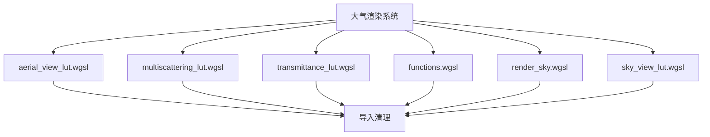

+++
title = "#21829 Trim imports atmosphere shaders"
date = "2025-11-26T00:00:00"
draft = false
template = "pull_request_page.html"
in_search_index = false

[extra]
current_language = "zh-cn"
available_languages = {"en" = { name = "English", url = "/pull_request/bevy/2025-11/pr-21829-en-20251126" }, "zh-cn" = { name = "中文", url = "/pull_request/bevy/2025-11/pr-21829-zh-cn-20251126" }}
labels = ["A-Rendering", "C-Code-Quality", "D-Shaders"]
+++

# Trim imports atmosphere shaders

## Basic Information
- **Title**: Trim imports atmosphere shaders
- **PR Link**: https://github.com/bevyengine/bevy/pull/21829
- **Author**: hukasu
- **Status**: MERGED
- **Labels**: A-Rendering, C-Code-Quality, S-Ready-For-Final-Review, D-Shaders
- **Created**: 2025-11-14T01:18:37Z
- **Merged**: 2025-11-26T22:35:50Z
- **Merged By**: mockersf

## Description Translation
# Objective

`bevy_pbr` 的 `atmosphere` 模块中的一些着色器有许多未使用的导入

## Solution

修剪有问题的着色器的导入。

## Testing

`atmosphere` 示例

## The Story of This Pull Request

这个PR解决了一个在Bevy渲染系统中发现的代码质量问题。在`bevy_pbr`的大气渲染模块中，多个WGSL着色器文件包含了大量未使用的导入语句。虽然这些未使用的导入不会影响渲染功能的正确性，但它们增加了代码的复杂性，降低了可读性，并可能在编译时产生不必要的警告。

开发者hukasu识别到这个问题后，采取了直接而有效的解决方案：系统性地审查每个大气着色器文件，移除所有未使用的导入语句。这是一个典型的代码清理任务，属于维护性工作而非功能性修改。

在`aerial_view_lut.wgsl`文件中，可以看到最显著的清理效果。原始代码导入了多个未使用的类型和函数：

```wgsl
#import bevy_pbr::{
    mesh_view_types::{Lights, DirectionalLight},
    atmosphere::{
        types::{Atmosphere, AtmosphereSettings},
        bindings::{atmosphere, settings, view, lights, aerial_view_lut_out},
        functions::{
            sample_transmittance_lut, sample_density_lut, rayleigh, henyey_greenstein,
            sample_multiscattering_lut, AtmosphereSample, sample_local_inscattering,
            uv_to_ndc, max_atmosphere_distance, uv_to_ray_direction, 
            MIDPOINT_RATIO, get_view_position, MIN_EXTINCTION, ABSORPTION_DENSITY,
            SCATTERING_DENSITY,
        },
    }
}
```

清理后，只保留了实际使用的导入：

```wgsl
#import bevy_pbr::{
    atmosphere::{
        bindings::settings,
        functions::{
            sample_density_lut, sample_local_inscattering, uv_to_ray_direction, get_view_position,
            MIDPOINT_RATIO, MIN_EXTINCTION, ABSORPTION_DENSITY, SCATTERING_DENSITY,
        },
    }
}
```

类似的方法应用于其他大气着色器文件。在`multiscattering_lut.wgsl`中，不仅移除了未使用的导入，还修复了一个格式问题，在`PI`和`PI_2`之间添加了缺失的逗号：

```wgsl
// 之前：
#import bevy_render::maths::{PI,PI_2}

// 之后：
#import bevy_render::maths::{PI, PI_2}
```

在`functions.wgsl`中，移除了未使用的`transmittance_lut_uv_to_r_mu`函数导入，这个函数在文件中没有被调用。这种清理有助于避免未来维护时的困惑，确保开发者能够清楚地了解每个文件的依赖关系。

这种导入清理在大型着色器代码库中特别重要，因为：
1. 减少编译时的符号解析负担
2. 提高代码可读性和维护性
3. 避免潜在的命名冲突
4. 使依赖关系更加明确

测试方面，开发者验证了`atmosphere`示例仍然正常工作，确认这些导入清理没有破坏任何功能。这种验证是必要的，因为虽然理论上只是移除未使用的代码，但实际中有时可能存在隐式的依赖关系。

从工程角度看，这个PR展示了良好的代码卫生习惯。定期清理未使用的导入可以防止技术债务积累，特别是在快速发展的渲染系统中，着色器代码经常随着新功能的添加而演变。

## Visual Representation



## Key Files Changed

### `crates/bevy_pbr/src/atmosphere/aerial_view_lut.wgsl` (+4/-9)
**变化描述**: 移除了大量未使用的导入，只保留必要的`settings`绑定和实际使用的函数。

**关键修改**:
```wgsl
// 之前包含多个未使用的导入
#import bevy_pbr::{
    mesh_view_types::{Lights, DirectionalLight},
    atmosphere::{
        types::{Atmosphere, AtmosphereSettings},
        bindings::{atmosphere, settings, view, lights, aerial_view_lut_out},
        // ... 多个未使用的函数
    }
}

// 之后只保留必要的导入
#import bevy_pbr::{
    atmosphere::{
        bindings::settings,
        functions::{
            sample_density_lut, sample_local_inscattering, uv_to_ray_direction, get_view_position,
            MIDPOINT_RATIO, MIN_EXTINCTION, ABSORPTION_DENSITY, SCATTERING_DENSITY,
        },
    }
}
```

### `crates/bevy_pbr/src/atmosphere/multiscattering_lut.wgsl` (+4/-9)
**变化描述**: 清理未使用的导入并修复格式问题。

**关键修改**:
```wgsl
// 移除了未使用的类型和函数导入
// 修复了数学常量导入的格式
#import bevy_render::maths::{PI, PI_2}  // 添加了缺失的逗号
```

### `crates/bevy_pbr/src/atmosphere/transmittance_lut.wgsl` (+6/-5)
**变化描述**: 简化导入语句，移除未使用的依赖。

**关键修改**:
```wgsl
// 之前：
#import bevy_pbr::atmosphere::{
    types::{Atmosphere, AtmosphereSettings},
    bindings::{settings, atmosphere},
    functions::{AtmosphereSample, sample_density_lut, get_local_r, max_atmosphere_distance, MIDPOINT_RATIO, ABSORPTION_DENSITY, SCATTERING_DENSITY},
    bruneton_functions::{transmittance_lut_uv_to_r_mu, distance_to_bottom_atmosphere_boundary, distance_to_top_atmosphere_boundary},
}

// 之后：
#import bevy_pbr::atmosphere::{
    bindings::settings,
    functions::{
        sample_density_lut, get_local_r, max_atmosphere_distance,
        MIDPOINT_RATIO, ABSORPTION_DENSITY, SCATTERING_DENSITY
    },
    bruneton_functions::transmittance_lut_uv_to_r_mu,
}
```

### `crates/bevy_pbr/src/atmosphere/functions.wgsl` (+3/-4)
**变化描述**: 移除未使用的函数导入。

**关键修改**:
```wgsl
// 移除了未使用的 transmittance_lut_uv_to_r_mu 函数
```

### `crates/bevy_pbr/src/atmosphere/render_sky.wgsl` (+1/-3)
**变化描述**: 简化导入，移除未使用的类型和绑定。

**关键修改**:
```wgsl
// 之前：
#import bevy_pbr::atmosphere::{
    types::{Atmosphere, AtmosphereSettings},
    bindings::{atmosphere, view, atmosphere_transforms, settings},
    // ...
}
#import bevy_render::view::View

// 之后：
#import bevy_pbr::atmosphere::{
    bindings::{view, settings},
    // ...
}
```

## Further Reading

- [WGSL 着色器语言规范](https://www.w3.org/TR/WGSL/)
- [Bevy 渲染架构文档](https://bevyengine.org/learn/quick-start/rendering/)
- [代码维护最佳实践](https://github.com/bevyengine/bevy/blob/main/CODE_STYLE.md)