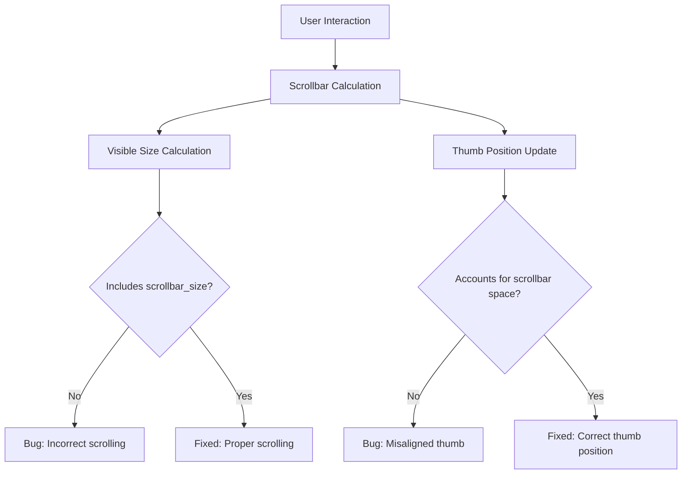

+++
title = "#21835 Fix bevy_ui_widgets scrollbar bug where scrollbar_size wasn't taken into account"
date = "2025-11-17T00:00:00"
draft = false
template = "pull_request_page.html"
in_search_index = true

[taxonomies]
list_display = ["show"]

[extra]
current_language = "en"
available_languages = {"en" = { name = "English", url = "/pull_request/bevy/2025-11/pr-21835-en-20251117" }, "zh-cn" = { name = "中文", url = "/pull_request/bevy/2025-11/pr-21835-zh-cn-20251117" }}
labels = ["C-Bug", "A-UI", "D-Straightforward"]
+++

# Title

## Basic Information
- **Title**: Fix bevy_ui_widgets scrollbar bug where scrollbar_size wasn't taken into account
- **PR Link**: https://github.com/bevyengine/bevy/pull/21835
- **Author**: PPakalns
- **Status**: MERGED
- **Labels**: C-Bug, A-UI, S-Ready-For-Final-Review, D-Straightforward
- **Created**: 2025-11-14T10:35:35Z
- **Merged**: 2025-11-17T00:12:36Z
- **Merged By**: alice-i-cecile

## Description Translation

# Objective

Bevy ui widget scrollbar implementation didn't correctly handle scrollbar width inserted by taffy.

## Solution

Correctly handle scrollbar width similarly as it is done in bevy engine scroll position calculation:

https://github.com/bevyengine/bevy/blob/0d46518eb21df54ba951f503930501bc2639e2a2/crates/bevy_ui/src/layout/mod.rs#L334-L336

## Testing

- In personal project added scrollareas with scrollbars that automatically attach to overflow: scroll elements and utilize space provided by taffy scrollbar-width.

## The Story of This Pull Request

This PR addresses a subtle but important bug in the bevy_ui_widgets scrollbar implementation. The core issue was that the scrollbar calculations weren't accounting for the space reserved by Taffy (Bevy's layout engine) for the scrollbars themselves, leading to incorrect scroll position calculations and visual misalignments.

The problem manifested in three key interaction points where scrollbar calculations occur: when clicking on the scrollbar track, during drag operations, and when updating the scrollbar thumb position. In each case, the visible area calculation was using the full container size without subtracting the space allocated for scrollbars.

The fix follows the established pattern already present in Bevy's core scroll position calculations. By subtracting `scrollbar_size` from the container size before calculating the visible area, the implementation now correctly accounts for the actual content display area rather than the total container dimensions.

Looking at the specific changes, each affected function now calculates the visible size as:

```rust
// Before:
let visible_size = scroll_content.size() * scroll_content.inverse_scale_factor;

// After:
let visible_size = (scroll_content.size() - scroll_content.scrollbar_size)
    * scroll_content.inverse_scale_factor;
```

This change ensures that scroll position calculations, thumb sizing, and drag behavior all work with the correct dimensions. The scrollbar thumb now properly represents the proportional relationship between visible content and total content, and clicking on the scrollbar track moves the content by the correct amount.

The implementation maintains consistency with Bevy's existing scroll handling patterns, which is evident from the reference to the core layout module where similar calculations are performed. This alignment with established patterns makes the fix more maintainable and reduces the cognitive load for developers working across different parts of the UI system.

From an engineering perspective, this fix demonstrates the importance of understanding how layout engines allocate space and ensuring that interaction logic respects those allocations. The bug was particularly subtle because it only manifested when scrollbars were actually present and taking up space - in cases where content fit entirely within the container, the calculations would appear correct.

## Visual Representation



## Key Files Changed

### `crates/bevy_ui_widgets/src/scrollbar.rs` (+8/-3)

This file contains the scrollbar widget implementation. The changes fix the scrollbar_size calculation in three key functions:

1. **scrollbar_on_pointer_down** - Handles click events on the scrollbar track
2. **scrollbar_on_drag** - Handles drag interactions with the scrollbar thumb  
3. **update_scrollbar_thumb** - Updates the scrollbar thumb position and size

**Key changes:**

```rust
// Before (line ~133):
let visible_size = scroll_content.size() * scroll_content.inverse_scale_factor;

// After:
let visible_size = (scroll_content.size() - scroll_content.scrollbar_size)
    * scroll_content.inverse_scale_factor;
```

```rust
// Before (line ~196):
let visible_size = scroll_content.size() * scroll_content.inverse_scale_factor;

// After:
let visible_size = (scroll_content.size() - scroll_content.scrollbar_size)
    * scroll_content.inverse_scale_factor;
```

```rust
// Before (line ~257):
let visible_size = scroll_area.1.size() * scroll_area.1.inverse_scale_factor;

// After:
let visible_size = (scroll_area.1.size() - scroll_area.1.scrollbar_size)
    * scroll_area.1.inverse_scale_factor;
```

These changes ensure that all scrollbar calculations properly account for the space allocated to scrollbars by the layout system, making the scrolling behavior accurate and consistent with user expectations.

## Further Reading

- [Bevy UI Documentation](https://bevyengine.org/learn/books/introduction/bevy-ui/) - Official Bevy UI guide
- [Taffy Layout Engine](https://github.com/DioxusLabs/taffy) - The layout engine used by Bevy
- [Scroll Containment MDN](https://developer.mozilla.org/en-US/docs/Web/CSS/scrollbar-width) - CSS scrollbar width property documentation
- [Bevy Scroll Example](https://github.com/bevyengine/bevy/blob/main/examples/ui/scroll.rs) - Example of scrolling implementation in Bevy

# Full Code Diff

```diff
diff --git a/crates/bevy_ui_widgets/src/scrollbar.rs b/crates/bevy_ui_widgets/src/scrollbar.rs
index 4d8b53cdb8de3..db3a166ac0be9 100644
--- a/crates/bevy_ui_widgets/src/scrollbar.rs
+++ b/crates/bevy_ui_widgets/src/scrollbar.rs
@@ -130,7 +130,8 @@ fn scrollbar_on_pointer_down(
         // Convert the click coordinates into a scroll position. If it's greater than the
         // current scroll position, scroll forward by one step (visible size) otherwise scroll
         // back.
-        let visible_size = scroll_content.size() * scroll_content.inverse_scale_factor;
+        let visible_size = (scroll_content.size() - scroll_content.scrollbar_size)
+            * scroll_content.inverse_scale_factor;
         let content_size = scroll_content.content_size() * scroll_content.inverse_scale_factor;
         let max_range = (content_size - visible_size).max(Vec2::ZERO);
 
@@ -193,8 +194,11 @@ fn scrollbar_on_drag(
 
         if drag.dragging {
             let distance = ev.event().distance / ui_scale.0;
-            let visible_size = scroll_content.size() * scroll_content.inverse_scale_factor;
+
+            let visible_size = (scroll_content.size() - scroll_content.scrollbar_size)
+                * scroll_content.inverse_scale_factor;
             let content_size = scroll_content.content_size() * scroll_content.inverse_scale_factor;
+
             let scrollbar_size = (node.size() * node.inverse_scale_factor).max(Vec2::ONE);
 
             match scrollbar.orientation {
@@ -250,7 +254,8 @@ fn update_scrollbar_thumb(
         };
 
         // Size of the visible scrolling area.
-        let visible_size = scroll_area.1.size() * scroll_area.1.inverse_scale_factor;
+        let visible_size = (scroll_area.1.size() - scroll_area.1.scrollbar_size)
+            * scroll_area.1.inverse_scale_factor;
 
         // Size of the scrolling content.
         let content_size = scroll_area.1.content_size() * scroll_area.1.inverse_scale_factor;
```